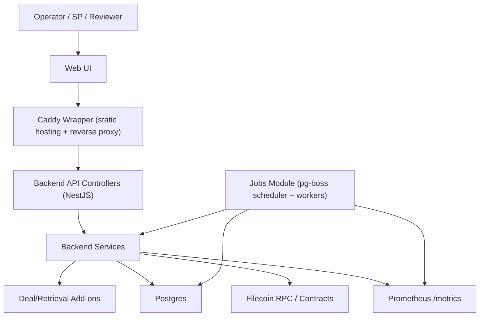

# Dealbot Architecture

## System Architecture

## Component Responsibilities

- [Web UI](../apps/web): React/Vite dashboard served by a Caddy wrapper (static hosting plus `/api` and `/metrics` reverse proxy).
- [Backend API](../apps/backend/src): controllers and services for endpoints and business logic.
- [Deal add-ons](../apps/backend/src/deal-addons) and [Retrieval add-ons](../apps/backend/src/retrieval-addons): deal/retrieval check integrations.
- [Job execution](../apps/backend/src/jobs): pg-boss scheduler + workers for deal/retrieval jobs.
- [Wallet + chain integration](../apps/backend/src/wallet-sdk): provider discovery and on-chain operations.
- [Persistence](../apps/backend/src/database): deal/retrieval state plus pg-boss queue/schedule state in Postgres.
- [Metrics](../apps/backend/src/metrics-prometheus): Prometheus instrumentation and `/metrics` exposure.
- Metrics retention/alerting lives in external monitoring (Prometheus/Grafana/BetterStack); those systems are observability surfaces, not Dealbot source-of-truth state.

## Data Stores and Ownership

Postgres is the system-of-record for Dealbot state:

- SPs under test and provider metadata in `storage_providers`.
- Deal lifecycle records in `deals`, including managed dataset/piece identifiers (`data_set_id`, `piece_id`, `piece_cid`).
- Retrieval lifecycle records in `retrievals`.
- Scheduler state in `job_schedule_state` and queue execution state in `pgboss.job`.

Prometheus is for runtime observability, not durable state:

- Job health/performance metrics (for example `jobs_started_total`, `jobs_completed_total`, `jobs_queued`) are emitted at runtime on `/metrics`.
- Grafana/BetterStack visualize scraped metrics and logs; these are monitoring surfaces and not canonical Dealbot state.
