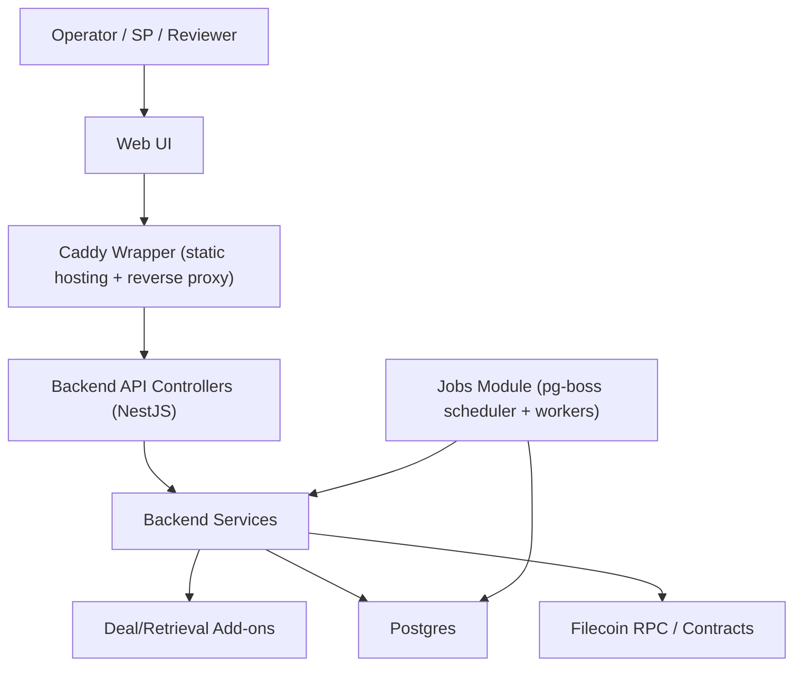

# Dealbot Architecture

## System Architecture

## Component Responsibilities

- [Web UI](../apps/web): React/Vite dashboard served by a Caddy wrapper (static hosting plus `/api` reverse proxy).
- [Backend API](../apps/backend/src): controllers and services for endpoints and business logic.
- [Deal add-ons](../apps/backend/src/deal-addons) and [Retrieval add-ons](../apps/backend/src/retrieval-addons): deal/retrieval check integrations.
- [Job execution](../apps/backend/src/jobs): pg-boss scheduler + workers for deal/retrieval jobs.
- [Wallet + chain integration](../apps/backend/src/wallet-sdk): provider discovery and on-chain operations.
- [Persistence](../apps/backend/src/database): deal/retrieval state plus pg-boss queue/schedule state in Postgres.
- [Metrics](../apps/backend/src/metrics-prometheus): Prometheus instrumentation. Scrape surface and observability expectations live in [infra.md](infra.md).

## Data Stores and Ownership

Postgres is the system-of-record for Dealbot state:

- SPs under test and provider metadata in `storage_providers`.
- Deal lifecycle records in `deals`, including managed dataset/piece identifiers (`data_set_id`, `piece_id`, `piece_cid`).
- Retrieval lifecycle records in `retrievals`.
- Scheduler state in `job_schedule_state` and queue execution state in `pgboss.job`.

ClickHouse is an optional sink for long-term check result analysis. Each completed check writes one row to `data_storage_checks`, `retrieval_checks`, or `data_retention_challenges`. Rows are buffered and flushed in batches; failed flushes are logged and dropped. The service starts and runs without ClickHouse. Operator wiring is described in [infra.md](infra.md).

Prometheus metrics are runtime observability, not durable state. Job health and per-check timing metrics are emitted at runtime; metric semantics live in [docs/checks/events-and-metrics.md](checks/events-and-metrics.md). External monitoring (Grafana, BetterStack, or other) is an observability surface, not canonical state.
