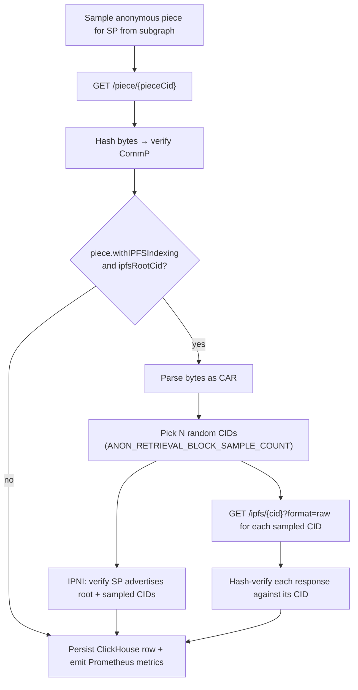

# Anonymous Retrieval Check

This document is the **source of truth** for how dealbot's Anonymous Retrieval check works.

Source code links throughout this document point to the current implementation.

For event and metric definitions to be used by the dashboard, see [Dealbot Events & Metrics](./events-and-metrics.md).

## Overview

The Anonymous Retrieval check (sometimes referred to internally as [retrieval++](https://github.com/FilOzone/dealbot/pull/427)) tests publicly discoverable pieces on a storage provider (pieces that were *not* uploaded by dealbot). The intent is to measure SP retrievability against real-world tenant data, not just dealbot's own corpus.

This is distinct from the [Retrieval check](./retrievals.md), which exercises pieces dealbot itself uploaded as part of a [Data Storage check](./data-storage.md). The Anonymous Retrieval check answers a different question: does the SP serve arbitrary pieces from its broader public corpus, with the same correctness and performance properties as dealbot's controlled pieces?

### Definition of Successful Retrieval

A successful anonymous retrieval requires:

1. **Piece fetch** — `GET {spBaseUrl}/piece/{pieceCid}` returns HTTP 2xx and the response bytes hash to the declared CommP (piece CID).

If the piece advertises IPFS indexing (`withIPFSIndexing = true` and a non-null `ipfsRootCid`), three additional dimensions are validated *independently*. Importantly, they do not gate the overall `piece_fetch_status`, and each is recorded as its own outcome column / metric:

2. **CAR parseable:** the fetched bytes parse as a CAR file.
3. **IPNI:** the SP is advertised as a provider for the root CID and a sample of child CIDs via filecoinpin.contact.
4. **Block fetch:** a sample of CIDs from the parsed CAR is re-fetched via `{spBaseUrl}/ipfs/{cid}?format=raw` and each response is hash-verified against its declared CID.

A piece without IPFS indexing is exercised only at step (1).

Operational timeouts exist to prevent jobs from running indefinitely. If the job exceeds `ANON_RETRIEVAL_JOB_TIMEOUT_SECONDS`, it is aborted; a row is still emitted so that partial metrics (TTFB, bytes, response code) are not lost.

## Piece Selection

Unlike the [Retrieval check](./retrievals.md#piece-selection), dealbot does not retrieve from its own deals. Pieces are sampled from the [on-chain subgraph](../../src/subgraph) of all FWSS-served pieces for the SP under test.

Selection strategy (per scheduled job, per SP):

1. **Pick a size bucket** by weighted random:
   - `small` (1–10 MiB) — 20%
   - `medium` (10–50 MiB) — 50%
   - `large` (50–100 MiB) — 30%
2. **Pick a pool**:
   - `indexed` (IPFS-indexed pieces) — 80%
   - `any` (all FWSS pieces) — 20%
3. **Generate a uniform-random `sampleKey`** and query the subgraph for the smallest `Root.sampleKey ≥ $sampleKey` matching the SP, payer, size range, and pool filters. If no such row exists (the random key fell above every matching `sampleKey`), `sampleAnonPiece` retries in the reverse direction (largest `sampleKey < $sampleKey`) so the highest keys are not a dead zone.
4. **Drop the candidate** if `pdpPaymentEndEpoch` has passed.
5. **Fall back** through: (same bucket, opposite pool) → (any bucket, indexed) → (any bucket, any).

The 80/20 split for `indexed` vs `any` exists so that SPs cannot optimize only their CAR corpus and still appear healthy on this check.

> [!NOTE]
> The bucket sizes were chosen such that the whole file will still fit into memory. In the future we may implement a streaming verification and parsing.

Source: [`anon-piece-selector.service.ts`](../../apps/backend/src/retrieval-anon/anon-piece-selector.service.ts)

## What Happens Each Cycle

### Piece Fetch

- **URL:** `{spBaseUrl}/piece/{pieceCid}` (HTTP/2)
- **Buffered in memory** — piece sizes are capped at 100 MiB by selection (the upper bound of the `large` bucket).
- **Validates CommP** — the CommP of the response bytes must match `pieceCid`.

Source: [`piece-retrieval.service.ts`](../../apps/backend/src/retrieval-anon/piece-retrieval.service.ts)

### CAR / IPNI / block-fetch validation (only when piece advertises IPFS indexing)

When the selected piece has `withIPFSIndexing = true` and a non-null `ipfsRootCid`, three dimensions are exercised by `PieceValidationService`. Each dimension has an independent outcome; a failure or skip in one never bleeds into another's status.

1. **CAR parse:** `@ipld/car` parses the response bytes; a random sample of `ANON_RETRIEVAL_BLOCK_SAMPLE_COUNT` CIDs is selected for the next two steps.
2. **IPNI check:** `IpniVerificationService.verify(rootCid, sampledCids, sp)` polls filecoinpin.contact until each CID resolves to the SP under test, the timeout fires, or `IPNI_VERIFICATION_TIMEOUT_MS` is reached.
3. **Block fetch check:** for each sampled CID, fetch `{spBaseUrl}/ipfs/{cid}?format=raw` and hash-verify the response against the CID. Non-2xx, hash mismatch, unsupported codec, or transport errors all count as a single failed block.

CAR parse failure (`not_parseable`) is attributed to the client (bad upload), not the SP. When the CAR is unparseable, IPNI and block fetch are skipped because there are no sampleable CIDs to verify or fetch.

Source: [`piece-validation.service.ts`](../../apps/backend/src/retrieval-anon/piece-validation.service.ts)

## What Gets Asserted

| # | Assertion | How It's Checked | Retries | Relevant Metric |
|---|-----------|------------------|:---:|------------------|
| 1 | SP serves the piece | `GET /piece/{pieceCid}` returns HTTP 2xx | 0 | [`anonPieceRetrievalLastByteMs`](./events-and-metrics.md#anonPieceRetrievalLastByteMs) |
| 2 | Bytes match the declared CommP | Hash of response bytes equals `pieceCid` | 0 | [`anonPieceRetrievalStatus`](./events-and-metrics.md#anonPieceRetrievalStatus) |
| 3 | Bytes parse as a CAR (IPFS-indexed pieces only) | `@ipld/car` parses the response | 0 | [`anonCarParseStatus`](./events-and-metrics.md#anonCarParseStatus) |
| 4 | SP is advertised on IPNI for root + sampled CIDs | filecoinpin.contact returns provider records | polling until timeout | [`anonIpniStatus`](./events-and-metrics.md#anonIpniStatus) |
| 5 | Sampled blocks fetch + hash-verify | `/ipfs/{cid}?format=raw` for each sample | 0 | [`anonBlockFetchStatus`](./events-and-metrics.md#anonBlockFetchStatus) |

## Sub-status meanings

Unlike the [Data Storage check](./data-storage.md#deal-status-progression), anonymous retrieval does **not** have a rolled-up status (e.g., `anonRetrievalStatus). Piece retrieval, CAR parsing, IPNI verification, block-fetch outcomes are recorded independently. Each status metric below is emitted exactly once per check, except when `anonPieceRetrievalStatus=failure.no_piece` because selection itself fails.

| anonPieceRetrievalStatus | Meaning |
|--------|---------|
| `success` | `GET /piece/{pieceCid}` returned HTTP 2xx **and** the response bytes hashed to the declared CommP. |
| `skipped` | The subgraph returned no candidate piece for the SP after all selection fallbacks. No HTTP request was attempted. |
| `failure.http` | Piece fetch did not return HTTP 2xx, or the request failed at the transport layer (DNS, TLS, connection reset, etc.). |
| `failure.commp` | Piece fetch returned HTTP 2xx, but the response bytes hashed to a different CID than `pieceCid`. The bytes are discarded — downstream CAR / IPNI / block-fetch validation is skipped to avoid amplifying a misbehaving SP. |
| `failure.timedout` | The job-level `AbortSignal` fired (most often `ANON_RETRIEVAL_JOB_TIMEOUT_SECONDS`). Partial timing/byte evidence is still persisted. |
| `failure.other` | Catch-all for retrieval failures that do not match any of the categories above. |

| anonCarParseStatus | Meaning                                                                                                                                               |
|--------|-------------------------------------------------------------------------------------------------------------------------------------------------------|
| `parseable` | The fetched piece bytes were successfully parsed as a CAR by `@ipld/car`.                                                                             |
| `not_parseable` | The fetched piece bytes could not be parsed as a CAR (malformed header, truncated content, unexpected encoding, or parser threw an error). |
| `skipped` | CAR parsing was not attempted — piece fetch failed, the piece does not advertise IPFS indexing, or the job aborted before parsing.                    |

| anonIpniStatus | Meaning |
|--------|---------|
| `valid` | filecoinpin.contact returned the SP as a provider for the root CID **and** every sampled child CID within `IPNI_VERIFICATION_TIMEOUT_MS`. |
| `invalid` | IPNI was queried but at least one CID never resolved to the SP under test before the timeout (or the timeout fired with unresolved CIDs). |
| `skipped` | IPNI verification was not attempted — piece fetch failed, the piece does not advertise IPFS indexing, CAR parsing returned `not_parseable`, the root CID itself failed to parse, or the job aborted. |
| `error` | IPNI verification was attempted and `IpniVerificationService.verify` threw unexpectedly (transport error, service down, etc.). |

| anonBlockFetchStatus | Meaning |
|--------|---------|
| `success` | Every sampled CID was fetched via `GET {spBaseUrl}/ipfs/{cid}?format=raw` and the response bytes hash-verified against the declared CID. |
| `failure` | At least one sampled block fetch failed: non-2xx HTTP, hash mismatch, unsupported codec, unsupported hash, or transport error. Each failed sample counts as one failed block. |
| `skipped` | Block-fetch sampling was not attempted — piece fetch failed, the piece does not advertise IPFS indexing, CAR parsing returned `not_parseable`, or the job aborted. |
| `error` | Block-fetch sampling was attempted but the loop threw unexpectedly outside the per-block try/catch. |

Sources:
- [`anon-retrieval.service.ts`](../../apps/backend/src/retrieval-anon/anon-retrieval.service.ts) — orchestrates the dimensions and emits the four status metrics
- [`piece-retrieval.service.ts`](../../apps/backend/src/retrieval-anon/piece-retrieval.service.ts) — classifies piece-fetch outcomes
- [`piece-validation.service.ts`](../../apps/backend/src/retrieval-anon/piece-validation.service.ts) — produces CAR / IPNI / block-fetch outcomes independently
- [`types.ts` (`CarParseStatus`, `IpniCheckStatus`)](../../apps/backend/src/database/types.ts) — enum source of truth

## Result Recording

Each anonymous retrieval attempt writes one row to the `anon_retrieval_checks` ClickHouse table. The row is emitted **even on abort or unexpected error** so that the partial evidence (TTFB, bytes, response code) is preserved.

The DDL and column-level comments in [`clickhouse.schema.ts`](../../apps/backend/src/clickhouse/clickhouse.schema.ts) are authoritative. The summary below is for orientation.

| Column | Meaning |
|--------|---------|
| `timestamp` | When the check started (ms UTC) |
| `probe_location` | Dealbot probe location (`DEALBOT_PROBE_LOCATION`) |
| `sp_address`, `sp_id`, `sp_name` | SP identity |
| `retrieval_id` | Per-event UUID; correlates row to logs and Prometheus |
| `piece_cid`, `data_set_id`, `piece_id`, `raw_size` | Sampled piece identity |
| `with_ipfs_indexing`, `ipfs_root_cid` | Whether the piece advertises IPNI metadata |
| `service_type` | Always `direct_sp` today |
| `retrieval_endpoint` | URL probed for piece fetch |
| `piece_fetch_status` | `success` or `failed` — outcome of `/piece/{cid}` (HTTP 2xx **and** CommP match). CAR/IPNI/block-fetch outcomes live in their own columns and do **not** flip this status. |
| `http_response_code` | Raw HTTP status; null on transport failure |
| `first_byte_ms`, `last_byte_ms`, `bytes_retrieved`, `throughput_bps` | Piece-fetch performance |
| `commp_valid` | Null when retrieval failed before CommP could be hashed |
| `car_status` | `parseable` \| `not_parseable` \| `skipped` — mirrors `anonCarParseStatus` |
| `car_block_count` | Total CAR block count; null unless `car_status='parseable'` |
| `block_fetch_endpoint` | Gateway base URL probed; null when skipped or SP info missing |
| `block_fetch_status` | `success` \| `failure` \| `skipped` \| `error` — mirrors `anonBlockFetchStatus` |
| `block_fetch_sampled_count`, `block_fetch_failed_count` | Sampled / failed block counts; null when skipped |
| `ipni_status` | `valid` \| `invalid` \| `skipped` \| `error` — mirrors `anonIpniStatus` |
| `ipni_verify_ms` | IPNI verification duration; null when skipped |
| `error_message` | Failure reason; null on success |

Source: [`anon-retrieval.service.ts`](../../apps/backend/src/retrieval-anon/anon-retrieval.service.ts)

## Metrics Recorded

Anonymous-retrieval Prometheus metric definitions live in [Dealbot Events & Metrics](./events-and-metrics.md). All anon-retrieval metrics carry `checkType=anon_retrieval`.

## Configuration

Key environment variables that control anonymous retrieval testing:

| Variable | Description |
|----------|-------------|
| `RETRIEVALS_ANON_PER_SP_PER_HOUR` | Anonymous retrieval rate per SP. Falls back to `RETRIEVALS_PER_SP_PER_HOUR` when unset. |
| `ANON_RETRIEVAL_JOB_TIMEOUT_SECONDS` | Max end-to-end anon retrieval job runtime before forced abort (default 360s). |
| `ANON_RETRIEVAL_BLOCK_SAMPLE_COUNT` | Number of CIDs sampled from the parsed CAR for IPNI + block-fetch verification (default 5, max 50). |
| `IPNI_VERIFICATION_TIMEOUT_MS` | Max time to wait for IPNI provider verification (shared with the Retrieval check). |
| `IPNI_VERIFICATION_POLLING_MS` | Poll interval between IPNI verification attempts (shared). |
| `CONNECT_TIMEOUT_MS` | Connection/header timeout for HTTP requests. |
| `HTTP2_REQUEST_TIMEOUT_MS` | Total timeout for HTTP/2 retrieval requests. |

See also: [`docs/environment-variables.md`](../environment-variables.md) for the full configuration reference.
