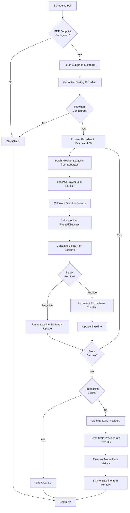

# Data Retention Check

This document describes how dealbot's Data Retention check monitors storage provider (SP) performance in retaining data through Filecoin's Proof of Data Possession (PDP) protocol.

Source code links throughout this document point to the current implementation.

For event and metric definitions used by the dashboard, see [Dealbot Events & Metrics](./events-and-metrics.md).

## Overview

The Data Retention check monitors storage providers' ability to retain data over time by tracking their PDP challenge performance. Unlike the [Data Storage check](./data-storage.md) which tests the upload and initial verification of new data, the Data Retention check evaluates how well providers maintain previously stored data.

Every data retention check cycle, dealbot:

1. Queries the [PDP subgraph](https://docs.filecoin.io/smart-contracts/advanced/proof-of-data-possession) for current challenge statistics
2. Computes estimated faulted and successful proving periods for each provider
3. Calculates deltas since the last poll
4. Records metrics to track provider reliability over time

## How It Works

### 1. Query PDP Subgraph

Dealbot polls The Graph API endpoint for PDP (Proof of Data Possession) data at a configurable interval. The subgraph indexes on-chain PDP events and provides aggregated statistics about provider challenge performance.

**Subgraph repository**: [FilOzone/pdp-explorer](https://github.com/FilOzone/pdp-explorer/blob/main/subgraph/src/pdp-verifier.ts)

**Subgraph endpoint**: Configured via `PDP_SUBGRAPH_ENDPOINT` environment variable (see [environment-variables.md](../environment-variables.md#pdp_subgraph_endpoint))

> **Note**: The production subgraph URL is currently being finalized [here](https://github.com/FilOzone/pdp-explorer/pull/86).

**Data retrieved**:

From `GET_SUBGRAPH_META` query:

- `_meta.block.number` - Current block number (used as `currentBlock` in formulas for consistent snapshots)

From `GET_PROVIDERS_WITH_DATASETS` query for each provider:

- `address` - Provider address
- `totalFaultedPeriods` - Cumulative count of faulted proving periods across all data sets
- `totalProvingPeriods` - Cumulative count of all proving periods (successful + faulted) across all data sets
- For each `proofSets` where `nextDeadline < currentBlock`:
  - `nextDeadline` - The most recent proving deadline (used as `lastDeadline` in formulas)
  - `maxProvingPeriod` - Maximum number of epochs between two consecutive proofs (used in overdue period calculation)
  - `totalFaultedPeriods` - Faulted periods for this specific data set
  - `currentDeadlineCount` - Number of deadlines that have passed for this data set

> **Note**: The subgraph query uses the field name `proofSets`, but this refers to "dataSets" in the current codebase. The terminology was updated from "proof set" to "data set" but the subgraph schema retains the old naming.

Source: [`pdp-subgraph.service.ts` (`fetchSubgraphMeta`, `fetchProvidersWithDatasets`)](../../apps/backend/src/pdp-subgraph/pdp-subgraph.service.ts)

### 2. Estimate Overdue Periods

For each provider's data sets, dealbot estimates how many proving periods have elapsed since the last deadline:

```
estimatedOverduePeriods = (currentBlock - (lastDeadline + 1)) / maxProvingPeriod
```

This calculation accounts for challenges that may have been missed between the last recorded deadline and the current block.

Source: [`data-retention.service.ts` (`processProvider`)](../../apps/backend/src/data-retention/data-retention.service.ts#L209)

### 3. Compute Challenge Totals

Dealbot combines on-chain recorded totals with estimated overdue periods:

```
estimatedTotalFaulted = totalFaultedPeriods + estimatedOverduePeriods
estimatedTotalPeriods = totalProvingPeriods + estimatedOverduePeriods
estimatedTotalSuccess = estimatedTotalPeriods - estimatedTotalFaulted
```

### 4. Calculate Deltas

To avoid double-counting, dealbot maintains a baseline of cumulative totals for each provider. On each poll, it computes the delta (change) since the last poll:

```
faultedDelta = currentTotalFaulted - previousTotalFaulted
successDelta = currentTotalSuccess - previousTotalSuccess
```

**Negative delta handling**: If deltas are negative (due to chain reorgs, subgraph corrections, or data inconsistencies), the baseline is reset to current values without incrementing counters. This prevents stalled metrics.

Source: [`data-retention.service.ts` (`processProvider`)](../../apps/backend/src/data-retention/data-retention.service.ts#L209)

### 5. Record Metrics

Only positive deltas increment Prometheus counters. This ensures metrics accurately reflect new challenges without duplication.

For very large deltas (exceeding `Number.MAX_SAFE_INTEGER`), increments are chunked to prevent precision loss.

Source: [`data-retention.service.ts` (`safeIncrementCounter`)](../../apps/backend/src/data-retention/data-retention.service.ts#L267)

## Stale Provider Cleanup

To prevent unbounded memory growth, dealbot periodically removes baseline data for providers no longer in the active testing list.

**Cleanup strategy**:

1. Identify providers in the baseline map but not in the current active list
2. Fetch provider info from the database
3. Remove Prometheus counter metrics for both success and fault labels
4. Delete baseline entry from memory **only if** counter removal succeeds

**Critical safeguard**: Baselines are retained if:

- Database fetch fails
- Provider not found in database
- Provider has null `providerId`
- Counter removal throws an error

This prevents metric inflation (double-counting) if a provider temporarily goes offline and returns later.

Source: [`data-retention.service.ts` (`cleanupStaleProviders`)](../../apps/backend/src/data-retention/data-retention.service.ts#L140)

## Batching and Rate Limiting

### Provider Batching

Providers are processed in batches of 50 to avoid overwhelming the subgraph API and to enable parallel processing within reasonable limits.

Source: [`data-retention.service.ts` (MAX_PROVIDER_BATCH_LENGTH)](../../apps/backend/src/data-retention/data-retention.service.ts#L19)

### Subgraph Rate Limiting

The PDP subgraph service enforces Goldsky's public endpoint rate limits:

- **Max requests**: 50 per 10-second window
- **Concurrent requests**: Up to 50 simultaneous requests
- **Retry strategy**: Exponential backoff (3 attempts) for transient failures

Rate limiting is enforced client-side to prevent 429 errors.

Source: [`pdp-subgraph.service.ts` (`enforceRateLimit`)](../../apps/backend/src/pdp-subgraph/pdp-subgraph.service.ts#L242)

## Metrics Recorded

See [`dataSetChallengeStatus`](./events-and-metrics.md#dataSetChallengeStatus) for more info.

**Increment behavior**:

- Only increments when positive deltas are detected
- Increments by the delta amount (not always 1)
- Handles large values (>MAX_SAFE_INTEGER) via chunked increments

## Configuration

Key environment variables that control data retention check behavior:

| Variable                | Required | Default      | Description                                                                                      |
| ----------------------- | -------- | ------------ | ------------------------------------------------------------------------------------------------ |
| `PDP_SUBGRAPH_ENDPOINT` | No       | Empty string | The Graph API endpoint for PDP subgraph queries. When empty, data retention checks are disabled. |

Source: [`app.config.ts`](../../apps/backend/src/config/app.config.ts)

See also: [`environment-variables.md`](../environment-variables.md#pdp_subgraph_endpoint) for the full configuration reference.

## Error Handling

### Transient Failures

The service handles transient failures gracefully:

- **Subgraph unavailable**: Retries with exponential backoff (up to 3 attempts)
- **Individual provider errors**: Logged but don't stop processing of other providers
- **Batch failures**: Continue processing remaining batches

### Data Validation Errors

Validation errors (schema mismatches, type errors) are **not retried** as they indicate structural issues requiring investigation.

### Cleanup Failures

If stale provider cleanup encounters errors (database failures, missing provider info), the cleanup is skipped entirely to preserve metric baselines and prevent double-counting.

Source: [`data-retention.service.ts` (`pollDataRetention`)](../../apps/backend/src/data-retention/data-retention.service.ts#L50)

## Architecture Diagram



## FAQ

### Why track deltas instead of absolute values?

Prometheus counters are designed to track cumulative totals that only increase. By tracking deltas, we ensure:

1. Metrics accurately reflect new challenges without duplication
2. Counter values remain monotonically increasing
3. Rate calculations work correctly in Prometheus queries

### What happens during a chain reorganization?

If a chain reorg causes challenge totals to decrease, dealbot detects negative deltas and resets the baseline without incrementing counters. This prevents metric corruption while allowing the system to recover automatically.

### Why not clean up baselines immediately when providers go offline?

Providers may temporarily drop from the active list due to configuration changes, approval status changes, or transient issues. Retaining baselines prevents massive metric inflation (double-counting) when providers return. Cleanup only occurs when we can successfully remove the associated Prometheus metrics.

### How does this differ from the Data Storage check?

- **Data Storage check**: Tests the full lifecycle of uploading new data (upload → onchain confirmation → IPNI indexing → retrieval)
- **Data Retention check**: Monitors ongoing data retention through PDP challenge performance for previously stored data

Both checks work together to provide comprehensive storage provider quality metrics.
