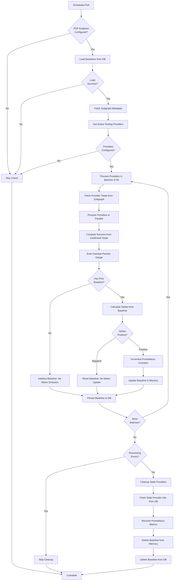

# Data Retention Check

This document describes how dealbot's Data Retention check monitors storage provider (SP) performance in retaining data through Filecoin's Proof of Data Possession (PDP) protocol.

Source code links throughout this document point to the current implementation.

For event and metric definitions used by the dashboard, see [Dealbot Events & Metrics](./events-and-metrics.md).

## Overview

The Data Retention check monitors storage providers' ability to retain data over time by tracking their PDP challenge performance. Unlike the [Data Storage check](./data-storage.md) which tests the upload and initial verification of new data, the Data Retention check evaluates how well providers maintain previously stored data.  (See also [Why is this called "data retention" vs. "data availability"?](#why-is-this-called-data-retention-vs-data-availability))

Every data retention check cycle, dealbot:

1. Queries the [PDP subgraph](https://docs.filecoin.io/smart-contracts/advanced/proof-of-data-possession) for provider-level challenge statistics
2. Computes confirmed successful proving periods from the subgraph totals with estimated overdue periods for real-time monitoring
3. Calculates proving-period deltas since the last poll and converts them to challenge counts
4. Records metrics to track provider reliability over time

**Provider selection**: Only providers returned by `WalletSdkService.getTestingProviders()` are polled, minus any matching the `spBlocklists` configuration (via `isSpBlocked`).

## How It Works

### 1. Query PDP Subgraph

Dealbot polls The Graph API endpoint for PDP (Proof of Data Possession) data at a configurable interval. The subgraph indexes on-chain PDP events and provides aggregated statistics about provider challenge performance.

**Subgraph repository**: [FilOzone/pdp-explorer](https://github.com/FilOzone/pdp-explorer/blob/main/subgraph/src/pdp-verifier.ts)

**Subgraph endpoint**: Configured via `PDP_SUBGRAPH_ENDPOINT` environment variable (see [environment-variables.md](../environment-variables.md#pdp_subgraph_endpoint))

> **Note**: The production subgraph URL is currently being finalized [here](https://github.com/FilOzone/pdp-explorer/pull/86).

**Data retrieved**:

From `GET_SUBGRAPH_META` query:

- `_meta.block.number` - Current indexed block number (recorded in baseline persistence for debugging)

From `GET_PROVIDERS_WITH_DATASETS` query for each provider:

- `address` - Provider address
- `totalFaultedPeriods` - Cumulative count of faulted proving periods across all data sets (maintained by the subgraph's `NextProvingPeriod` event handler)
- `totalProvingPeriods` - Cumulative count of all proving periods (successful + faulted) across all data sets
- `proofSets` - Array of proof sets where `nextDeadline < currentBlock` (overdue deadlines), each containing:
  - `nextDeadline` - Next deadline block number
  - `maxProvingPeriod` - Maximum proving period duration

> **Note**: The subgraph query uses the field name `proofSets`, but this refers to "dataSets" in the current codebase. The terminology was updated from "proof set" to "data set" but the subgraph schema retains the old naming.

Source: [`pdp-subgraph.service.ts` (`fetchSubgraphMeta`, `fetchProvidersWithDatasets`)](../../apps/backend/src/pdp-subgraph/pdp-subgraph.service.ts)

### 2. Compute Challenge Totals and Overdue Estimates

Dealbot uses the subgraph-confirmed totals directly for cumulative counters:

```
confirmedTotalSuccess = totalProvingPeriods - totalFaultedPeriods
```

Additionally, dealbot calculates **estimated overdue periods** for real-time monitoring via a separate gauge metric. The value is the **sum across all of the provider's overdue proof sets** (those where `nextDeadline < currentBlock`); proof sets with `maxProvingPeriod === 0` are skipped:

```
estimatedOverduePeriods = sum over overdue proofSets of:
    (currentBlock - (nextDeadline + 1)) / maxProvingPeriod
```

This gauge provides immediate visibility into providers that are behind on submitting proofs, even before the subgraph confirms the faults. The gauge naturally resets to 0 when providers submit their proofs and the subgraph catches up.

**Key distinction**: The overdue gauge is independent of the cumulative counter baselines. It reflects the current state on every poll, while counters track confirmed changes over time.

### 3. Calculate Deltas

To avoid double-counting, dealbot maintains a baseline of cumulative **proving-period** totals for each provider. On each poll, it computes the period delta since the last poll and converts it to a challenge count using a fixed multiplier (`CHALLENGES_PER_PROVING_PERIOD = 5`, sourced from the `FilecoinWarmStorageService` contract):

```
faultedChallengesDelta = (totalFaultedPeriods    - previousTotalFaulted) * 5
successChallengesDelta = (confirmedTotalSuccess - previousTotalSuccess) * 5
```

Baselines are stored and compared in **periods**; the `dataSetChallengeStatus` counter is incremented in **challenges**.

**First-seen provider handling**: When a provider has no prior baseline (fresh deploy or newly added provider), dealbot initializes the baseline to the current cumulative totals **without emitting any counters**. This prevents dumping the provider's full cumulative history as a single metric spike. Metrics for that provider will begin accumulating from the next poll onward.

**Negative delta handling**: If either challenge delta is negative (due to chain reorgs, subgraph corrections, or data inconsistencies), the baseline is reset to current values without incrementing counters. This prevents stalled metrics.

**Baseline persistence**: Baselines are persisted to the `data_retention_baselines` database table after each successful poll. On service restart, baselines are reloaded from the database to prevent metric inflation.

Source: [`data-retention.service.ts` (`processProvider`)](../../apps/backend/src/data-retention/data-retention.service.ts)

### 4. Record Metrics

Only positive deltas increment Prometheus counters. This ensures metrics accurately reflect new challenges without duplication.

For very large deltas (exceeding `Number.MAX_SAFE_INTEGER`), increments are chunked to prevent precision loss.

Source: [`data-retention.service.ts` (`safeIncrementCounter`)](../../apps/backend/src/data-retention/data-retention.service.ts)

## Baseline Persistence

To prevent metric inflation across service restarts, dealbot persists provider baselines to the database.

**Storage**: Baselines are stored in the `data_retention_baselines` table with columns for `provider_address`, `faulted_periods`, `success_periods`, `last_block_number`, and `updated_at`.

**Lifecycle**:

1. **On first poll**: Load all baselines from database into memory. If load fails, abort poll to prevent emitting inflated values.
2. **First-seen provider**: If a provider has no prior baseline (not in memory or database), initialize its baseline to the current cumulative totals without emitting counters. This avoids a metric spike from the provider's full history.
3. **On each poll**: After processing providers, persist updated baselines to database.
4. **On restart**: Reload baselines from database. Delta computation resumes from last persisted state, preventing double-counting.

**Error handling**:

- **DB load failure**: Poll aborted, retry on next cycle
- **DB persist failure**: Warning logged, in-memory state remains consistent
- **Stale provider cleanup**: Baselines deleted from both memory and database when providers are removed from active list

Source: [`data-retention.service.ts` (`loadBaselinesFromDb`, `persistBaseline`)](../../apps/backend/src/data-retention/data-retention.service.ts), [`CreateDataRetentionBaselines` migration](../../apps/backend/src/database/migrations/1761500000002-CreateDataRetentionBaselines.ts)

## Stale Provider Cleanup

To prevent unbounded memory growth, dealbot periodically removes baseline data for providers no longer in the active testing list.

**Cleanup strategy**:

1. Identify providers in the baseline map but not in the current active list
2. Fetch provider info from the database
3. Remove Prometheus counter metrics for both success and fault labels
4. Remove Prometheus gauge metric for overdue periods
5. Delete baseline entry from memory **only if** metric removal succeeds
6. Delete baseline entry from database (non-blocking, logged on failure)

**Critical safeguard**: Baselines are retained if:

- Database fetch fails
- Provider not found in database
- Provider has null `providerId`
- Counter removal throws an error

This prevents metric inflation (double-counting) if a provider temporarily goes offline and returns later.

Source: [`data-retention.service.ts` (`cleanupStaleProviders`)](../../apps/backend/src/data-retention/data-retention.service.ts)

## Batching and Rate Limiting

### Provider Batching

Providers are processed in batches of 50 to avoid overwhelming the subgraph API and to enable parallel processing within reasonable limits.

**Why batching instead of per-provider scheduling?**

The data retention check processes all providers in a single scheduled poll rather than creating individual job schedules per provider. This design choice is driven by several technical considerations:

1. **Subgraph rate limiting**: Goldsky enforces strict rate limits (50 requests per 10-second window). Batching significantly reduces API load:
   - **Current batched approach** (100 providers): 2 batch requests + 1 metadata request = 3 total requests
   - **Per-provider approach** (100 providers): 100 × (1 metadata + 1 provider request) = 200 total requests

   The batched approach stays well within rate limits and reduces infrastructure load.

Source: [`data-retention.service.ts` (`MAX_PROVIDER_BATCH_LENGTH`)](../../apps/backend/src/data-retention/data-retention.service.ts)

### Subgraph Rate Limiting

The PDP subgraph service enforces Goldsky's public endpoint rate limits:

- **Max requests**: 50 per 10-second window
- **Concurrent requests**: Up to 50 simultaneous requests
- **Retry strategy**: Exponential backoff (3 attempts) for transient failures

Rate limiting is enforced client-side to prevent 429 errors.

Source: [`pdp-subgraph.service.ts` (`enforceRateLimit`)](../../apps/backend/src/pdp-subgraph/pdp-subgraph.service.ts)

## Metrics Recorded

### Counter: `dataSetChallengeStatus`

See [`dataSetChallengeStatus`](./events-and-metrics.md#dataSetChallengeStatus) for more info.

**Unit**: challenges (period delta × `CHALLENGES_PER_PROVING_PERIOD = 5`).

**`value` label**:

- `success` — challenges in successfully-proven periods (`totalProvingPeriods - totalFaultedPeriods`)
- `failure` — challenges in faulted periods (`totalFaultedPeriods`)

**Increment behavior**:

- Only increments when the challenge delta is strictly positive
- Increments by the full challenge delta (not always 1)
- For deltas exceeding `Number.MAX_SAFE_INTEGER`, `safeIncrementCounter` splits the increment into `MAX_SAFE_INTEGER`-sized chunks to preserve precision

### Gauge: `pdp_provider_estimated_overdue_periods`

See [`pdp_provider_estimated_overdue_periods`](./events-and-metrics.md#pdp_provider_estimated_overdue_periods) for more info.

**Unit**: proving periods (sum across the provider's overdue proof sets).

**Emission behavior**:

- Emitted on every poll for every processed provider, independent of counter deltas and independent of baseline state (emitted even on first-seen providers)
- Reflects estimated unrecorded overdue proving periods in real-time
- Naturally resets to 0 when providers submit proofs and the subgraph catches up
- For values exceeding `Number.MAX_SAFE_INTEGER`, `safeSetGauge` **clamps** the gauge to `Number.MAX_SAFE_INTEGER` and logs an `overdue_periods_overflow` warning (it does **not** chunk)

## Configuration

Key environment variables that control data retention check behavior:

| Variable                | Required | Default      | Description                                                                                      |
| ----------------------- | -------- | ------------ | ------------------------------------------------------------------------------------------------ |
| `PDP_SUBGRAPH_ENDPOINT` | No       | Empty string | The Graph API endpoint for PDP subgraph queries. When empty, data retention checks are disabled. |

Source: [`app.config.ts`](../../apps/backend/src/config/app.config.ts)

See also: [`environment-variables.md`](../environment-variables.md#pdp_subgraph_endpoint) for the full configuration reference.

## Error Handling

### Transient Failures

The service handles transient failures gracefully:

- **Subgraph unavailable**: Retries with exponential backoff (up to 3 attempts)
- **Individual provider errors**: Logged but don't stop processing of other providers
- **Batch failures**: Continue processing remaining batches

### Data Validation Errors

Validation errors (schema mismatches, type errors) are **not retried** as they indicate structural issues requiring investigation.

### Cleanup Failures

If stale provider cleanup encounters errors (database failures, missing provider info), the cleanup is skipped entirely to preserve metric baselines and prevent double-counting.

Source: [`data-retention.service.ts` (`pollDataRetention`)](../../apps/backend/src/data-retention/data-retention.service.ts#L50)

## Architecture Diagram


```mermaid
flowchart TD
    Start[Scheduled Poll] --> CheckEndpoint{PDP Endpoint<br/>Configured?}
    CheckEndpoint -->|No| Skip[Skip Check]
    CheckEndpoint -->|Yes| LoadBaselines[Load Baselines from DB]
    LoadBaselines --> CheckLoad{Load<br/>Success?}
    CheckLoad -->|No| Skip
    CheckLoad -->|Yes| FetchMeta[Fetch Subgraph Metadata]
    FetchMeta --> GetProviders[Get Active Testing Providers]
    GetProviders --> CheckProviders{Providers<br/>Configured?}
    CheckProviders -->|No| Skip
    CheckProviders -->|Yes| BatchLoop[Process Providers in Batches of 50]

    BatchLoop --> FetchData[Fetch Provider Totals from Subgraph]
    FetchData --> ProcessParallel[Process Providers in Parallel]
    ProcessParallel --> CalcTotals[Compute Success from Confirmed Totals]
    CalcTotals --> EmitGauge[Emit Overdue Periods Gauge]
    EmitGauge --> CheckBaseline{Has Prior<br/>Baseline?}
    CheckBaseline -->|No| InitBaseline[Initialize Baseline. No Metric Emission]
    InitBaseline --> PersistBaseline
    CheckBaseline -->|Yes| CalcDeltas[Calculate Deltas from Baseline]
    CalcDeltas --> CheckDeltas{Deltas<br/>Positive?}

    CheckDeltas -->|Negative| ResetBaseline[Reset Baseline. No Metric Update]
    CheckDeltas -->|Positive| IncrementMetrics[Increment Prometheus Counters]
    IncrementMetrics --> UpdateBaseline[Update Baseline in Memory]
    ResetBaseline --> PersistBaseline[Persist Baseline to DB]
    UpdateBaseline --> PersistBaseline
    PersistBaseline --> MoreBatches{More<br/>Batches?}

    MoreBatches -->|Yes| BatchLoop
    MoreBatches -->|No| CheckErrors{Processing<br/>Errors?}
    CheckErrors -->|Yes| SkipCleanup[Skip Cleanup]
    CheckErrors -->|No| Cleanup[Cleanup Stale Providers]

    Cleanup --> FetchStale[Fetch Stale Provider Info from DB]
    FetchStale --> RemoveMetrics[Remove Prometheus Metrics]
    RemoveMetrics --> DeleteMemory[Delete Baseline from Memory]
    DeleteMemory --> DeleteDB[Delete Baseline from DB]

    SkipCleanup --> End[Complete]
    DeleteDB --> End
    Skip --> End
```

## FAQ

### Why track deltas instead of absolute values?

Prometheus counters are designed to track cumulative totals that only increase. By tracking deltas, we ensure:

1. Metrics accurately reflect new challenges without duplication
2. Counter values remain monotonically increasing
3. Rate calculations work correctly in Prometheus queries

### What happens during a chain reorganization?

If a chain reorg causes challenge totals to decrease, dealbot detects negative deltas and resets the baseline without incrementing counters. This prevents metric corruption while allowing the system to recover automatically.

### Why not clean up baselines immediately when providers go offline?

Providers may temporarily drop from the active list due to configuration changes, approval status changes, or transient issues. Retaining baselines prevents massive metric inflation (double-counting) when providers return. Cleanup only occurs when we can successfully remove the associated Prometheus metrics.

### What happens if the service restarts?

Baselines are persisted to the database after each successful poll. On restart, the service loads all baselines from the database on the first poll, and delta computation resumes from the last persisted state. This prevents metric inflation (double-counting).

**Example scenario:**

```
Poll 1 (fresh start, no DB baseline):
  Subgraph: faulted=1000, success=9000
  No prior baseline → Initialize baseline to 1000, 9000
  Emit: nothing (first-seen provider, baseline only)

Poll 2:
  Subgraph: faulted=1005, success=9005
  Memory baseline: 1000, 9000 → Period delta: 5, 5 (× 5 challenges/period)
  Emit: +25 faulted challenges, +25 success challenges

--- SERVICE RESTARTS ---

Poll 3 (after restart):
  Subgraph: faulted=1005, success=9005
  DB baseline: 1005, 9005 (loaded) → Period delta: 0, 0
  Emit: nothing (no new challenges)

Poll 4:
  Subgraph: faulted=1008, success=9012
  Memory baseline: 1005, 9005 → Period delta: 3, 7
  Emit: +15 faulted challenges, +35 success challenges
```

If the database is unavailable on startup, the poll is aborted to prevent emitting inflated values. The service will retry on the next scheduled poll.

### How does this differ from the Data Storage check?

- **Data Storage check**: Tests the full lifecycle of uploading new data (upload → onchain confirmation → IPNI indexing → retrieval)
- **Data Retention check**: Monitors ongoing data retention through PDP challenge performance for previously stored data

Both checks work together to provide comprehensive storage provider quality metrics.

### Why is this called "data retention" vs. "data availability"?

This check relies on the [Proof of Data Possession (PDP) protocol](https://github.com/FilOzone/pdp), which monitors data retention over time.  We use "data retention" to be precise about the nature of the check.

> Data retention = “How long do we keep it?”

Retention is about **preservation over time**:

- What data must be kept, and for how long (days, months, years)
- Whether it must be recoverable after deletion, corruption, or disasters
- Policies like TTLs, backups, archives, legal/compliance holds
- Typical metrics/controls: retention period, backup frequency, restore points (RPO), restore time (RTO), deletion guarantees

Example: “Keep audit logs for 7 years” is a retention requirement even if nobody reads them most days.

> Data availability = “Can I access it when I need it?”

Availability is about **accessibility and uptime**:

- Is the data reachable now, with acceptable latency and error rate?
- What’s the acceptable downtime (SLA/SLO)?
- What happens during outages, partitions, or maintenance?
- Typical metrics/controls: uptime %, read/write success rate, latency, failover behavior

Example: “Users must be able to fetch their profile data 99.9% of the time” is an availability requirement even if you only retain profiles while the account exists.

> Why the distinction matters

- You can have **high retention, low availability**: data is safely stored in cold archive, but slow or hard to retrieve.
- You can have **high availability, low retention**: data is accessible right now, but only for a short window (e.g., ephemeral caches, short TTL event streams).