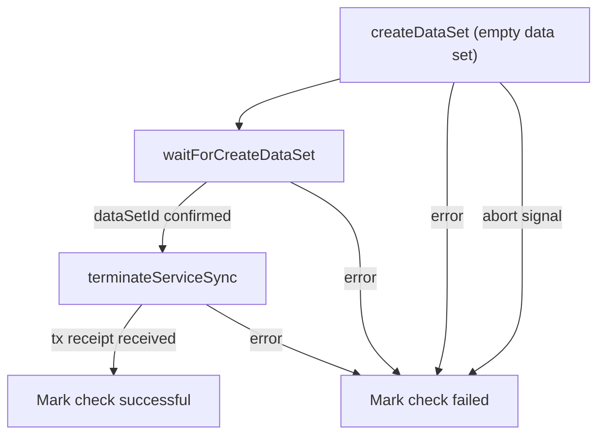

# Data Set Lifecycle Check

This document is the **source of truth** for how dealbot's Data Set Lifecycle check works.

Source code links throughout this document point to the current implementation.

For event and metric definitions used by the dashboard, see [Dealbot Events & Metrics](./events-and-metrics.md).

> **Note**: This check calls `terminateService` to start the on-chain termination sequence. It does **not** call `PDPVerifier.deleteDataSet`, which is SP-initiated. See the [FAQ](#what-happens-on-chain-after-terminateservice-is-called) for details on what happens after termination.

## Overview

A "data set lifecycle check" tests the full `createDataSet → terminateService` lifecycle for a storage provider. Dealbot creates an empty throwaway data set and immediately terminates it in the same run. A successful check confirms both the `createDataSet` and `terminateService` paths work correctly on the SP.

Every data set lifecycle check, dealbot:

1. Creates a new empty data set, tagged with a `dealbotLifecycleCheck` metadata key so any leaked sets are discoverable later
2. Waits for the SP to confirm the data set is created on-chain and returns a `dataSetId`
3. Calls `terminateService` on the created data set and waits for the transaction receipt

A successful check requires all [assertions in the table below](#what-gets-asserted) to pass. Failure occurs if any step fails or the check exceeds its max allowed time.

## What Gets Asserted

Each data set lifecycle check asserts the following for every SP:

| # | Assertion | How It's Checked | Relevant Metric |
|---|-----------|-----------------|-----------------|
| 1 | SP accepts an empty data set creation | `createDataSet` call completes and the SP returns a `statusUrl` | [`dataSetLifecycleCheckStatus`](./events-and-metrics.md#dataSetLifecycleCheckStatus) |
| 2 | Data set is confirmed on-chain | `waitForCreateDataSet` resolves with a `dataSetId` | [`dataSetLifecycleCheckStatus`](./events-and-metrics.md#dataSetLifecycleCheckStatus) |
| 3 | `terminateService` succeeds on the created data set | `terminateServiceSync` call completes and the transaction receipt is received | [`dataSetLifecycleCheckMs`](./events-and-metrics.md#dataSetLifecycleCheckMs) |
| 4 | All steps complete within the timeout | Check is not marked successful until all steps pass within `DATA_SET_LIFECYCLE_CHECK_JOB_TIMEOUT_SECONDS` | [`dataSetLifecycleCheckMs`](./events-and-metrics.md#dataSetLifecycleCheckMs) |

## Data Set Lifecycle Check Lifecycle

The dealbot scheduler triggers data set lifecycle check jobs at a configurable rate.

### 1. Apply job guards

Dealbot applies the same maintenance-window and SP-blocklist rules used by all other SP jobs. If `DATASET_LIFECYCLE_CHECK_ENABLED` is `false`, the job logs a disabled skip and exits.

### 2. Create the empty data set

Dealbot calls `createDataSet` (from `@filoz/synapse-core/sp`) to create a new empty data set on the SP. The data set is tagged with metadata `{ dealbotLifecycleCheck: "<timestamp>" }`. The fixed `dealbotLifecycleCheck` key is the handle for finding leaked sets later; the per-run value ensures a fresh data set is created on every invocation rather than resolving a prior one.

This step does **not** emit `dataSetCreation` metrics — those belong to the `data_set_creation` job.

Source: [`data-set-lifecycle.service.ts` (`runLifecycleCheck`)](../../apps/backend/src/data-set-lifecycle/data-set-lifecycle.service.ts)

### 3. Wait for creation confirmation

Dealbot calls `waitForCreateDataSet` with the `statusUrl` returned by the SP. When the SP confirms the data set is created on-chain, it resolves with a `dataSetId`.

### 4. Terminate the service

Dealbot calls `terminateServiceSync` (from `@filoz/synapse-core/warm-storage`) on the newly created `dataSetId`. This submits the terminate transaction and waits for the receipt, confirming the termination was recorded on-chain. This is Step 1 of the [full on-chain termination sequence](#what-happens-on-chain-after-terminateservice-is-called). The job does not wait for the full ~30-day rail finalization.

The entire check (creation + confirmation + termination) is bounded by `DATA_SET_LIFECYCLE_CHECK_JOB_TIMEOUT_SECONDS`. A timeout is classified as `failure.timedout`.

## Check Status Progression

A data set lifecycle check has a single terminal status, recorded once per check via [`dataSetLifecycleCheckStatus`](./events-and-metrics.md#dataSetLifecycleCheckStatus):

| Overall Status | Meaning |
|--------|---------|
| `success` | All steps passed: data set created, service terminated, and termination confirmed on-chain. |
| `failure.timedout` | The job was aborted because it exceeded `DATA_SET_LIFECYCLE_CHECK_JOB_TIMEOUT_SECONDS`. |
| `failure.other` | Any other failure: `createDataSet` failed, `terminateService` failed, or on-chain confirmation polling failed. |

## Metrics Recorded

Metric definitions live in [Dealbot Events & Metrics](./events-and-metrics.md). The metrics emitted by a data set lifecycle check are:

- [`dataSetLifecycleCheckStatus`](./events-and-metrics.md#dataSetLifecycleCheckStatus) — `success`, `failure.timedout`, or `failure.other` per provider per run
- [`dataSetLifecycleCheckMs`](./events-and-metrics.md#dataSetLifecycleCheckMs) — end-to-end duration (create + confirm + terminate); emitted on `success` and `failure.timedout`

## Configuration

Key environment variables that control data set lifecycle check behavior:

| Variable | Description |
|----------|-------------|
| `DATASET_LIFECYCLE_CHECK_ENABLED` | Enables or disables the check. Defaults to `true` on calibration, `false` on mainnet. When disabled, stale schedules are removed so they stop enqueuing no-op jobs. |
| `DATASET_LIFECYCLE_CHECKS_PER_SP_PER_HOUR` | Per-SP check rate. Independent of `DATASET_CREATIONS_PER_SP_PER_HOUR`. |
| `DATA_SET_LIFECYCLE_CHECK_JOB_TIMEOUT_SECONDS` | Max end-to-end job runtime before forced abort. Default `600`. |

Source: [`apps/backend/src/config/app.config.ts`](../../apps/backend/src/config/app.config.ts)

See also: [`docs/environment-variables.md`](../environment-variables.md) for the source-of-truth configuration reference.

## FAQ

### What happens on-chain after `terminateService` is called?

`terminateService` does not delete a data set instantly. It starts a multi-step on-chain sequence that plays out over roughly 30 days. The lifecycle check only waits for the first step before it exits.

**Step 1 — terminateService confirms.** `terminateService` calls `FilecoinPay.terminateRail(pdpRailId)`, which sets `endEpoch = block.number + lockupPeriod` on the PDP rail. The FWSS `railTerminated` callback fires in the same transaction, stores `info.pdpEndEpoch`, and emits `PDPPaymentsTerminated` and `ServiceTerminated`. This is the point dealbot polls for: `pdpEndEpoch != 0`.

**Step 2 — rail finalization (~30 days later).** When the PDP rail's `settledUpTo` reaches `endEpoch`, `finalizeTerminatedRail` fires atomically inside the settle transaction.

**Step 3 — data set deletion at PDPVerifier (SP-initiated).** After the rail finalizes, the SP may call `PDPVerifier.deleteDataSet`. The lifecycle check does not wait for steps 2 or 3 — waiting ~30 days per invocation would defeat the purpose of a canary.

### Why does data set creation use an empty data set?

Empty data set creation calls `createDataSet` from `@filoz/synapse-core/sp` directly, bypassing the upload flow used by the data storage check. This keeps the lifecycle check lightweight: it validates the SP's `createDataSet → terminateService` path without storing any actual data or consuming upload capacity.

### What if creation succeeds but termination fails?

If creation succeeds but termination fails (process crash, job timeout, or an on-chain error that is not an already-terminated no-op), the created data set stays live on the SP. This is called a leak and is an accepted trade-off for keeping the job self-contained.

Leaked sets are discoverable by filtering data sets with the `dealbotLifecycleCheck` metadata key. Each leak is also recorded in the `dataset_lifecycle_check_failed` log line (message: "throwaway data set may have leaked") with the `dataSetId` included for easy identification.

### Why does the job create and terminate in the same run?

An earlier design terminated an existing managed slot and relied on `data_set_creation` to recreate it on a later tick. That approach was coupled to `MIN_NUM_DATASETS_FOR_CHECKS`, a minimum-index window, and the creation job's schedule — making the canary sensitive to overall provider state.

The current design is self-contained: it always creates a fresh data set and terminates it in the same run. The check works regardless of provider state and needs no coordination with other jobs.
