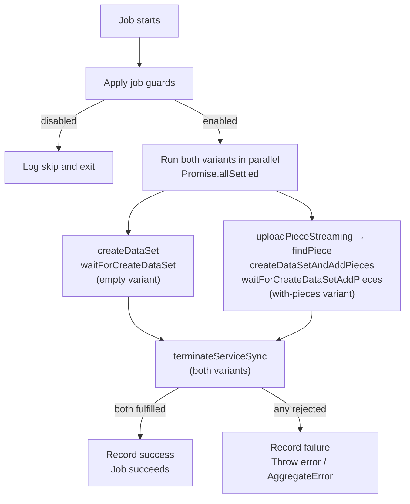

# Data Set Lifecycle Check

This document is the **source of truth** for how dealbot's Data Set Lifecycle check works.

Source code links throughout this document point to the current implementation.

For event and metric definitions used by the dashboard, see [Dealbot Events & Metrics](./events-and-metrics.md).

> **Note**: This check calls `terminateService` to start the on-chain termination sequence. It does **not** call `PDPVerifier.deleteDataSet`, which is SP-initiated. See the [FAQ](#what-happens-on-chain-after-terminateservice-is-called) for details on what happens after termination.

## Overview

A "data set lifecycle check" tests the `createDataSet|createDataSetAndAddPieces → terminateService` lifecycle for a storage provider. Each tick _both_ creation path variants run in parallel, then each immediately terminates its throwaway data set.

**Empty variant**: exercises the `createDataSet` path.
1. Creates a new empty data set, tagged with `dealbotLifecycleCheck` metadata
2. Waits for the SP to confirm the data set on-chain (`dataSetId` returned)
3. Calls `terminateService` on the created data set and waits for the transaction receipt

**With-pieces variant**: exercises the `createDataSetAndAddPieces` path.
1. Uploads a small random 256-byte canary piece to the SP's HTTP storage service
2. Polls until the SP confirms it has ingested the piece (`findPiece` with retry)
3. Atomically creates a data set and registers the piece on-chain
4. Waits for the SP to confirm both data set creation and piece addition
5. Calls `terminateService` on the created data set and waits for the transaction receipt

A successful check requires all steps of **both** variants to complete within the allowed time. If either variant fails, the overall job fails. If both variants fail, an `AggregateError` is thrown. Failure occurs if any step fails or the check exceeds `DATA_SET_LIFECYCLE_CHECK_JOB_TIMEOUT_SECONDS`.

Both variants share a single `checkType` label (`dataSetLifecycleCheck`). One combined metric is emitted per tick: `success` only when both variants pass, `failure` when either fails.

## What Gets Asserted

**Empty variant assertions:**

| # | Assertion | How It's Checked | Relevant Metric |
|---|-----------|-----------------|-----------------|
| 1 | SP accepts an empty data set creation | `createDataSet` call completes and the SP returns a `statusUrl` | [`dataSetLifecycleCheckStatus`](./events-and-metrics.md#dataSetLifecycleCheckStatus) |
| 2 | Data set is confirmed on-chain | `waitForCreateDataSet` resolves with a `dataSetId` | [`dataSetLifecycleCheckStatus`](./events-and-metrics.md#dataSetLifecycleCheckStatus) |
| 3 | `terminateService` succeeds on the created data set | `terminateServiceSync` call completes and the transaction receipt is received | [`dataSetLifecycleCheckMs`](./events-and-metrics.md#dataSetLifecycleCheckMs) |
| 4 | All steps complete within the timeout | Check is not marked successful until all steps pass within `DATA_SET_LIFECYCLE_CHECK_JOB_TIMEOUT_SECONDS` | [`dataSetLifecycleCheckMs`](./events-and-metrics.md#dataSetLifecycleCheckMs) |

**With-pieces variant assertions:**

| # | Assertion | How It's Checked | Relevant Metric |
|---|-----------|-----------------|-----------------|
| 1′ | SP accepts the canary piece upload | `uploadPieceStreaming` completes and returns a `pieceCid` | [`dataSetLifecycleCheckStatus`](./events-and-metrics.md#dataSetLifecycleCheckStatus) |
| 2′ | SP confirms piece ingestion | `findPiece` (with retry) resolves, confirming the SP has the data before the on-chain call | [`dataSetLifecycleCheckStatus`](./events-and-metrics.md#dataSetLifecycleCheckStatus) |
| 3′ | SP accepts atomic data set + piece creation | `createDataSetAndAddPieces` call completes and the SP returns a `statusUrl` | [`dataSetLifecycleCheckStatus`](./events-and-metrics.md#dataSetLifecycleCheckStatus) |
| 4′ | Data set and piece are confirmed on-chain | `waitForCreateDataSetAddPieces` resolves with a `dataSetId` and `piecesIds` | [`dataSetLifecycleCheckStatus`](./events-and-metrics.md#dataSetLifecycleCheckStatus) |
| 5′ | `terminateService` succeeds on the created data set | `terminateServiceSync` call completes and the transaction receipt is received | [`dataSetLifecycleCheckMs`](./events-and-metrics.md#dataSetLifecycleCheckMs) |
| 6′ | All steps complete within the timeout | Check is not marked successful until all steps pass within `DATA_SET_LIFECYCLE_CHECK_JOB_TIMEOUT_SECONDS` | [`dataSetLifecycleCheckMs`](./events-and-metrics.md#dataSetLifecycleCheckMs) |

## Data Set Lifecycle Check Lifecycle

The dealbot scheduler triggers data set lifecycle check jobs at a configurable rate. On each tick, both creation variants run in parallel via `Promise.allSettled`.

### 1. Apply job guards

Dealbot applies the same maintenance-window and SP-blocklist rules used by all other SP jobs. If `DATASET_LIFECYCLE_CHECK_ENABLED` is `false`, the job logs a disabled skip and exits.

### 2. Run both variants in parallel

Both the empty variant and the with-pieces variant are started concurrently via `Promise.allSettled`. Each variant runs to completion independently and logs its own outcome. After both settle, a single combined metric is recorded under `checkType=dataSetLifecycleCheck`: `success` only when both pass, `failure` when either fails. Any rejection is re-thrown so check dependency outages are never swallowed as success. See [Why two variants?](#why-two-variants) for the rationale.

Source: [`data-set-lifecycle.service.ts` (`runLifecycleCheck`)](../../apps/backend/src/data-set-lifecycle/data-set-lifecycle.service.ts)

### 3. Empty variant: exercise `createDataSet` path

### 3a. Create the empty data set

Dealbot calls `createDataSet` (from `@filoz/synapse-core/sp`) to create a new empty data set on the SP. The data set is tagged with metadata `{ dealbotLifecycleCheck: "<timestamp>" }`. The fixed `dealbotLifecycleCheck` key is the handle for finding leaked sets later; the per-run timestamp ensures a fresh data set is created on every invocation.

This step does **not** emit `dataSetCreation` metrics — those belong to the [`data_set_creation`](../data-set-creation.md) job.

### 3b. Wait for data set creation confirmation

Dealbot calls `waitForCreateDataSet` with the `statusUrl` returned by the SP. When the SP confirms the data set is created on-chain, it resolves with a `dataSetId`.

### 4. With-pieces variant: exercise `createDataSetAndAddPieces` path

### 4a. Upload canary piece

Dealbot calls `uploadPieceStreaming` to push a small random 256-byte canary piece to the SP's HTTP storage service. Leaked data sets are identifiable by the `dealbotLifecycleCheck` metadata key.

### 4b. Verify piece ingestion

Dealbot calls `findPiece` with `retry: true`, polling until the SP confirms it has ingested the piece. This pre-flight step prevents `createDataSetAndAddPieces` from failing due to upload processing delays.

### 4c. Create data set with piece

Dealbot calls `createDataSetAndAddPieces` (from `@filoz/synapse-core/sp`) to atomically create the data set and register the canary piece on-chain in a single transaction. The data set is tagged with the same `dealbotLifecycleCheck` metadata.

### 4d. Wait for confirmation

Dealbot calls `waitForCreateDataSetAddPieces` with the `statusUrl` returned by the SP. When the SP confirms both the data set creation and piece addition on-chain, it resolves with `{ dataSetId, piecesIds }`.

### 5. Terminate the service (both variants)

Dealbot calls `terminateServiceSync` (from `@filoz/synapse-core/warm-storage`) on the newly created `dataSetId`. This submits the terminate transaction and waits for the receipt, confirming the termination was recorded on-chain. This is Step 1 of the [full on-chain termination sequence](#what-happens-on-chain-after-terminateservice-is-called). The job does not wait for the full ~30-day rail finalization.

The entire check (all variant steps + termination) is bounded by `DATA_SET_LIFECYCLE_CHECK_JOB_TIMEOUT_SECONDS`. A timeout is classified as `failure.timedout`.

## Check Status Progression

One combined status is recorded per tick (after both variants settle) via [`dataSetLifecycleCheckStatus`](./events-and-metrics.md#dataSetLifecycleCheckStatus):

| Overall Status | Meaning |
|--------|---------|
| `success` | Both variants passed: all creation, confirmation, and termination steps completed for both paths. |
| `failure.timedout` | The job was aborted because it exceeded `DATA_SET_LIFECYCLE_CHECK_JOB_TIMEOUT_SECONDS`. |
| `failure.other` | Any other failure in either variant: creation, confirmation, piece upload, or termination step failed. |

## Metrics Recorded

Metric definitions live in [Dealbot Events & Metrics](./events-and-metrics.md). One combined observation is emitted per tick using `checkType=dataSetLifecycleCheck`.

- [`dataSetLifecycleCheckStatus`](./events-and-metrics.md#dataSetLifecycleCheckStatus) — `success`, `failure.timedout`, or `failure.other` per provider per run; `success` requires both variants to pass
- [`dataSetLifecycleCheckMs`](./events-and-metrics.md#dataSetLifecycleCheckMs) — wall-clock duration of the full parallel execution (from the `Promise.allSettled` start to when both variants settle); emitted on `success` and `failure.timedout`

## Configuration

Key environment variables that control data set lifecycle check behavior:

| Variable | Description |
|----------|-------------|
| `DATASET_LIFECYCLE_CHECK_ENABLED` | Enables or disables both variants of the check. Defaults to `true` on calibration, `false` on mainnet. When disabled, stale schedules are removed so they stop enqueuing no-op jobs. |
| `DATASET_LIFECYCLE_CHECKS_PER_SP_PER_HOUR` | Per-SP check rate. Each tick runs both variants in parallel. Independent of `DATASET_CREATIONS_PER_SP_PER_HOUR`. |
| `DATA_SET_LIFECYCLE_CHECK_JOB_TIMEOUT_SECONDS` | Max end-to-end job runtime before forced abort. Both variants run in parallel within this budget. Default `600`. |

Source: [`apps/backend/src/config/app.config.ts`](../../apps/backend/src/config/app.config.ts)

See also: [`docs/environment-variables.md`](../environment-variables.md) for the source-of-truth configuration reference.

## FAQ

### What happens on-chain after `terminateService` is called?

`terminateService` does not delete a data set instantly. It starts a multi-step on-chain sequence that plays out over roughly 30 days. The lifecycle check only waits for the first step before it exits.

**Step 1 — terminateService confirms.** `terminateService` calls `FilecoinPay.terminateRail(pdpRailId)`, which sets `endEpoch = block.number + lockupPeriod` on the PDP rail. The FWSS `railTerminated` callback fires in the same transaction, stores `info.pdpEndEpoch`, and emits `PDPPaymentsTerminated` and `ServiceTerminated`. This is the point dealbot polls for: `pdpEndEpoch != 0`.

**Step 2 — rail finalization (~30 days later).** When the PDP rail's `settledUpTo` reaches `endEpoch`, `finalizeTerminatedRail` fires atomically inside the settle transaction.

**Step 3 — data set deletion at PDPVerifier (SP-initiated).** After the rail finalizes, the SP may call `PDPVerifier.deleteDataSet`. The lifecycle check does not wait for steps 2 or 3 — waiting ~30 days per invocation would defeat the purpose of a canary.

### Why two variants?

The data storage check (`data_set_creation` job) uses `createDataSetAndAddPieces` internally when creating a new data set with a piece. A canary that only exercises `createDataSet` would leave `createDataSetAndAddPieces` untested by the lifecycle check.

Both variants run on every tick. It ensures both SP code paths are exercised on every invocation rather than in expectation over two ticks. The `Promise.allSettled` approach also ensures that a failure in one variant is never hidden by success in the other.

The empty variant exercises the `createDataSet → waitForCreateDataSet → terminateService` path. The with-pieces variant exercises `uploadPieceStreaming → findPiece → createDataSetAndAddPieces → waitForCreateDataSetAddPieces → terminateService`. Both variants share the single `checkType=dataSetLifecycleCheck` label; per-variant outcomes are visible only in the log lines (each carries `variant: "empty"` or `variant: "withPieces"`).

### What if creation succeeds but termination fails?

If creation succeeds but termination fails (process crash, job timeout, or an on-chain error that is not an already-terminated no-op), the created data set stays live on the SP. This is called a leak and is an accepted trade-off for keeping the job self-contained.

Leaked sets are discoverable by filtering data sets with the `dealbotLifecycleCheck` metadata key — this key is set by both variants. Each leak is recorded in the log line (message: "throwaway data set may have leaked") with the `dataSetId` included.

### Why does the job create and terminate in the same run?

An earlier design terminated an existing managed slot and relied on `data_set_creation` to recreate it on a later tick. That approach was coupled to `MIN_NUM_DATASETS_FOR_CHECKS`, a minimum-index window, and the creation job's schedule — making the canary sensitive to overall provider state.

The current design is self-contained: it always creates a fresh data set and terminates it in the same run. The check works regardless of provider state and needs no coordination with other jobs.
