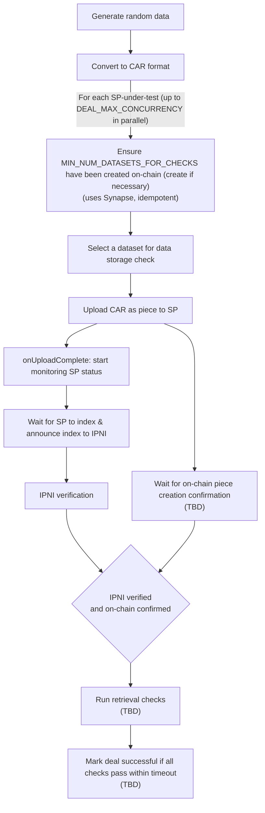
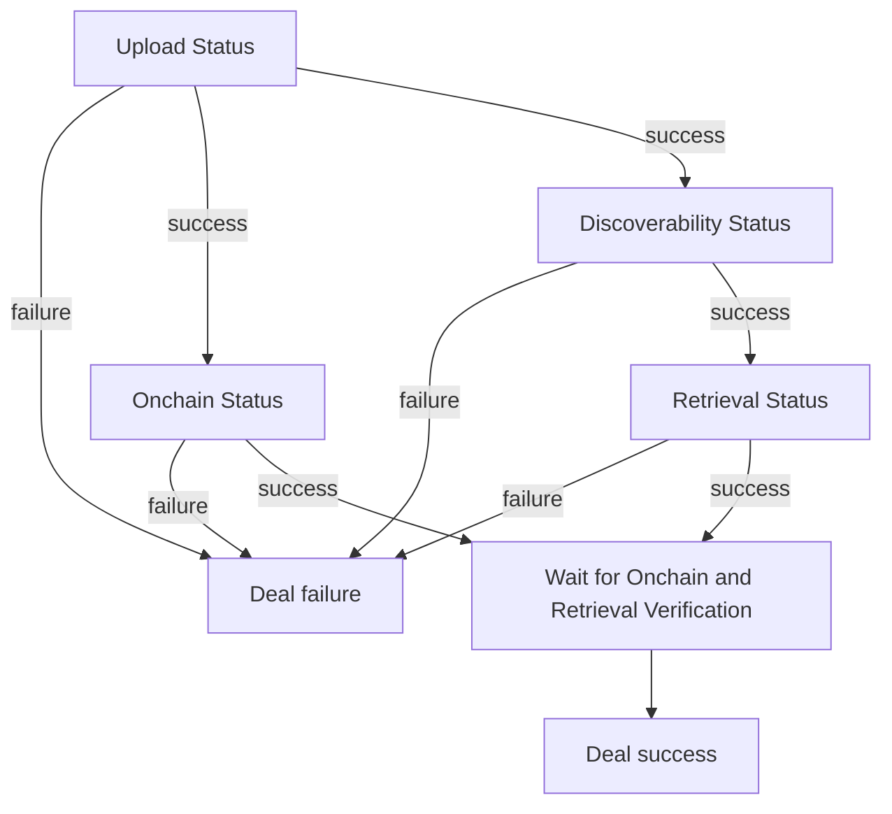

# Data Storage Check

This document is the **source of truth** for how dealbot's Data Storage check works. Items marked **TBD** are not yet implemented; code changes will follow.

Source code links throughout this document point to the current implementation.

For event and metric definitions used by the dashboard, see [Dealbot Events & Metrics](./events-and-metrics.md).

## Overview

A "deal" is dealbot's end-to-end test of uploading a piece to a storage provider (SP). Every deal cycle, dealbot:

1. Generates a random data file
2. Converts it to [CAR format](https://ipld.io/specs/transport/car/)
3. Uploads the CAR to **[every testable SP](#what-sps-does-dealbot-run-data-storage-checks-against)** as a new piece in one of the [dealbot-managed datasets](#how-any-datasets-are-created-by-dealbot-per-sp-for-data-storage-checks).
4. Waits for: 
   - IPNI discoverability, meaning the SP indexes the CAR announces the index to IPNI and dealbot confirm that IPNI has the index
   - Onchain confirmation, meaning the SP sends a message adding the piece to the dataset and dealbot confirms it onchain
5. **TBD:** Runs retrieval checks as defined in [Retrieval Check](./retrievals.md) and gates deal success on those results

A deal is **not** considered successful until all required assertions pass (see below).

### Definition of Successful Data Storage Operation

A successful operation requires all assertions in the table below to pass (e.g., upload, on-chain confirmation, and **TBD:** retrieval checks).

**Failure** occurs if any step fails or the deal exceeds its max allowed time. There are no timing-based quality assertions. Operational timeouts exist to prevent jobs from running indefinitely, but they are not quality assertions. A per-deal max time limit that fails the deal if exceeded is **TBD**.

## What Gets Asserted

Each deal asserts the following for every SP:

| # | Assertion | How It's Checked | Retries | Relevant Metric for Setting a Max Duration | Implemented? |
|---|-----------|-----------------|:---:|-----------------------------------|:---:|
| 1 | SP accepts piece upload | Upload completes without error (HTTP 200); piece CID is returned | 1 | [`ingestMs`](./events-and-metrics.md#ingestms) | Yes |
| 2 | Piece submission recorded on-chain | Synapse `onPieceAdded` callback fires with a transaction hash | n/a | [`chainAddPieceMs`](./events-and-metrics.md#chainaddpiecems) | Yes |
| 3 | Piece is confirmed on-chain | Synapse `onPieceConfirmed` callback fires | n/a | [`chainConfirmPieceMs`](./events-and-metrics.md#chainconfirmpiecems) | **TBD** |
| 4 | SP indexes piece locally | PDP server reports `indexed: true` | n/a | [`indexLocalMs`](./events-and-metrics.md#indexlocalms) | Yes |
| 5 | Content is discoverable on filecoinpin.contact | IPNI index returns a <IpfsRootCid,SP> provider record | Unlimited polling with delay until timeout | [`ipniVerifyMs`](./events-and-metrics.md#ipniVerifyMs) | **TBD** |
| 6 | Content is retrievable | See [Retrieval Check](./retrievals.md) for specific assertions | See [Retrieval Check](./retrievals.md) | See [Retrieval Check](./retrievals.md) | **TBD** |
| 7 | All checks pass | Deal is not marked successful until all assertions pass within window | n/a | [`dataStorageCheckMs`](./events-and-metrics.md#dataStorageCheckMs) | **TBD** |

## Deal Lifecycle

The scheduler triggers deal creation on a configurable interval.

**Key constraint:** One data file is generated per cycle and reused across all SPs. This ensures fair comparison — every SP is tested with identical data in a given cycle.

### 1. Generate Random Data

Dealbot generates a random binary file with a unique name and embedded markers (prefix/suffix with timestamp and unique ID). The same file is reused across all SPs in the cycle.

- **File format:** `random-{timestamp}-{uniqueId}.bin`
- **Possible sizes:** 10 KiB, 10 MB, or 100 MB (configurable via `RANDOM_PIECE_SIZES`)

Source: [`dataSource.service.ts`](../../apps/backend/src/dataSource/dataSource.service.ts#L116)

### 2. Convert to CAR Format

The raw data is converted to a CAR (Content Addressable Archive) file (via `filecoin-pin` integration — **TBD**).  See https://github.com/filecoin-project/filecoin-pin/blob/master/documentation/behind-the-scenes-of-adding-a-file.md#create-car for more info.

Source: [`ipni.strategy.ts` (`convertToCar`)](../../apps/backend/src/deal-addons/strategies/ipni.strategy.ts#L530)

### 3. Determine Which SPs to Check for this Cycle

The set of **SPs under test** is determined by configuration:

- Only **active PDP providers** are eligible (dev-tagged providers are excluded)
- If `USE_ONLY_APPROVED_PROVIDERS=true` (default), only approved providers are tested

Source: [`wallet-sdk.service.ts` (`getTestingProviders`)](../../apps/backend/src/wallet-sdk/wallet-sdk.service.ts#L213)

**SP under test** are processed in parallel batches controlled by `DEAL_MAX_CONCURRENCY`. Failures for individual SPs do not block other SPs.

### 4. Upload to Each SP

For each **SP under testing** in the current batch, dealbot:

1. **Creates datasets on-chain** if necessary.  
   - This is done via the Synapse SDK (`synapse.createStorage(...)`).
   - Dataset creation is idempotent.
   - The quantity per SP is controlled by [`MIN_NUM_DATASETS_FOR_CHECKS`](#MIN_NUM_DATASETS_FOR_CHECKS).
2. **Uploads the CAR file** to the SP. Callbacks track progress:
   - `onUploadComplete` — SP confirms receipt (HTTP 2xx). Records the piece CID.
   - `onPieceAdded` — piece submission is recorded on-chain (transaction hash available).
   - `onPieceConfirmed` — **TBD**: will track chain confirmation once the callback is wired.

Source: [`deal.service.ts` (`createDeal`)](../../apps/backend/src/deal/deal.service.ts#L100)

### 5. Wait for SP to Index and Announce Index to IPNI

After upload completes, dealbot polls the SP's PDP server to track the piece through its indexing lifecycle:

| PDP SP Status | Meaning |
|--------|---------|
| `sp_indexed` | SP has indexed the piece locally.  Any CID in the CAR it is now retrievable with `/ipfs/$CID` retrieval |
| `sp_advertised` | SP has announced the piece index to IPNI. (In IPNI terminology this is "advertisement announcement" (see [docs](https://docs.cid.contact/filecoin-network-indexer/technical-walkthrough))) |

- **Poll interval:** 2.5 seconds (see `TBD_VARIABLE`)

Once the SP reports `sp_indexed`, the content is retrievable via the SP's `/ipfs` endpoint.  That said, it may not be discoverable by the rest of the network. This is the trigger for the next step.

Source: [`ipni.strategy.ts` (`monitorPieceStatus`)](../../apps/backend/src/deal-addons/strategies/ipni.strategy.ts#L343)

### 6. Verify IPNI indexing

After the SP advertises the piece index to IPNI, dealbot ensures the uploaded piece can be discovered by others with [standard IPFS tooling](https://github.com/filecoin-project/filecoin-pin/blob/master/documentation/glossary.md#standard-ipfs-tooling).  It does this by polling filecoinpin.contact for a valid provider record for the <IPFSRootCid,SP>.  

This uses the `waitForIpniProviderResults` function from the `filecoin-pin` library.

- **Polling interval:** 5 seconds (see `TBD_VARIABLE`)

Source: [`ipni.strategy.ts` (`monitorAndVerifyIPNI`)](../../apps/backend/src/deal-addons/strategies/ipni.strategy.ts#L239)

### 7. Retrieve and Verify Content — **TBD**

See [Retrieval Check](./retrievals.md) for the specifics of retrieving and  verifying the returned bytes match the CID.

## Deal Status Progression

A deal's **overall status** is a function of four sub-statuses: **Upload**, **Onchain**, **Discoverability**, and **Retrieval**. The deal **succeeds** only if all four report success; **if any one fails**, the overall deal is a failure. The flow is sequential at the start, then branches:

1. **Upload** must succeed first.
2. After upload succeeds, **Onchain** and **Discoverability** run in parallel (two branches).
3. After **Discoverability** succeeds, **Retrieval** runs.

---

### Sub-status meanings

| Upload Status | Meaning |
|--------|---------|
| `pending` | Piece upload to the SP hasn't started. |
| `success` | SP confirmed receipt of the piece (piece CID assigned). |
| `failure` | Failed to upload within the allotted time.

| Onchain Status | Meaning |
|--------|---------|
| `pending` | Onchain verification hasn't started yet because waiting for successful upload. |
| `success` | Piece confirmed on-chain (transaction hash recorded). |
| `failure` | Failed to confirm piece onchain within the allotted time. |

| Discoverability Status | Meaning |
|--------|---------|
| `pending` | Discoverability verification hasn't started yet because waiting for successful upload. |
| `sp_indexed` | SP indexed the piece locally |
| `sp_announced_advertisement` | SP announced the local index to IPNI so IPNI can pull it from the SP |
| `success` | Root CID is discoverable via IPNI and the SP is listed as a provider in the IPNI response. |
| `failed` | Dealbot failed to confirm <IPFSRootCid,SP> provider record within the allotted time |

| Retrieval Status | Meaning |
|--------|---------|
| `pending` | Retrieval checking hasn't started yet because discoverability verification hasn't started yet. |
| `success` | Piece was retrieved and verified with [standard IPFS tooling](https://github.com/filecoin-project/filecoin-pin/blob/master/documentation/glossary.md#standard-ipfs-tooling).  |
| `failed` | Piece wasn't retrieved and verified within the allotted time. |

Sources: 
- [`types.ts` (`DealStatus`)](../../apps/backend/src/database/types.ts#L1)
- [`types.ts` (`IpniStatus`)](../../apps/backend/src/database/types.ts#L28)

## Metrics Recorded

Metric definitions live in [Dealbot Events & Metrics](./events-and-metrics.md). 

## Configuration

Key environment variables that control deal creation behavior:

| Variable | Default | Description |
|----------|---------|-------------|
| `DEAL_INTERVAL_SECONDS` | `30` | How often deal creation runs |
| `ENABLE_IPNI_TESTING` | `always` | IPNI mode: `always`, `random`, or `disabled` |
| `ENABLE_CDN_TESTING` | `true` | Whether CDN is randomly enabled for deals |
| `RANDOM_PIECE_SIZES` | `10240,10485760,104857600` | Possible random file sizes in bytes (10 KiB, 10 MB, 100 MB) |
| `USE_ONLY_APPROVED_PROVIDERS` | `true` | Only test approved SPs |
| `DEAL_START_OFFSET_SECONDS` | `0` | Delay before first deal creation run |
| `DEAL_MAX_CONCURRENCY` | **TBD** | Max number of SPs processed in parallel |
| `MIN_NUM_DATASETS_FOR_CHECKS` | **TBD** (I assume this will be 1) | Minimum number of datasets to create on-chain for each SP.  The usecase for setting this greater than one is if you want an SP to have more non-empty datasets. |

Source: [`apps/backend/src/config/app.config.ts`](../../apps/backend/src/config/app.config.ts)

See also: [`docs/environment-variables.md`](../environment-variables.md) for the full configuration reference.

## Retries and Polling

TODO: remove this....

- **Piece status polling:** Dealbot polls the PDP SP for `indexed`/`advertised` status until the polling timeout.
- **IPNI verification retries:** `waitForIpniProviderResults` retries IPNI lookups with a fixed delay between attempts, bounded by the configured IPNI timeout.
- **Upload retries:** No explicit upload retry logic is implemented in dealbot; failures are surfaced by the SDK and mark the deal as failed.

Source: [`ipni.strategy.ts`](../../apps/backend/src/deal-addons/strategies/ipni.strategy.ts#L239), [`ipni.strategy.ts`](../../apps/backend/src/deal-addons/strategies/ipni.strategy.ts#L343)

## TBD Summary

The following items are **TBD**:

| Item | Description |
|------|-------------|
| Inline retrieval verification | After SP indexes, immediately retrieve and verify content as part of the deal flow — deal must not be marked successful until retrieval passes (separate scheduled job until inline verification lands) |
| CID-based content verification | Verify retrieved content by re-computing CID and comparing to upload-time CID (size-check only until CID verification lands) |
| Per-deal max time limit | If the entire deal (all steps) does not complete within a configurable max time, mark the deal as failed. Operational timeouts prevent infinite runs but are not treated as a quality assertion that fails the deal. |
| Deal gated on all checks | Deal should not be marked successful until retrieval and IPNI verification pass (IPNI runs async until gating is implemented) |
| Status model update | Deal statuses may need new states to reflect retrieval and IPNI verification gates |
| `onPieceConfirmed` callback tracking | Track `onPieceConfirmed` callback as a distinct step — piece confirmed on-chain (only `onPieceAdded` is tracked as a deal status gate until this lands) |
| IPFS gateway retrieval verification | After SP indexes, retrieve content via the SP IPFS gateway (`/ipfs/{rootCid}`) and verify it before the deal can pass |
| `filecoin-pin` CAR conversion | CAR conversion should use the `filecoin-pin` library integration (local implementation in `ipni.strategy.ts` until this lands) |

## FAQ

### Why do we check filecoinpin.contact rather than cid.contact?

See https://github.com/filecoin-project/filecoin-pin/blob/master/documentation/content-routing-faq.md#why-is-there-filecoinpincontact-and-cidcontact
