# Dealbot Events & Metrics

This document is the **source of truth** for the events emitted by dealbot checks and the metrics computed from them. It is intended for dashboard consumers and maintainers who need to understand what each metric means and where it comes from.

This document describes the expected flow and metrics. Items marked **TBD** are not yet implemented.

## Event Model

Events are grouped by check type. Each event includes a short definition, its implementation status, and a link to the expected source of truth.

### Event Timeline

```mermaid
sequenceDiagram
  autonumber
  participant Dealbot
  participant SP as PDP Storage Provider
  participant RPC as Chain RPC Provider
  participant IPNI as filecoinpin.contact IPNI Instance
  participant Retrieval as Retrieval Job

  rect rgb(50, 50, 50)
    %% Data Storage Only
    Dealbot->>SP: uploadToSpStart
    SP-->>Dealbot: uploadToSpEnd (2xx, piece CID)
    Dealbot-->>Dealbot: dealCreated (upload result returned)
    SP-->>Dealbot: pieceAdded (tx hash, async)
    RPC-->>Dealbot: pieceConfirmed (TBD, async)
    SP-->>Dealbot: spIndexingComplete
    SP-->>Dealbot: spAnnouncedAdvertisementToIpni
    Dealbot->>IPNI: ipniVerificationStart (TBD)
    IPNI-->>Dealbot: ipniVerificationComplete
  end

  Retrieval-->>SP: ipfsRetrievalStart (TBD)
  SP-->>Retrieval: ipfsRetrievalFirstByteReceived (TBD)
  SP-->>Retrieval: ipfsRetrievalLastByteReceived (TBD)
  Dealbot-->>Dealbot: ipfsRetrievalIntegrityChecked (TBD)
```

### Event List

| Event | Definition | Relevant Checks | Implemented | Source of truth |
|------|------------|:------:|:------:|-----------------|
| `uploadToSpStart` | Dealbot is about to start an upload attempt for a piece to an SP. | Data Storage | **TBD** | [`deal.service.ts`](../../apps/backend/src/deal/deal.service.ts) |
| `uploadToSpEnd` | Upload finishes when the PDP server returns a 2xx; piece CID is known; ingest metrics are recorded. | Data Storage | Yes | [`deal.service.ts`](../../apps/backend/src/deal/deal.service.ts) (`handleUploadComplete`) |
| `pieceAdded` | Piece submission is recorded on-chain by polling the PDP SP; transaction hash is known. | Data Storage | Yes | [`deal.service.ts`](../../apps/backend/src/deal/deal.service.ts) (`handleRootAdded`) |
| `pieceConfirmed` | Piece is confirmed on-chain by polling a chain RPC endpoint. | Data Storage | **TBD** | Synapse SDK callback (not yet tracked) |
| `dealCreated` | Deal is marked `DEAL_CREATED` after the upload result is returned. | Data Storage | Yes | [`deal.service.ts`](../../apps/backend/src/deal/deal.service.ts) (`updateDealWithUploadResult`) |
| `spIndexingComplete` | By polling SP, dealbot learned SP has indexed the piece locally (`indexed=true`). | Data Storage | Yes | [`ipni.strategy.ts`](../../apps/backend/src/deal-addons/strategies/ipni.strategy.ts) |
| `spAnnouncedAdvertisementToIpni` | By polling SP, dealbot learned SP has announced the advertisement to IPNI (`advertised=true`). | Data Storage | Yes | [`ipni.strategy.ts`](../../apps/backend/src/deal-addons/strategies/ipni.strategy.ts) |
| `ipniVerificationStart` | Dealbot begins polling filecoinpin.contact for <IpfsRootCid,SP> provider record. | Data Storage, Retrieval | **TBD** | [`ipni.strategy.ts`](../../apps/backend/src/deal-addons/strategies/ipni.strategy.ts) |
| `ipniVerificationComplete` | IPNI verification completes (pass or timeout) for root CID + provider. | Data Storage, Retrieval | Yes | [`ipni.strategy.ts`](../../apps/backend/src/deal-addons/strategies/ipni.strategy.ts) |
| `ipfsRetrievalStart` | Dealbot to SP `/ipfs/` retrieval begins. | Data Storage, Retrieval | **TBD** | [`retrieval.service.ts`](../../apps/backend/src/retrieval/retrieval.service.ts) |
| `ipfsRetrievalFirstByteReceived` | First byte received from `/ipfs/{rootCid}`. | Data Storage, Retrieval | **TBD** | [`retrieval.service.ts`](../../apps/backend/src/retrieval/retrieval.service.ts) |
| `ipfsRetrievalLastByteReceived` | Last byte received from `/ipfs/{rootCid}`. | Data Storage, Retrieval |**TBD** | [`retrieval.service.ts`](../../apps/backend/src/retrieval/retrieval.service.ts) |
| `ipfsRetrievalIntegrityChecked` | Retrieved content matches expected CID. | Data Storage, Retrieval | **TBD** | [`retrieval.service.ts`](../../apps/backend/src/retrieval/retrieval.service.ts) |

## Metrics

* The metrics below are derived from the events above. 
* They are exported via Prometheus and recorded on deal or retrieval entities in the database.
* All Prometheus/OpenTelemetry metrics have a label/attribute of `checkType=dataStprage|retrieval`.

### Time Related Metrics

* All time-related metrics are emitted as histograms.
* Histogram buckets are defined in **TBD** .

| Metric | Relevant Checks | Timer Starts | Timer Ends | Additional Info | Source of truth |
|--------|----------------|--------------|------------|-----------------|-----------------|
| `ingestMs` | Data Storage | [`uploadToSpStart`](#uploadToSpStart) | [`uploadToSpEnd`](#uploadToSpEnd) |  | [`deal.service.ts`](../../apps/backend/src/deal/deal.service.ts) |
| `ingestThroughputBps` | Data Storage | n/a | n/a | `(uploadedPieceBytes / ingestMs) * 1000` | [`deal.service.ts`](../../apps/backend/src/deal/deal.service.ts) |
| `pieceConfirmedOnChainMs` | Data Storage | [`uploadToSpEnd`](#uploadToSpEnd) | [`pieceConfirmed`](#pieceConfirmed) |  | [`deal.service.ts`](../../apps/backend/src/deal/deal.service.ts) |
| `spIndexLocallyMs` | Data Storage | [`uploadToSpEnd`](#uploadToSpEnd) | [`spIndexingComplete`](#spIndexingComplete) |  | [`ipni.strategy.ts`](../../apps/backend/src/deal-addons/strategies/ipni.strategy.ts) |
| `spAnnounceAdvertisementMs` | Data Storage | [`uploadToSpEnd`](#uploadToSpEnd) | [`spAdvertisedToIpni`](#spAdvertisedToIpni) |  | [`ipni.strategy.ts`](../../apps/backend/src/deal-addons/strategies/ipni.strategy.ts) |
| `ipniVerifyMs` | Data Storage, Retrieval | [`spIndexingComplete`](#spIndexingComplete) | [`verifyIpniAdvertisement`](#verifyIpniAdvertisement) |  | [`ipni.strategy.ts`](../../apps/backend/src/deal-addons/strategies/ipni.strategy.ts) |
| `ipfsRetrievalFirstByteMs` | Data Storage, Retrieval | [`ipfsRetrievalStart`](#ipfsRetrievalStart) | [`ipfsRetrievalFirstByteReceived`](#ipfsRetrievalFirstByteReceived) |  | [`retrieval.service.ts`](../../apps/backend/src/retrieval/retrieval.service.ts) |
| `ipfsRetrievalLastByteMs` | Data Storage, Retrieval | [`ipfsRetrievalStart`](#ipfsRetrievalStart) | [`ipfsRetrievalLastByteReceived`](#ipfsRetrievalLastByteReceived) |  | [`retrieval.service.ts`](../../apps/backend/src/retrieval/retrieval.service.ts) |
| `ipfsRetrievalThroughputBps` | Data Storage, Retrieval | n/a | n/a | `(downloadedCarBytes / ipfsRetrievalLastByteMs) * 1000 | [`retrieval.service.ts`](../../apps/backend/src/retrieval/retrieval.service.ts) |
| `dataStorageCheckMs` | Data Storage | [`uploadToSpStart`](#uploadToSpStart) | [`ipfsRetrievalIntegrityChecked`](#ipfsRetrievalIntegrityChecked) |  | |
| `retrievalCheckMs` | Retrieval | [`verifyIpniAdvertisement`](#verifyIpniAdvertisement) | [`ipfsRetrievalIntegrityChecked`](#ipfsRetrievalIntegrityChecked) |  | |

### Count Related Metrics

* All count-related metrics have a label/attribute like `success|failure` or `200`.

| Metric | Relevant Checks | When Emmitted | Additional Info | Source of truth |
|--------|----------------|--------------|------------|-----------------|-----------------|
| `dataStorageUploadStatus` | Data Storage | [`uploadToSpEnd`](#uploadToSpEnd) when successful |  | 
| `dataStorageOnchainStatus` | Data Storage | [`pieceConfirmed`](#pieceConfirmed) when successful |  |  | |
| `discoverabilityStatus` | Data Storage, Retrieval | [`ipniVerificationComplete`](#ipniVerificationComplete) when successful |  |  | |
| `ipfsRetrievalHttpResponseCode` | Data Storage, Retrieval | [`ipfsRetrievalLastByteReceived`](#ipfsRetrievalLastByteReceived) |  | [`retrieval.service.ts`](../../apps/backend/src/retrieval/retrieval.service.ts) |
| `retrievalStatus` | Data Storage, Retrieval | [`ipfsRetrievalIntegrityChecked`](#ipfsRetrievalIntegrityChecked) when successful |  |  | |
