# Dealbot Events & Metrics

This document is the intended **source of truth** for the events emitted by dealbot [checks](./README.md#check) and the metrics computed from them. It is intended for dealbot dashboard consumers and maintainers who need to understand what each metric means and where it comes from.

This document describes the expected flow and metrics. Items marked **TBD** are not yet implemented but will get reviewed and cleaned up as part of https://github.com/FilOzone/dealbot/issues/280.

## Event Model

### Event Timeline

Below are the sequence of events for a Data Storage check.  The Data Storage flow is used because it encapsulates a Retrieval check as well.

```mermaid
sequenceDiagram
  autonumber
  participant Dealbot
  participant SP as PDP Storage Provider
  participant RPC as Chain RPC Provider
  participant IPNI as filecoinpin.contact IPNI Instance

  rect rgb(50, 50, 50)
    %% Data Storage Only
    Dealbot->>SP: uploadToSpStart
    SP-->>Dealbot: uploadToSpEnd (2xx, piece CID)
    Dealbot-->>Dealbot: dealCreated (upload result returned)
    SP-->>Dealbot: pieceAdded (tx hash, async)
    RPC-->>Dealbot: pieceConfirmed (TBD, async)
    SP-->>Dealbot: spIndexingComplete
    SP-->>Dealbot: spAnnouncedAdvertisementToIpni
  end

  Dealbot->>IPNI: ipniVerificationStart (TBD)
  IPNI-->>Dealbot: ipniVerificationComplete
  Dealbot-->>SP: ipfsRetrievalStart (TBD)
  SP-->>Dealbot: ipfsRetrievalFirstByteReceived (TBD)
  SP-->>Dealbot: ipfsRetrievalLastByteReceived (TBD)
  Dealbot-->>Dealbot: ipfsRetrievalIntegrityChecked (TBD)
```

### Event List

| Event | Definition | Relevant Checks | Implemented | Source of truth |
|------|------------|:------:|:------:|-----------------|
| `uploadToSpStart` | Dealbot is about to start an upload attempt for a piece to an SP. | Data Storage | **TBD** | [`deal.service.ts`](../../apps/backend/src/deal/deal.service.ts) |
| `uploadToSpEnd` | Upload finished (success with HTTP 2xx, failure). | Data Storage | Yes | [`deal.service.ts`](../../apps/backend/src/deal/deal.service.ts) (`handleUploadComplete`) |
| `dealCreated` | Deal is marked `DEAL_CREATED` if the upload result is successful. | Data Storage | Yes | [`deal.service.ts`](../../apps/backend/src/deal/deal.service.ts) (`updateDealWithUploadResult`) |
| `pieceAdded` | Piece submission is recorded on-chain by polling the PDP SP; transaction hash is known. | Data Storage | Yes | [`deal.service.ts`](../../apps/backend/src/deal/deal.service.ts) (`handleRootAdded`) |
| `pieceConfirmed` | Piece is confirmed on-chain by polling a chain RPC endpoint. | Data Storage | **TBD** | Synapse SDK callback (not yet tracked) |
| `spIndexingComplete` | By polling SP, dealbot learned SP has indexed the piece locally (`indexed=true`). | Data Storage | Yes | [`ipni.strategy.ts`](../../apps/backend/src/deal-addons/strategies/ipni.strategy.ts) |
| `spAnnouncedAdvertisementToIpni` | By polling SP, dealbot learned SP has announced the advertisement to IPNI (`advertised=true`). | Data Storage | Yes | [`ipni.strategy.ts`](../../apps/backend/src/deal-addons/strategies/ipni.strategy.ts) |
| `ipniVerificationStart` | Dealbot begins polling filecoinpin.contact for <IpfsRootCid,SP> provider record. | Data Storage, Retrieval | **TBD** | [`ipni.strategy.ts`](../../apps/backend/src/deal-addons/strategies/ipni.strategy.ts) |
| `ipniVerificationComplete` | IPNI verification completes (pass or timeout). | Data Storage, Retrieval | Yes | [`ipni.strategy.ts`](../../apps/backend/src/deal-addons/strategies/ipni.strategy.ts) |
| `ipfsRetrievalStart` | Dealbot to SP `/ipfs/` retrieval begins. | Data Storage, Retrieval | **TBD** | [`retrieval.service.ts`](../../apps/backend/src/retrieval/retrieval.service.ts) |
| `ipfsRetrievalFirstByteReceived` | First byte received from `/ipfs/{rootCid}`. | Data Storage, Retrieval | **TBD** | [`retrieval.service.ts`](../../apps/backend/src/retrieval/retrieval.service.ts) |
| `ipfsRetrievalLastByteReceived` | Last byte received from `/ipfs/{rootCid}`. | Data Storage, Retrieval |**TBD** | [`retrieval.service.ts`](../../apps/backend/src/retrieval/retrieval.service.ts) |
| `ipfsRetrievalIntegrityChecked` | Retrieved content matches expected CID. | Data Storage, Retrieval | **TBD** | [`retrieval.service.ts`](../../apps/backend/src/retrieval/retrieval.service.ts) |

## Metrics

* The metrics below are derived from the [events above](#event-list).
* They are exported via Prometheus.
* All Prometheus/OpenTelemetry metrics have label/attributes for:
   - `checkType=dataStorage|retrieval` — attribute metrics to a particular check
   - `providerId` — attribute metrics to a particular SP
   - `providerStatus=approved|unapproved` — attribute metrics to only approved SPs for example

### Time Related Metrics

* All time-related metrics are emitted as histograms.
* Histogram buckets are defined in **TBD** .

| Metric | Relevant Checks | Timer Starts | Timer Ends | Additional Info | Source of truth |
|--------|----------------|--------------|------------|-----------------|-----------------|
| `ingestMs` | Data Storage | [`uploadToSpStart`](#uploadToSpStart) | [`uploadToSpEnd`](#uploadToSpEnd) |  | [`deal.service.ts`](../../apps/backend/src/deal/deal.service.ts) |
| `ingestThroughputBps` | Data Storage | n/a | n/a | `(uploadedPieceBytes / ingestMs) * 1000` | [`deal.service.ts`](../../apps/backend/src/deal/deal.service.ts) |
| `pieceAddedOnChainMs` | Data Storage | [`uploadToSpEnd`](#uploadToSpEnd) | [`pieceAdded`](#pieceAdded) |  | [`deal.service.ts`](../../apps/backend/src/deal/deal.service.ts) |
| `pieceConfirmedOnChainMs` | Data Storage | [`pieceAdded`](#pieceAdded) | [`pieceConfirmed`](#pieceConfirmed) |  | [`deal.service.ts`](../../apps/backend/src/deal/deal.service.ts) |
| `spIndexLocallyMs` | Data Storage | [`uploadToSpEnd`](#uploadToSpEnd) | [`spIndexingComplete`](#spIndexingComplete) |  | [`ipni.strategy.ts`](../../apps/backend/src/deal-addons/strategies/ipni.strategy.ts) |
| `spAnnounceAdvertisementMs` | Data Storage | [`uploadToSpEnd`](#uploadToSpEnd) | [`spAnnouncedAdvertisementToIpni`](#spAnnouncedAdvertisementToIpni) |  | [`ipni.strategy.ts`](../../apps/backend/src/deal-addons/strategies/ipni.strategy.ts) |
| `ipniVerifyMs` | Data Storage, Retrieval | [`ipniVerificationStart`](#ipniVerificationStart) | [`ipniVerificationComplete`](#ipniVerificationComplete) |  | [`ipni.strategy.ts`](../../apps/backend/src/deal-addons/strategies/ipni.strategy.ts) |
| `ipfsRetrievalFirstByteMs` | Data Storage, Retrieval | [`ipfsRetrievalStart`](#ipfsRetrievalStart) | [`ipfsRetrievalFirstByteReceived`](#ipfsRetrievalFirstByteReceived) |  | [`retrieval.service.ts`](../../apps/backend/src/retrieval/retrieval.service.ts) |
| `ipfsRetrievalLastByteMs` | Data Storage, Retrieval | [`ipfsRetrievalStart`](#ipfsRetrievalStart) | [`ipfsRetrievalLastByteReceived`](#ipfsRetrievalLastByteReceived) |  | [`retrieval.service.ts`](../../apps/backend/src/retrieval/retrieval.service.ts) |
| `ipfsRetrievalThroughputBps` | Data Storage, Retrieval | n/a | n/a | `(downloadedCarBytes / ipfsRetrievalLastByteMs) * 1000` | [`retrieval.service.ts`](../../apps/backend/src/retrieval/retrieval.service.ts) |
| `dataStorageCheckMs` | Data Storage | [`uploadToSpStart`](#uploadToSpStart) | [`ipfsRetrievalIntegrityChecked`](#ipfsRetrievalIntegrityChecked) | Duration of a Data Storage check | |
| `retrievalCheckMs` | Retrieval | Retrieval check start | [`ipfsRetrievalIntegrityChecked`](#ipfsRetrievalIntegrityChecked) | Duration of a Retrieval check | |

### Status Count Related Metrics

- These count metrics are used to track the occurrence of a particular status for a check.
- All Prometheus/OpenTelemetry status count metrics have label/attributes for:
   - `value` — see [Sub-status meanings](./data-storage.md#sub-status-meanings) for valid values per metric
   - For `ipfsRetrievalHttpResponseCode`, `value` is one of: `200`, `500`, `2xxSuccess`, `4xxClientError`, `5xxServerError`, `otherHttpStatusCodes`, `failure`

| Metric | Relevant Checks | When Emitted In Successful Case| Additional Info | Source of truth |
|---|---|---|---|---|
| `dataStorageUploadStatus` | Data Storage | [`uploadToSpEnd`](#uploadToSpEnd) |  |  |
| `dataStorageOnchainStatus` | Data Storage | [`pieceConfirmed`](#pieceConfirmed) |  | [`deal.service.ts`](../../apps/backend/src/deal/deal.service.ts) |
| `dataStorageStatus` | Data Storage | When the Data Storage check completes (all four sub-statuses done) | Overall status: `pending`, `success`, `failure.timedout`, `failure.other`. See [Deal Status Progression](./data-storage.md#deal-status-progression). | [`deal.service.ts`](../../apps/backend/src/deal/deal.service.ts) |
| `discoverabilityStatus` | Data Storage, Retrieval | [`ipniVerificationComplete`](#ipniVerificationComplete) |  |  |
| `ipfsRetrievalHttpResponseCode` | Data Storage, Retrieval | [`ipfsRetrievalLastByteReceived`](#ipfsRetrievalLastByteReceived) |  | [`retrieval.service.ts`](../../apps/backend/src/retrieval/retrieval.service.ts) |
| `retrievalStatus` | Data Storage, Retrieval | [`ipfsRetrievalIntegrityChecked`](#ipfsRetrievalIntegrityChecked) |  |  |
