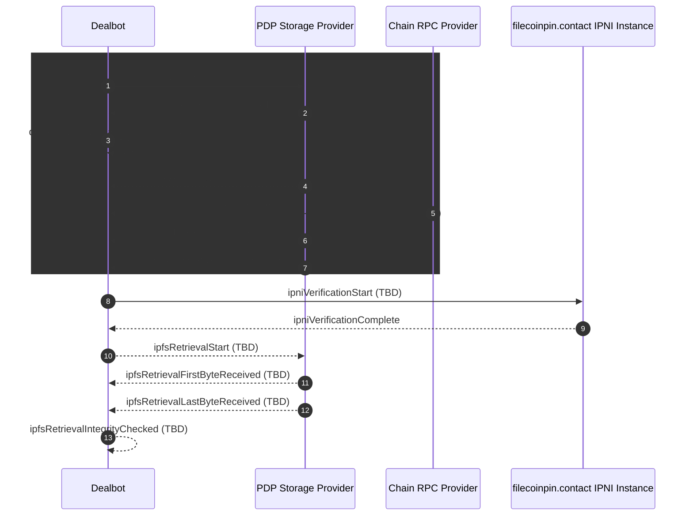
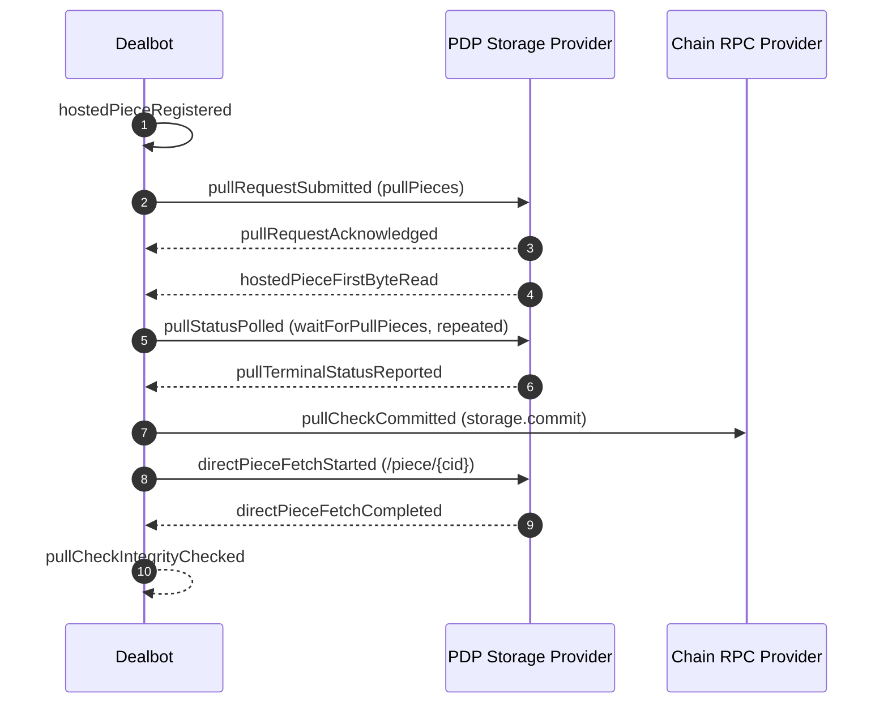

# Dealbot Events & Metrics

This document is the intended **source of truth** for the events emitted by dealbot [checks](./README.md#check) and the metrics computed from them. It is intended for dealbot dashboard consumers and maintainers who need to understand what each metric means and where it comes from.

This document describes the expected flow and metrics. Items marked **TBD** are not yet implemented but will get reviewed and cleaned up as part of https://github.com/FilOzone/dealbot/issues/280.

## Data Storage Event Model

Below are the sequence of events for a [Data Storage check](./data-storage.md).  The Data Storage flow is used because it encapsulates a [Retrieval check](./retrievals.md) as well.

### Data Storage Event Timeline

```mermaid
sequenceDiagram
  autonumber
  participant Dealbot
  participant SP as PDP Storage Provider
  participant RPC as Chain RPC Provider
  participant IPNI as filecoinpin.contact IPNI Instance

  rect rgb(50, 50, 50)
    %% Data Storage Only
    Dealbot->>SP: uploadToSpStart
    SP-->>Dealbot: uploadToSpEnd (2xx, piece CID)
    Dealbot-->>Dealbot: dealCreated (upload result returned)
    SP-->>Dealbot: pieceAdded (tx hash, async)
    RPC-->>Dealbot: pieceConfirmed (TBD, async)
    SP-->>Dealbot: spIndexingComplete
    SP-->>Dealbot: spAnnouncedAdvertisementToIpni
  end

  Dealbot->>IPNI: ipniVerificationStart (TBD)
  IPNI-->>Dealbot: ipniVerificationComplete
  Dealbot-->>SP: ipfsRetrievalStart (TBD)
  SP-->>Dealbot: ipfsRetrievalFirstByteReceived (TBD)
  SP-->>Dealbot: ipfsRetrievalLastByteReceived (TBD)
  Dealbot-->>Dealbot: ipfsRetrievalIntegrityChecked (TBD)
```

### Event List

| Event | Definition | Relevant Checks | Implemented | Source of truth |
|------|------------|:------:|:------:|-----------------|
| `uploadToSpStart` | Dealbot is about to start an upload attempt for a piece to an SP. | Data Storage | **TBD** | [`deal.service.ts`](../../apps/backend/src/deal/deal.service.ts) |
| `uploadToSpEnd` | Upload finished (success with HTTP 2xx, failure). | Data Storage | Yes | [`deal.service.ts`](../../apps/backend/src/deal/deal.service.ts) (`handleStored`) |
| `dealCreated` | Deal is marked `DEAL_CREATED` if the upload result is successful. | Data Storage | Yes | [`deal.service.ts`](../../apps/backend/src/deal/deal.service.ts) (`updateDealWithUploadResult`) |
| `pieceAdded` | Piece submission is recorded on-chain by polling the PDP SP; transaction hash is known. | Data Storage | Yes | [`deal.service.ts`](../../apps/backend/src/deal/deal.service.ts) (`handleRootAdded`) |
| `pieceConfirmed` | Piece is confirmed on-chain by polling a chain RPC endpoint. | Data Storage | **TBD** | Synapse SDK callback (not yet tracked) |
| `spIndexingComplete` | By polling SP, dealbot learned SP has indexed the piece locally (`indexed=true`). | Data Storage | Yes | [`ipni.strategy.ts`](../../apps/backend/src/deal-addons/strategies/ipni.strategy.ts) |
| `spAnnouncedAdvertisementToIpni` | By polling SP, dealbot learned SP has announced the advertisement to IPNI (`advertised=true`). | Data Storage | Yes | [`ipni.strategy.ts`](../../apps/backend/src/deal-addons/strategies/ipni.strategy.ts) |
| `ipniVerificationStart` | Dealbot begins polling filecoinpin.contact for <IpfsRootCid,SP> provider record. | Data Storage, Retrieval | **TBD** | [`ipni.strategy.ts`](../../apps/backend/src/deal-addons/strategies/ipni.strategy.ts) |
| `ipniVerificationComplete` | IPNI verification completes (pass or timeout). | Data Storage, Retrieval | Yes | [`ipni.strategy.ts`](../../apps/backend/src/deal-addons/strategies/ipni.strategy.ts) |
| `ipfsRetrievalStart` | Dealbot to SP `/ipfs/` retrieval begins. | Data Storage, Retrieval | **TBD** | [`retrieval.service.ts`](../../apps/backend/src/retrieval/retrieval.service.ts) |
| `ipfsRetrievalFirstByteReceived` | First byte received from `/ipfs/{rootCid}`. | Data Storage, Retrieval | **TBD** | [`retrieval.service.ts`](../../apps/backend/src/retrieval/retrieval.service.ts) |
| `ipfsRetrievalLastByteReceived` | Last byte received from `/ipfs/{rootCid}`. | Data Storage, Retrieval |**TBD** | [`retrieval.service.ts`](../../apps/backend/src/retrieval/retrieval.service.ts) |
| `ipfsRetrievalIntegrityChecked` | Retrieved content matches expected CID. | Data Storage, Retrieval | **TBD** | [`retrieval.service.ts`](../../apps/backend/src/retrieval/retrieval.service.ts) |

## Pull Check Event Model

Below are the events for a [Pull Check](./pull-check.md). Pull checks reverse the data flow of the [Data Storage check](./data-storage.md): instead of dealbot uploading bytes, it asks the SP to pull bytes from a temporary `/api/piece/{pieceCid}` URL.

### Pull Check Event Timeline

```mermaid
sequenceDiagram
  autonumber
  participant Dealbot
  participant SP as PDP Storage Provider
  participant RPC as Chain RPC Provider

  Dealbot->>Dealbot: hostedPieceRegistered
  Dealbot->>SP: pullRequestSubmitted (pullPieces)
  SP-->>Dealbot: pullRequestAcknowledged
  SP-->>Dealbot: hostedPieceFirstByteRead
  Dealbot->>SP: pullStatusPolled (waitForPullPieces, repeated)
  SP-->>Dealbot: pullTerminalStatusReported
  Dealbot->>RPC: pullCheckCommitted (storage.commit)
  Dealbot->>SP: directPieceFetchStarted (/piece/{cid})
  SP-->>Dealbot: directPieceFetchCompleted
  Dealbot-->>Dealbot: pullCheckIntegrityChecked
```

### Pull Check Event List

| Event | Definition | Implemented | Source of truth |
|------|------------|:------:|-----------------|
| `pullRequestSubmitted` | Dealbot calls `pullPieces` against the SP for the registered piece CID. | Yes | [`pull-check.service.ts`](../../apps/backend/src/pull-check/pull-check.service.ts) |
| `pullRequestAcknowledged` | SP returns from `pullPieces` (success or non-terminal-failure). | Yes | [`pull-check.service.ts`](../../apps/backend/src/pull-check/pull-check.service.ts) |
| `hostedPieceFirstByteRead` | SP reads the first byte of `/api/piece/{pieceCid}` from dealbot. Recorded once per registration. | Yes | [`piece-source.controller.ts`](../../apps/backend/src/pull-check/piece-source.controller.ts) |
| `pullTerminalStatusReported` | SP reports a terminal pull status (`complete`, `failed`, ...) via `waitForPullPieces`. Intermediate poll statuses are not counted. | Yes | [`pull-check.service.ts`](../../apps/backend/src/pull-check/pull-check.service.ts) |
| `pullCheckCommitted` | Synapse `storage.commit()` succeeds for the pulled piece. | Yes | [`pull-check.service.ts`](../../apps/backend/src/pull-check/pull-check.service.ts) |
| `pullCheckIntegrityChecked` | Direct `/piece/{pieceCid}` fetch from the SP returns bytes whose recomputed pieceCid matches the expected CID. | Yes | [`pull-check.service.ts`](../../apps/backend/src/pull-check/pull-check.service.ts) |

## Metrics

* Many of the metrics below are derived from the [events above](#event-list).
* They are exported via Prometheus.
* All Prometheus/OpenTelemetry metrics have label/attributes for:
   - `network=calibration|mainnet`
   - `checkType=dataStorage|retrieval|dataRetention|dataSetCreation|pullCheck` — attribute metrics to a particular check/job
   - `providerId` — attribute metrics to a particular SP
   - `providerName` — human-readable name of the SP (defaults to `"unknown"` when not available)
   - `providerStatus=approved|unapproved` — attribute metrics to only approved SPs for example

### Time Related Metrics

* All time-related metrics are emitted as histograms.
* Histogram buckets are defined in **TBD** .

| Metric | Relevant Checks | Timer Starts | Timer Ends | Additional Info | Source of truth |
|--------|----------------|--------------|------------|-----------------|-----------------|
| `ingestMs` | Data Storage | [`uploadToSpStart`](#uploadToSpStart) | [`uploadToSpEnd`](#uploadToSpEnd) |  | [`deal.service.ts`](../../apps/backend/src/deal/deal.service.ts) |
| `ingestThroughputBps` | Data Storage | n/a | n/a | `(uploadedPieceBytes / ingestMs) * 1000` | [`deal.service.ts`](../../apps/backend/src/deal/deal.service.ts) |
| `pieceAddedOnChainMs` | Data Storage | [`uploadToSpEnd`](#uploadToSpEnd) | [`pieceAdded`](#pieceAdded) |  | [`deal.service.ts`](../../apps/backend/src/deal/deal.service.ts) |
| `pieceConfirmedOnChainMs` | Data Storage | [`pieceAdded`](#pieceAdded) | [`pieceConfirmed`](#pieceConfirmed) |  | [`deal.service.ts`](../../apps/backend/src/deal/deal.service.ts) |
| `spIndexLocallyMs` | Data Storage | [`uploadToSpEnd`](#uploadToSpEnd) | [`spIndexingComplete`](#spIndexingComplete) |  | [`ipni.strategy.ts`](../../apps/backend/src/deal-addons/strategies/ipni.strategy.ts) |
| `spAnnounceAdvertisementMs` | Data Storage | [`uploadToSpEnd`](#uploadToSpEnd) | [`spAnnouncedAdvertisementToIpni`](#spAnnouncedAdvertisementToIpni) |  | [`ipni.strategy.ts`](../../apps/backend/src/deal-addons/strategies/ipni.strategy.ts) |
| `ipniVerifyMs` | Data Storage, Retrieval | [`ipniVerificationStart`](#ipniVerificationStart) | [`ipniVerificationComplete`](#ipniVerificationComplete) |  | [`ipni.strategy.ts`](../../apps/backend/src/deal-addons/strategies/ipni.strategy.ts) |
| `ipfsRetrievalFirstByteMs` | Data Storage, Retrieval | [`ipfsRetrievalStart`](#ipfsRetrievalStart) | [`ipfsRetrievalFirstByteReceived`](#ipfsRetrievalFirstByteReceived) |  | [`retrieval.service.ts`](../../apps/backend/src/retrieval/retrieval.service.ts) |
| `ipfsRetrievalBlockFirstByteMs` | Data Storage, Retrieval | Each IPFS block request | First byte received for each block | Emitted for block-fetch retrievals (one observation per block) | [`retrieval.service.ts`](../../apps/backend/src/retrieval/retrieval.service.ts) |
| `ipfsRetrievalLastByteMs` | Data Storage, Retrieval | [`ipfsRetrievalStart`](#ipfsRetrievalStart) | [`ipfsRetrievalLastByteReceived`](#ipfsRetrievalLastByteReceived) |  | [`retrieval.service.ts`](../../apps/backend/src/retrieval/retrieval.service.ts) |
| `ipfsRetrievalThroughputBps` | Data Storage, Retrieval | n/a | n/a | `(downloadedCarBytes / ipfsRetrievalLastByteMs) * 1000` | [`retrieval.service.ts`](../../apps/backend/src/retrieval/retrieval.service.ts) |
| `dataStorageCheckMs` | Data Storage | [`uploadToSpStart`](#uploadToSpStart) | [`ipfsRetrievalIntegrityChecked`](#ipfsRetrievalIntegrityChecked) | Duration of a Data Storage check | |
| `retrievalCheckMs` | Retrieval | Retrieval check start | [`ipfsRetrievalIntegrityChecked`](#ipfsRetrievalIntegrityChecked) | Duration of a Retrieval check | |
| `dataSetCreationMs` | Data-Set Creation | Data-set creation uploadToSpStart | Data-set creation pieceConfirmed | Duration of one data-set creation with confirmed piece (all using `createDataSetWithPiece`) | [`deal.service.ts`](../../apps/backend/src/deal/deal.service.ts) |
| `pullCheckRequestLatencyMs` | Pull | [`pullRequestSubmitted`](#pullRequestSubmitted) | [`pullRequestAcknowledged`](#pullRequestAcknowledged) | Time from `pullPieces` submission to SP request acknowledgement. | [`pull-check.service.ts`](../../apps/backend/src/pull-check/pull-check.service.ts) |
| `pullCheckCompletionLatencyMs` | Pull | [`pullRequestSubmitted`](#pullRequestSubmitted) | [`pullTerminalStatusReported`](#pullTerminalStatusReported) | Time from `pullPieces` submission to terminal SP pull status. Observed once on success and once on failure. | [`pull-check.service.ts`](../../apps/backend/src/pull-check/pull-check.service.ts) |
| `pullCheckFirstByteMs` | Pull | [`pullRequestSubmitted`](#pullRequestSubmitted) | [`hostedPieceFirstByteRead`](#hostedPieceFirstByteRead) | Time from `pullPieces` submission to the SP reading the first byte of `/api/piece/{pieceCid}`. Skipped (no observation) when the SP serves the pull from a local cache and never fetches from dealbot. | [`pull-check.service.ts`](../../apps/backend/src/pull-check/pull-check.service.ts), [`piece-source.controller.ts`](../../apps/backend/src/pull-check/piece-source.controller.ts) |
| `pullCheckThroughputBps` | Pull | n/a | n/a | `(pieceSizeBytes / pullCheckCompletionLatencyMs) * 1000`. Upper-bound on actual transfer rate because `pullCheckCompletionLatencyMs` includes SP-side scheduling and dealbot's polling cadence. | [`pull-check.service.ts`](../../apps/backend/src/pull-check/pull-check.service.ts) |

### Status Count Related Metrics

- These count metrics are used to track the occurrence of a particular status for a check.
- All Prometheus/OpenTelemetry status count metrics have additonal label/attributes for:
   - `value` - attribute counts to different outcomes.

| Metric | Relevant Checks | When Emitted In Successful Case| `value` Values | Source of truth |
|---|---|---|---|---|
| `dataStorageUploadStatus` | Data Storage | [`uploadToSpEnd`](#uploadToSpEnd) | `success`, `failure.timedout`, `failure.other` from [Data Storage Sub-status meanings](./data-storage.md#sub-status-meanings). |  |
| `dataStorageOnchainStatus` | Data Storage | [`pieceConfirmed`](#pieceConfirmed) | `success`, `failure.timedout`, `failure.other` frin [Data Storage Sub-status meanings](./data-storage.md#sub-status-meanings). | [`deal.service.ts`](../../apps/backend/src/deal/deal.service.ts) |
| `dataStorageStatus` | Data Storage | When the Data Storage check completes (all four sub-statuses done) | `success`, `failure.timedout`, `failure.other` from [Deal Status Progression](./data-storage.md#deal-status-progression). | [`deal.service.ts`](../../apps/backend/src/deal/deal.service.ts) |
| `discoverabilityStatus` | Data Storage, Retrieval | [`ipniVerificationComplete`](#ipniVerificationComplete) | `success`, `failure.timedout`, `failure.other` from [Data Storage Sub-status meanings](./data-storage.md#sub-status-meanings). |  |
| `ipfsRetrievalHttpResponseCode` | Data Storage, Retrieval | [`ipfsRetrievalLastByteReceived`](#ipfsRetrievalLastByteReceived) | `200`, `500`, `2xxSuccess`, `4xxClientError`, `5xxServerError`, `otherHttpStatusCodes`, `failure` | [`retrieval.service.ts`](../../apps/backend/src/retrieval/retrieval.service.ts) |
| `retrievalStatus` | Data Storage, Retrieval | [`ipfsRetrievalIntegrityChecked`](#ipfsRetrievalIntegrityChecked) | `success`, `failure.timedout`, `failure.other` from [Data Storage Sub-status meanings](./data-storage.md#sub-status-meanings). |  |
| `dataSetCreationStatus` | Data-Set Creation | Not tied to an [event above](#event-list) but rather to data-set creation start (`pending`) and completion (`success`/`failure.*`) | `pending`, `success`, `failure.timedout`, `failure.other` | [`deal.service.ts`](../../apps/backend/src/deal/deal.service.ts) |
| `dataSetChallengeStatus` | Data Retention | Emitted on each [Data Retention Check](./data-retention.md) poll when a provider's confirmed proving-period totals advance (strictly positive deltas). Unit: **challenges** (period delta × `CHALLENGES_PER_PROVING_PERIOD = 5`). | `success` (challenges in successfully-proven periods), `failure` (challenges in faulted periods) | [`data-retention.service.ts`](../../apps/backend/src/data-retention/data-retention.service.ts) |
| `pdp_provider_estimated_overdue_periods` | Data Retention | Emitted on every [Data Retention Check](./data-retention.md) poll for every successfully processed provider. | Gauge value in proving periods (non-negative integer) | [`data-retention.service.ts`](../../apps/backend/src/data-retention/data-retention.service.ts) |
| `pullCheckStatus` | Pull | When the [Pull Check](./pull-check.md) terminates (success after commit + direct piece validation, or any failure). Recorded exactly once per check. | `success`, `failure.timedout`, `failure.other`. Failure classification follows [`classifyFailureStatus`](../../apps/backend/src/metrics-prometheus/check-metric-labels.ts) (timeout-keyed errors → `failure.timedout`, everything else → `failure.other`). | [`pull-check.service.ts`](../../apps/backend/src/pull-check/pull-check.service.ts) |
| `pullCheckProviderStatus` | Pull | When the SP reports a terminal pull status via `waitForPullPieces`. Recorded exactly once per check (intermediate poll statuses are not counted). | Raw SP-reported pull status, for example `complete`, `failed`, `not_found`. Use this to separate SP-side pull failures from dealbot-side commit/validation failures. | [`pull-check.service.ts`](../../apps/backend/src/pull-check/pull-check.service.ts) |

## ClickHouse Tables

When `CLICKHOUSE_URL` is configured, dealbot writes one row per check result to ClickHouse for long-term storage and analysis. All tables are partitioned by month with a 1-year TTL.

> **Source of truth**: the DDL and column-level comments in [`clickhouse.schema.ts`](../../apps/backend/src/clickhouse/clickhouse.schema.ts) are authoritative. The summary below is for orientation only.

- **`data_storage_checks`** — one row written each time a deal is saved (on every status transition). Populated by [`deal.service.ts`](../../apps/backend/src/deal/deal.service.ts).
- **`retrieval_checks`** — one row per retrieval attempt. Populated by [`retrieval.service.ts`](../../apps/backend/src/retrieval/retrieval.service.ts).
- **`data_retention_challenges`** — one row per provider per poll cycle. Populated by [`data-retention.service.ts`](../../apps/backend/src/data-retention/data-retention.service.ts).

All tables share the primary key `(probe_location, sp_address, timestamp)`:

- `probe_location` - identifies which dealbot instance produced the row, allowing multiple deployments to be distinguished in queries (set via `DEALBOT_PROBE_LOCATION`)
- `sp_address` - the Ethereum/FEVM address of the storage provider under test
- `timestamp` - when the row was written (milliseconds UTC)
