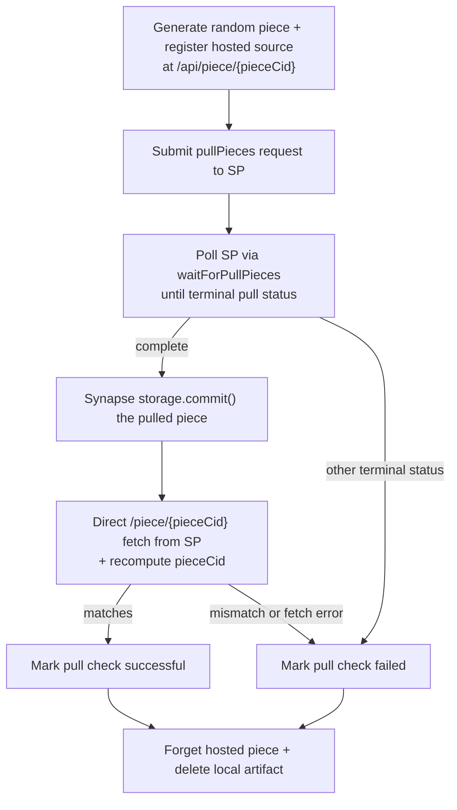

# Pull Check

This document is the **source of truth** for how dealbot's Pull check works.

Source code links throughout this document point to the current implementation.

For event and metric definitions used by the dashboard, see [Dealbot Events & Metrics](./events-and-metrics.md).

## Overview

A "pull check" exercises the **storage provider pull-to-park pathway**: dealbot publishes a temporary piece at `/api/piece/{pieceCid}`, asks the SP to fetch (pull) and park it via the Synapse `pullPieces` API, waits for a terminal SP pull status, commits the pulled piece on-chain, and finally re-fetches the piece from the SP to verify byte-for-byte integrity.

The pull check answers a different question than the [Data Storage check](./data-storage.md): instead of *uploading* bytes to the SP, it asks the SP to *pull* bytes from a public URL. This validates an SP's outbound HTTP fetcher, the pull request lifecycle, and the resulting on-chain commit and retrieval surface.

A successful pull check requires all [assertions in the table below](#what-gets-asserted) to pass. Failure occurs if any step fails or the job exceeds its max allowed time. Operational timeouts exist to prevent jobs from running indefinitely, but they are not quality assertions.

> **Where results live:** Pull check results are exported to Prometheus and structured logs only. They are **not** persisted in Postgres or written to ClickHouse. Committed pull-check pieces are also **not** tracked in the `deals` table, so the [Piece Cleanup](../environment-variables.md#piece-cleanup) job will not garbage-collect them; they will accrue on the SP unless explicitly removed.

## What Gets Asserted

Each pull check asserts the following for every SP:

| # | Assertion | How It's Checked | Retries | Relevant Metric for Setting a Max Duration | Implemented? |
|---|-----------|------------------|:---:|--------------------------------------------|:---:|
| 1 | SP accepts the pull request | `pullPieces` returns without error and reports a non-terminal-failure status | 0 | [`pullCheckRequestLatencyMs`](./events-and-metrics.md#pullCheckRequestLatencyMs) | Yes |
| 2 | SP reaches a terminal `complete` pull status | `waitForPullPieces` polls the SP until a terminal status is reported | Polling with delay until [`PULL_CHECK_JOB_TIMEOUT_SECONDS`](../environment-variables.md#pull_check_job_timeout_seconds) | [`pullCheckCompletionLatencyMs`](./events-and-metrics.md#pullCheckCompletionLatencyMs) | Yes |
| 3 | SP records the piece on-chain | Synapse `storage.commit()` succeeds for the pulled piece | n/a | n/a (bounded by job timeout) | Yes |
| 4 | SP serves the pulled piece via `/piece/{pieceCid}` | Re-fetch the bytes from the SP's PDP service URL and re-compute the piece CID | 0 | n/a (bounded by job timeout) | Yes |
| 5 | All checks pass | Pull check is not marked successful until all assertions pass within the job timeout | n/a | [`pullCheckCompletionLatencyMs`](./events-and-metrics.md#pullCheckCompletionLatencyMs) | Yes |

## Pull Check Lifecycle

The dealbot scheduler triggers pull check jobs at a configurable rate (`PULL_CHECKS_PER_SP_PER_HOUR`).

### 1. Prepare the hosted piece

Dealbot generates a random binary file, computes its piece CID, and registers it in an in-memory `HostedPieceRegistry`. The registration carries a TTL controlled by `PULL_CHECK_HOSTED_PIECE_TTL_SECONDS` so the source remains available for the entire pull window.

The source URL handed to the SP is built from the dealbot `app.apiPublicUrl` config (set via `DEALBOT_API_PUBLIC_URL`). When `DEALBOT_API_PUBLIC_URL` is unset, dealbot falls back to `http://{DEALBOT_HOST}:{DEALBOT_PORT}`, which is only reachable in single-host or `localhost` setups.

- **File format:** `random-{timestamp}-{uniqueId}.bin`
- **Default size:** `PULL_CHECK_PIECE_SIZE_BYTES` (default 10 MiB)
- **Source URL:** `{apiPublicUrl}/api/piece/{pieceCid}`

Source: [`pull-check.service.ts` (`prepareHostedPiece`)](../../apps/backend/src/pull-check/pull-check.service.ts), [`hosted-piece.registry.ts`](../../apps/backend/src/pull-check/hosted-piece.registry.ts)

### 2. Submit the pull request

Dealbot calls `pullPieces` from `@filoz/synapse-core/sp` with the pieceCid, the source URL, and either the SP's existing `dataSetId`/`clientDataSetId` or the SP `payee` for new-dataset flows. The submission timestamp is stamped on the registration so it can later be subtracted from the first-byte event.

Source: [`pull-check.service.ts` (`runPullCheck`)](../../apps/backend/src/pull-check/pull-check.service.ts)

### 3. Wait for terminal SP pull status

`waitForPullPieces` polls the SP at `PULL_CHECK_POLL_INTERVAL_SECONDS` until the SP reports a terminal status (`complete` or `failed`) or the job timeout fires. Dealbot increments the [`pullCheckProviderStatus`](./events-and-metrics.md#pullCheckProviderStatus) counter exactly once with the **terminal** status; intermediate poll statuses are not counted.

When the SP fetches `/api/piece/{pieceCid}` for the first time, the controller stamps a first-byte timestamp on the registration. This is the basis for [`pullCheckFirstByteMs`](./events-and-metrics.md#pullCheckFirstByteMs).

Source: [`piece-source.controller.ts`](../../apps/backend/src/pull-check/piece-source.controller.ts)

### 4. Commit the piece on-chain

When the terminal pull status is `complete`, dealbot calls `synapse.storage.commit({ pieces: [{ pieceCid }] })`. Pull-check pieces are committed without `pieceMetadata` because the synthetic content has no meaningful IPFS root CID and including a synthetic one would corrupt downstream IPNI advertising.

A failure here marks the pull check as `failure.other` and aborts before validation.

### 5. Direct piece-fetch validation

After commit, dealbot fetches `{serviceURL}/piece/{pieceCid}` from the SP, re-computes the piece CID over the response body, and compares it against the expected CID. A mismatch fails the pull check with `failure.other`. A network or HTTP error during validation also fails the check (transport errors are intentionally not retried).

Aborts (job timeout) propagate as throws and are classified as `failure.timedout` rather than as a validation failure.

Source: [`pull-check.service.ts` (`validateByDirectPieceFetch`)](../../apps/backend/src/pull-check/pull-check.service.ts)

### 6. Cleanup

Whether the pull check succeeds or fails, the `finally` block:

1. Marks the registration as cleaned up (so subsequent `/api/piece/{pieceCid}` requests return HTTP 410 Gone instead of 200).
2. Removes the on-disk dataset artifact via `DataSourceService.cleanupRandomDataset`.
3. Forgets the registration entry so the controller returns HTTP 404 Not Found for any later requests.

Cleanup errors are logged at WARN level but do not propagate, so a transient cleanup failure cannot mask a successful pull check.

## Pull Check Status Progression

A pull check has a single terminal status, recorded once per check via [`pullCheckStatus`](./events-and-metrics.md#pullCheckStatus):

| Overall Status | Meaning |
|--------|---------|
| `success` | All five [assertions](#what-gets-asserted) passed within the job timeout. |
| `failure.timedout` | The job was aborted because it exceeded `PULL_CHECK_JOB_TIMEOUT_SECONDS`, or the underlying error message indicates a timeout. |
| `failure.other` | Any other failure: SP rejected the pull request, SP reached a non-`complete` terminal status, commit failed, or direct piece validation failed. |

Failures are classified by inspecting the error message; see [`classifyFailureStatus`](../../apps/backend/src/metrics-prometheus/check-metric-labels.ts) for the exact rule.

In addition to the overall status, dealbot records the **raw SP-reported terminal pull status** via [`pullCheckProviderStatus`](./events-and-metrics.md#pullCheckProviderStatus) (for example `complete`, `failed`, `not_found`). This separates "SP said it failed" from "dealbot's downstream commit/validation failed" in dashboards.

## HTTP API

The dealbot API exposes one endpoint dedicated to pull checks:

| Method | Path | Description |
|--------|------|-------------|
| `GET` | `/api/piece/{pieceCid}` | Streams the temporary hosted piece bytes for an in-flight pull check. Returns `200` with the bytes when an active registration exists, `410 Gone` when the registration has been cleaned up or expired, and `404 Not Found` when no registration exists. |

The endpoint is registered on the same `/api` prefix as the other dealbot HTTP endpoints. It is intentionally unauthenticated because SPs must be able to pull from it during a check; access is bounded by the per-piece TTL.

Source: [`piece-source.controller.ts`](../../apps/backend/src/pull-check/piece-source.controller.ts)

## Metrics Recorded

Metric definitions (including Prometheus metrics) live in [Dealbot Events & Metrics](./events-and-metrics.md). The metrics emitted by a pull check are:

- [`pullCheckRequestLatencyMs`](./events-and-metrics.md#pullCheckRequestLatencyMs)
- [`pullCheckCompletionLatencyMs`](./events-and-metrics.md#pullCheckCompletionLatencyMs)
- [`pullCheckFirstByteMs`](./events-and-metrics.md#pullCheckFirstByteMs) (only when the SP actually pulled from `/api/piece/{pieceCid}`)
- [`pullCheckThroughputBps`](./events-and-metrics.md#pullCheckThroughputBps)
- [`pullCheckStatus`](./events-and-metrics.md#pullCheckStatus)
- [`pullCheckProviderStatus`](./events-and-metrics.md#pullCheckProviderStatus)

## Configuration

Key environment variables that control pull check behavior:

| Variable | Description |
|----------|-------------|
| `DEALBOT_API_PUBLIC_URL` | Public base URL used to construct the hosted-piece source URL handed to SPs. Required for any deployment where SPs cannot reach `DEALBOT_HOST:DEALBOT_PORT` directly. |
| `PULL_CHECKS_PER_SP_PER_HOUR` | Per-SP pull check rate. |
| `PULL_CHECK_JOB_TIMEOUT_SECONDS` | Max end-to-end pull check job runtime before forced abort. |
| `PULL_CHECK_HOSTED_PIECE_TTL_SECONDS` | TTL of the temporary hosted piece source served at `/api/piece/{pieceCid}`. |
| `PULL_CHECK_POLL_INTERVAL_SECONDS` | Polling interval used while waiting for a terminal SP pull status. |
| `PULL_CHECK_PIECE_SIZE_BYTES` | Size of the synthetic test piece dealbot generates per pull check. |

Source: [`apps/backend/src/config/app.config.ts`](../../apps/backend/src/config/app.config.ts)

See also: [`docs/environment-variables.md`](../environment-variables.md) for the source-of-truth configuration reference.

## FAQ

### Why isn't the pull-check piece tracked in the `deals` table?

Pull checks are intentionally isolated from the data-storage flow: they don't pass through `DealService.createDeal`, don't allocate a `Deal` entity. This keeps the pull-check signal independent of the data-storage success rate. The trade-off is that the [Piece Cleanup](../environment-variables.md#piece-cleanup) job will not garbage-collect committed pull-check pieces, so SPs accumulate them over time until removed manually.

### Why does a "cached pull" not record `pullCheckFirstByteMs`?

If an SP previously pulled the same piece CID and serves the new pull request from a local cache, it will never fetch `/api/piece/{pieceCid}`, so dealbot has no first-byte timestamp to subtract. In that case dealbot skips the histogram observation rather than emit a misleading zero. Cached pulls are uncommon today because each pull check generates a fresh random piece, but the registry's first-byte capture is **idempotent** so retried pulls during a single check do not skew measurements either.

### Why don't we set `pieceMetadata` on the commit?

`IPFS_ROOT_CID` is meaningless for synthetic pull-check pieces; setting it would announce a fake provider record to IPNI and corrupt downstream discoverability for unrelated content. We pass only `{ pieceCid }` to `storage.commit()`.
