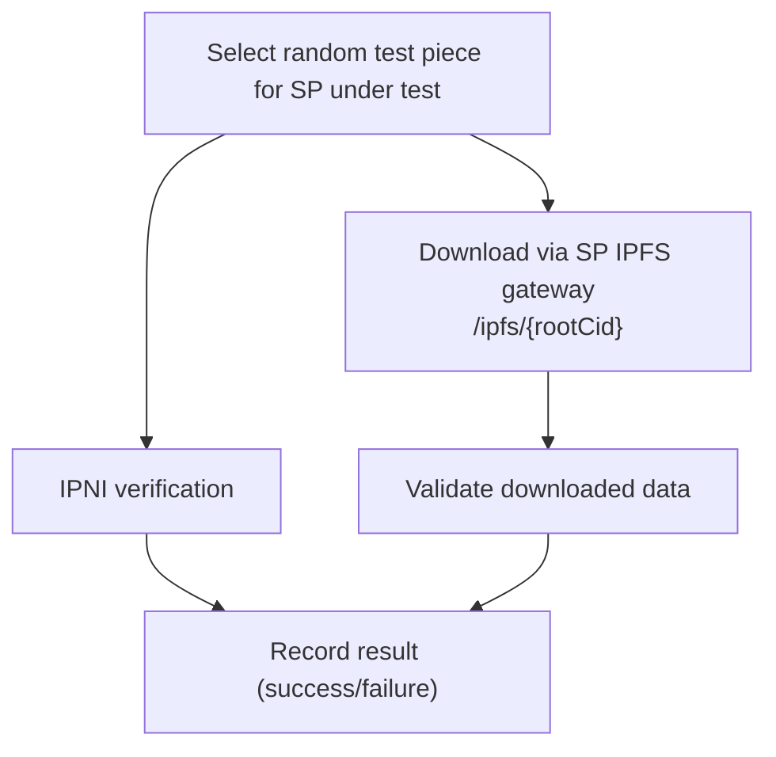

# Retrieval Check

This document is the **source of truth** for how dealbot's Retrieval check works.

Source code links throughout this document point to the current implementation.

For event and metric definitions used by the dashboard, see [Dealbot Events & Metrics](./events-and-metrics.md).

## Overview

The Retrieval check tests that **previously stored** pieces from [data storage checks](./data-storage.md) remain retrievable over time. It runs on a separate schedule from data storage checks.

This is distinct from the inline retrieval verification in the data storage check, which confirms an SP can serve data immediately after indexing. The Retrieval check answers a different question: **does the SP continue to serve data correctly after the initial storage operation?**

### Definition of Successful Retrieval

A **successful** retrieval requires ALL of:

1. Randomly select a previously stored test piece of a dealbot-managed dataset.
2. Verify the root CID is discoverable via IPNI and the SP is listed as a provider
3. Perform [`/ipfs` retrieval](https://github.com/filecoin-project/filecoin-pin/blob/master/documentation/glossary.md#ipfs-retrieval) with the SP.
4. Fetch the root CID from the SP and confirm the response is HTTP 2xx.
5. Verify the root block hashes to its CID.
6. Walk the DAG and repeat steps 4–5 for each child block.

**Failure** occurs if ANY required check fails (IPNI verification, download, or content verification) or the retrieval exceeds its max allowed time.

Operational timeouts exist to prevent jobs from running indefinitely. If a retrieval exceeds the configured limit (`RETRIEVAL_JOB_TIMEOUT_SECONDS`), it is marked as failed.

> **Note on location:** Retrieval latency varies by dealbot-to-SP distance. Measurements reflect dealbot's probe location, not absolute SP performance. This check tests retrievability, not latency.

## What Happens Each Cycle

The scheduler triggers retrieval testing on a configurable interval.

### Piece Selection

Dealbot randomly selects **one** piece per SP for each scheduled retrieval job. The per‑SP job frequency is controlled by `RETRIEVALS_PER_SP_PER_HOUR`. Selection follows these constraints:

- Only pieces from "data storage" check deals with overall status **success** (saved in the DB as `DEAL_CREATED`).
- Only pieces with IPNI metadata enabled and a root CID.
- Only pieces of size `RANDOM_DATASET_SIZES` (matched against `metadata.ipfs_pin.originalSize`).

Source: [`retrieval.service.ts` (`selectRandomDealsForRetrieval`)](../../apps/backend/src/retrieval/retrieval.service.ts#L318)

### Retrieval Checks

For each selected piece, dealbot performs the following in parallel:

#### IPNI Verification

Retrieval checks **only query the IPNI indexer** to confirm the SP is listed as a provider for the root CID. We do **not** poll the SP for piece status in retrieval checks. The polling interval and timeout are controlled by `IPNI_VERIFICATION_POLLING_MS` and `IPNI_VERIFICATION_TIMEOUT_MS`.

#### `/ipfs` Retrieval

Dealbot retrieves the content by **traversing the DAG** rooted at the IPFS Root CID and fetching each block from the SP IPFS gateway.

- **Root URL:** `{serviceURL}/ipfs/{rootCID}?format=raw`
- **Block URL:** `{serviceURL}/ipfs/{cid}?format=raw`
- **Request:** HTTP/2 with `Accept: application/vnd.ipld.raw`
- **Applicable when:** Piece has IPNI metadata enabled with a root CID
- **What this tests:** The SP can serve the root CID and all linked blocks in its DAG via the IPFS gateway

Source: [`apps/backend/src/retrieval-addons/strategies/ipfs-block.strategy.ts`](../../apps/backend/src/retrieval-addons/strategies/ipfs-block.strategy.ts)

## What Gets Asserted

For each retrieval attempt:

| # | Assertion | How It's Checked | Retries | Relevant Metric for Setting a Max Duration | Implemented? |
|---|-----------|-----------------|:---:|-------------------------------------------|:---:|
| 1 | Valid <IpfsRootCid,SP> provider record from filecoinpin.contact | IPNI query for root CID returns a result that includes the SP as a provider | unlimited polling with delay until timeout | [`ipniVerifyMs`](./events-and-metrics.md#ipniVerifyMs) | Yes |
| 2 | IPFS content is retrievable | All DAG block requests return 2xx status | 0. Failure to establish a connection or getting a 5xx response marks the retrieval as failed. There is no retry. | [`ipfsRetrievalLastByteMs`](./events-and-metrics.md#ipfsRetrievalLastByteMs) | Yes |
| 3 | Content integrity via CID | Each fetched block is hash-verified against its CID during DAG traversal | none - if we receive non-matching bytes it's a failure | n/a (client-side) | Yes |
| 4 | All checks pass | Check is not marked successful until all assertions pass within window | n/a | [`retrievalCheckMs`](./events-and-metrics.md#retrievalCheckMs) | Yes |

## Retrieval Result Recording

Each retrieval step (post IPNI validation) creates a `Retrieval` entity in the database:

| Field | Description |
|-------|-------------|
| `dealId` | Which deal was tested |
| `retrievalMethod` | Only `sp_ipfs` supported currently but in future could imagine `sp_piece` or `cdn` |
| `retrievalEndpoint` | URL used for the download |
| `status` | `success` or `failed` |
| `responseCode` | HTTP status code |
| `bytesRetrieved` | Actual bytes downloaded |
| `latencyMs` | Total download time |
| `ttfbMs` | Time to first byte |
| `throughputBps` | Download throughput in bytes per second |
| `errorMessage` | Error details (if failed) |
| `retryCount` | Number of retry attempts (`0` means the first attempt succeeded)|

Source: [`retrieval.entity.ts`](../../apps/backend/src/database/entities/retrieval.entity.ts)

Source: [`retrieval-addons.service.ts`](../../apps/backend/src/retrieval-addons/retrieval-addons.service.ts#L234), [`cdn.strategy.ts`](../../apps/backend/src/retrieval-addons/strategies/cdn.strategy.ts#L23)

Source: [`apps/backend/src/config/app.config.ts`](../../apps/backend/src/config/app.config.ts)

## Metrics Recorded

Metric definitions (including Prometheus metrics) live in [Dealbot Events & Metrics](./events-and-metrics.md).

## Configuration

Key environment variables that control retrieval testing:

| Variable | Default | Description |
|----------|---------|-------------|
| `IPFS_RETRIEVAL_REQUEST_CONNECTION_ESTABLISH_TIMEOUT_MS` | `5000` | Max duration to wait for an HTTP connection get established. |
| `IPFS_RETRIEVAL_TIMEOUT_MS` | `20000` | Max duration to wait for an `/ipfs` request check to complete |

See also: [`docs/environment-variables.md`](../environment-variables.md) for the full configuration reference.
