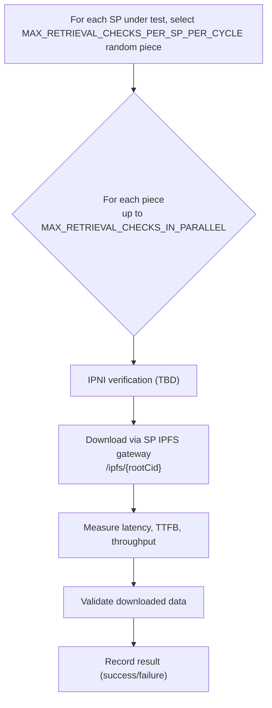

# Retrieval Check

This document is the **source of truth** for how dealbot's Retrieval check works. Items marked **TBD** are not yet implemented; code changes will follow.

Source code links throughout this document point to the current implementation.

For event and metric definitions used by the dashboard, see [Dealbot Events & Metrics](./events-and-metrics.md).

## Overview

The Retrieval check tests that **previously stored** pieces from [data storage checks](./data-storage.md) remains retrievable over time. It runs on a separate schedule from data storage checks.

This is distinct from the inline retrieval verification in the [Data Storage Check](./data-storage.md), which confirms an SP can serve data immediately after indexing. The Retrieval check answers a different question: **does the SP continue to serve data correctly after the initial storage operation?**

### Definition of Successful Retrieval

A **successful** retrieval requires ALL of:

1. Randomly select a previously stored test piece of a dealbot-managed dataset.
2. **TBD:** Verify the root CID is discoverable via IPNI and the SP is listed as a provider
3. Perform [`/ipfs` retrieval](https://github.com/filecoin-project/filecoin-pin/blob/master/documentation/glossary.md#ipfs-retrieval) with the SP.
4. Download completes successfully (HTTP 2xx)
5. Downloaded content hashed to the requested CID (**TBD**: size-check only until CID verification lands).

**Failure** occurs if any required check fails (IPNI verification, download, or content verification) or the retrieval exceeds its max allowed time.

Operational timeouts exist to prevent jobs from running indefinitely, but they are not quality assertions. A per-retrieval max time limit that fails the retrieval if exceeded is **TBD**.

> **Note on location:** Retrieval latency varies by dealbot-to-SP distance. Measurements reflect dealbot's probe location, not absolute SP performance. This check tests retrievability, not latency.

## What Happens Each Cycle

The scheduler triggers retrieval testing on a configurable interval.

### 1. SP selection

The set of SPs under test is determined with the same logic specified in [data storage](./data-storage.md#3-determine-which-sps-to-check-for-this-cycle).

### 2. Piece Selection

Dealbot randomly selects MAX_RETRIEVAL_CHECKS_PER_SP_PER_CYCLE pieces per SP under test for retrieval testing with the following constraints:

- Only pieces from "data storage" check deals with overall status `success`.
- Only pieces with a root CID in metadata
- Only pieces of size RANDOM_PIECE_SIZES

Source: [`retrieval.service.ts` (`selectRandomDealsForRetrieval`)](../../apps/backend/src/retrieval/retrieval.service.ts#L273)

## Retrieval Checks

For each selected piece, dealbot performs the following retrieval checks:

### 1. IPNI Verification

**TBD:** IPNI verification is the same as described in [Data Storage Check](./data-storage.md#6-verify-ipni-indexing).  The only difference is that we don't wait as long since we already know the piece was indexed.  We're just making sure that it's still indexed.

### 2. `/ipfs` Retrieval

Downloads content from the SP with [`/ipfs` retrieval](https://github.com/filecoin-project/filecoin-pin/blob/master/documentation/glossary.md#ipfs-retrieval)

- **URL:** `{serviceURL}/ipfs/{rootCID}`
- **Request:** HTTP/2 with `Accept: application/vnd.ipld.car` header (TODO: remove this - it shouldn't be needed)
- **Applicable when:** Piece has a root CID in metadata (deal was created with IPNI enabled)
- **Validation:** CAR file size must match expected CAR size from deal metadata
- **What this tests:** The SP can serve content by root CID via its IPFS gateway

Source: [`apps/backend/src/retrieval-addons/strategies/ipni.strategy.ts`](../../apps/backend/src/retrieval-addons/strategies/ipni.strategy.ts)

## What Gets Asserted

For each retrieval attempt:

| # | Assertion | How It's Checked | Retries | Relevant Metric for Setting a Max Duration | Implemented? |
|---|-----------|-----------------|:---:|-------------------------------------------|:---:|
| 1 | Valid <IpfsRootCid,SP> provider record from filecoinpin.contact | IPNI query for root CID returns a result that includes the SP as a provider | unlimited polling with delay until timeout | [`ipniVerifyMs`](./events-and-metrics.md#ipniVerifyMs) | **TBD** |
| 2 | IPFS content is retrievable | HTTP response returns 2xx status | Unlimited if a connection doesn't establish within 5s or if get a 5xx response | [`ipfsRetrievalLastByteMs`](./events-and-metrics.md#ipfsRetrievalLastByteMs) | Yes |
| 3 | Content integrity via CID | CID of downloaded content matches ipfsRootCid | none - if we receive non-matching bytes it's a failure | n/a (this is client side and fast) | **TBD** |
| 4 | All checks pass | Check is not marked successful until all assertions pass within window | n/a | [`retrievalCheckMs`](./events-and-metrics.md#retrievalCheckMs) | **TBD** |

> **Note on timing:** Timing-related metrics (latency, TTFB, throughput) are recorded for observability only. Operational timeouts prevent infinite runs but are not treated as quality assertions.

## Retrieval Result Recording

Each retrieval step (post IPNI validation) creates a `Retrieval` entity in the database:

| Field | Description |
|-------|-------------|
| `pieceId` | Which piece was tested |
| `retrievalMethod` | Only `sp_ipfs` supported currently but in future could imagine `sp_piece` or `cdn` |
| `retrievalEndpoint` | URL used for the download |
| `status` | `success` or `failed` |
| `responseCode` | HTTP status code |
| `bytesRetrieved` | Actual bytes downloaded |
| `latencyMs` | Total download time |
| `ttfbMs` | Time to first byte |
| `throughputBps` | Download throughput in bytes per second |
| `errorMessage` | Error details (if failed) |
| `retryCount` | Number of retry attempts (`0` means the first attempt succeeded)|

Source: [`retrieval.entity.ts`](../../apps/backend/src/database/entities/retrieval.entity.ts)

Source: [`retrieval-addons.service.ts`](../../apps/backend/src/retrieval-addons/retrieval-addons.service.ts#L234), [`cdn.strategy.ts`](../../apps/backend/src/retrieval-addons/strategies/cdn.strategy.ts#L23)

Source: [`apps/backend/src/config/app.config.ts`](../../apps/backend/src/config/app.config.ts)

## Metrics Recorded

Metric definitions (including Prometheus metrics) live in [Dealbot Events & Metrics](./events-and-metrics.md).

## Configuration

Key environment variables that control retrieval testing:

| Variable | Default | Description |
|----------|---------|-------------|
| `MAX_RETRIEVAL_CHECKS_PER_SP_PER_CYCLE` | **TBD** | Number of pieces to select per SP under test per retrieval cycle. |
| `MAX_RETRIEVAL_CHECKS_IN_PARALLEL` | **TBD** | Max number of retrieval checks run in parallel (across all SPs) per cycle. |
| `IPNI_VERIFICATION_TIMEOUT_MS` | `10000` | Max duration to attempt the IPNI verification step  |
| `IPNI_VERIFICATION_POLLING_MS` | `2000` | How long to give between IPNI polling attempts  |
| `IPFS_RETRIEVAL_REQUEST_CONNECTION_ESTABLISH_TIMEOUT_MS` | `5000` | Max duration to wait for an HTTP connection get established. |
| `IPFS_RETRIEVAL_TIMEOUT_MS` | `20000` | Max duration to wait for an `/ipfs` request check to complete |

Effective timeouts:

See also: [`docs/environment-variables.md`](../environment-variables.md) for the full configuration reference.

## TBD Summary

The following items are **TBD**:

| Item | Description |
|------|-------------|
| Enforce piece selection based on RANDOM_PIECE_SIZES | Only select pieces of the selected size. |
| Remove PDP `/piece` retrieval | Retrieval checks should only use the SP IPFS gateway (`/ipfs/{rootCid}`). |
| Per-retrieval max time limit | If a retrieval does not complete within a configurable max time, mark it as failed. Operational timeouts prevent infinite runs but are not treated as a quality assertion that fails the retrieval. |
| CID-based content verification | Verify retrieved content by re-computing CID and comparing to upload-time CID (size-check only until CID verification lands). See [issue #144](https://github.com/FilOzone/dealbot/issues/144). |
