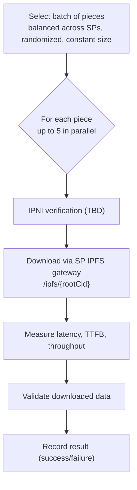

# Retrieval Check

This document is the **source of truth** for how dealbot's Retrieval check works. Items marked **TBD** are not yet implemented; code changes will follow.

Source code links throughout this document point to the current implementation.

For event and metric definitions used by the dashboard, see [Dealbot Events & Metrics](./events-and-metrics.md).

## Overview

The Retrieval check tests that **previously stored** data remains retrievable over time. It runs on a separate schedule from deal creation and selects pieces that have already been uploaded and confirmed.

This is distinct from the inline retrieval verification in the [Data Storage Check](./data-storage.md), which confirms an SP can serve data immediately after indexing. The Retrieval check answers a different question: **does the SP continue to serve data correctly after the initial storage operation?**

### Definition of Successful Retrieval

A **successful** retrieval requires ALL of:

1. Randomly select a previously stored test piece of a **single constant size** (10 MB) from a successful deal
2. **TBD:** Verify the root CID is discoverable via IPNI and the SP is listed as a provider
3. Request retrieval via the SP IPFS gateway (`/ipfs/{rootCid}`)
4. Download completes successfully (HTTP 2xx)
5. Downloaded content matches the expected content (**TBD**: size-check only until CID verification lands).

**Failure** occurs if any required check fails (IPNI verification, download, or content match) or the retrieval exceeds its max allowed time.

Operational timeouts exist to prevent jobs from running indefinitely, but they are not quality assertions. A per-retrieval max time limit that fails the retrieval if exceeded is **TBD**.

> See [Retrieval Checks](#retrieval-checks) for the specific checks performed.

> **Note on location:** Retrieval latency varies by dealbot-to-SP distance. Measurements reflect dealbot's probe location, not absolute SP performance. This check tests retrievability, not latency.

## What Happens Each Cycle

The scheduler triggers retrieval testing on a configurable interval.

### Source Code Entry Points

| Step | File | Entry Point |
|------|------|-------------|
| Scheduler trigger | [`scheduler.service.ts`](../../apps/backend/src/scheduler/scheduler.service.ts#L110) | `handleRetrievalTests()` |
| Batch orchestration | [`retrieval.service.ts`](../../apps/backend/src/retrieval/retrieval.service.ts#L42) | `performRandomBatchRetrievals()` |
| Deal selection | [`retrieval.service.ts`](../../apps/backend/src/retrieval/retrieval.service.ts#L273) | `selectRandomDealsForRetrieval()` |
| Method testing | [`retrieval-addons.service.ts`](../../apps/backend/src/retrieval-addons/retrieval-addons.service.ts#L161) | `testAllRetrievalMethods()` |

## Piece Selection

Not every piece is tested every cycle. Dealbot selects a batch of pieces for retrieval testing with the following constraints:

- **Eligible pieces:** Only pieces from deals with status `DEAL_CREATED` or `PIECE_ADDED`
- **Constant size:** Only 10 MB test pieces are eligible (**TBD**)
- **IPNI-ready:** Only pieces with a root CID in metadata are eligible (**TBD**)
- **Grouped by SP:** Pieces are grouped by storage provider
- **Balanced batch size:** Compute `dealsPerProvider = ceil(count / providers.length)`
- **Random per SP:** For each SP, randomly sample up to `dealsPerProvider` pieces (capped by remaining slots)
- **Randomization:** Within each provider's pieces, selection order is shuffled before sampling
- **Fill remaining slots:** If the balanced pass yields fewer than `count` deals, fill the remainder from the remaining pool across providers

This ensures each SP gets tested with roughly equal frequency, and tests cover a variety of pieces rather than always testing the most recent ones.

Source: [`retrieval.service.ts` (`selectRandomDealsForRetrieval`)](../../apps/backend/src/retrieval/retrieval.service.ts#L273)

## Retrieval Checks

For each selected piece, dealbot performs the following retrieval checks:

### 1. IPNI Verification

**TBD:** The retrieval job does not currently perform IPNI verification. When implemented, it will reuse the IPNI verification flow described in the Data Storage check.
Source: [`ipni.strategy.ts` (`monitorAndVerifyIPNI`)](../../apps/backend/src/deal-addons/strategies/ipni.strategy.ts#L239), [Data Storage Check](./data-storage.md#6-ipni-verification)

### 2. IPFS Gateway Retrieval

Downloads content from the SP's IPFS gateway.

- **URL:** `{serviceURL}/ipfs/{rootCID}`
- **Request:** HTTP/2 with `Accept: application/vnd.ipld.car` header
- **Applicable when:** Piece has a root CID in metadata (deal was created with IPNI enabled)
- **Validation:** CAR file size must match expected CAR size from deal metadata
- **What this tests:** The SP can serve content by root CID via its IPFS gateway

Source: [`apps/backend/src/retrieval-addons/strategies/ipni.strategy.ts`](../../apps/backend/src/retrieval-addons/strategies/ipni.strategy.ts)

## What Gets Asserted

For each retrieval attempt:

| # | Assertion | How It's Checked | Implemented? |
|---|-----------|-----------------|:---:|
| 1 | Constant-size test piece selected | Only 10 MB test pieces are eligible for retrieval | **TBD** |
| 2 | Root CID is discoverable via IPNI | IPNI query for root CID returns a result | **TBD** |
| 3 | SP is listed as provider in IPNI response | IPNI result includes the SP as a provider | **TBD** |
| 4 | IPFS content is retrievable | HTTP response returns 2xx status | Yes |
| 5 | Content integrity via CID | CID of downloaded content matches upload-time CID | **TBD** |
| 6 | Retrieval completes within max time | Retrieval completes within a configurable max time; otherwise marked failed | **TBD** |

> **Note on timing:** Timing metrics (latency, TTFB, throughput) are recorded for observability only. Operational timeouts prevent infinite runs but are not treated as quality assertions.

## Retrieval Result Recording

Each retrieval run can create **multiple** `Retrieval` entities for a single piece: one per retrieval method result (e.g., `direct_sp`, `cdn`, `ipfs_pin`).

Each retrieval attempt creates a `Retrieval` entity in the database:

| Field | Description |
|-------|-------------|
| `dealId` | Which deal was tested |
| `serviceType` | Retrieval method used (`direct_sp`, `cdn`, or `ipfs_pin`) |
| `retrievalEndpoint` | URL used for the download |
| `status` | Currently persisted as `success` or `failed` (`timeout` is **TBD**) |
| `latencyMs` | Total download time |
| `ttfbMs` | Time to first byte |
| `throughputBps` | Download throughput in bytes per second |
| `bytesRetrieved` | Actual bytes downloaded |
| `responseCode` | HTTP status code |
| `errorMessage` | Error details (if failed) |
| `retryCount` | Number of retry attempts |

Source: [`retrieval.entity.ts`](../../apps/backend/src/database/entities/retrieval.entity.ts)

## Metrics Recorded

Metric definitions (including Prometheus metrics) live in [Dealbot Events & Metrics](./events-and-metrics.md).

## Configuration

Key environment variables that control retrieval testing:

| Variable | Default | Description |
|----------|---------|-------------|
| `RETRIEVAL_INTERVAL_SECONDS` | `60` | How often retrieval tests run |
| `RETRIEVAL_START_OFFSET_SECONDS` | `600` | Delay before first retrieval run (10 min) |
| `HTTP_REQUEST_TIMEOUT_MS` | `600000` | Base max time for a single HTTP/1.1 retrieval |
| `HTTP2_REQUEST_TIMEOUT_MS` | `600000` | Base max time for a single HTTP/2 retrieval (IPFS gateway) |
| `RETRIEVAL_TIMEOUT_BUFFER_MS` | `60000` | Buffer subtracted from the scheduler interval when computing the batch timeout |

Effective timeouts:

- **Per-retrieval timeout:** `max(HTTP_REQUEST_TIMEOUT_MS, HTTP2_REQUEST_TIMEOUT_MS)`
- **Batch timeout:** `RETRIEVAL_INTERVAL_SECONDS * 1000 - RETRIEVAL_TIMEOUT_BUFFER_MS` (minimum 10s)

## Retries

Retrieval retries are method-specific and defined by each strategy:

- **Default:** 1 attempt (no retries).
- **CDN:** 3 attempts with a 10s delay to allow cache warming between attempts.
- **Retry count:** Recorded per retrieval as `retryCount` (`0` means the first attempt succeeded).

Source: [`retrieval-addons.service.ts`](../../apps/backend/src/retrieval-addons/retrieval-addons.service.ts#L234), [`cdn.strategy.ts`](../../apps/backend/src/retrieval-addons/strategies/cdn.strategy.ts#L23)

Source: [`apps/backend/src/config/app.config.ts`](../../apps/backend/src/config/app.config.ts)

See also: [`docs/environment-variables.md`](../environment-variables.md) for the full configuration reference.

## TBD Summary

The following items are **TBD**:

| Item | Description |
|------|-------------|
| Enforce constant size selection | Only select 10 MB test pieces for retrieval checks. |
| Remove PDP `/piece` retrieval | Retrieval checks should only use the SP IPFS gateway (`/ipfs/{rootCid}`). |
| Per-retrieval max time limit | If a retrieval does not complete within a configurable max time, mark it as failed. Operational timeouts prevent infinite runs but are not treated as a quality assertion that fails the retrieval. |
| CID-based content verification | Verify retrieved content by re-computing CID and comparing to upload-time CID (size-check only until CID verification lands). See [issue #144](https://github.com/FilOzone/dealbot/issues/144). |
