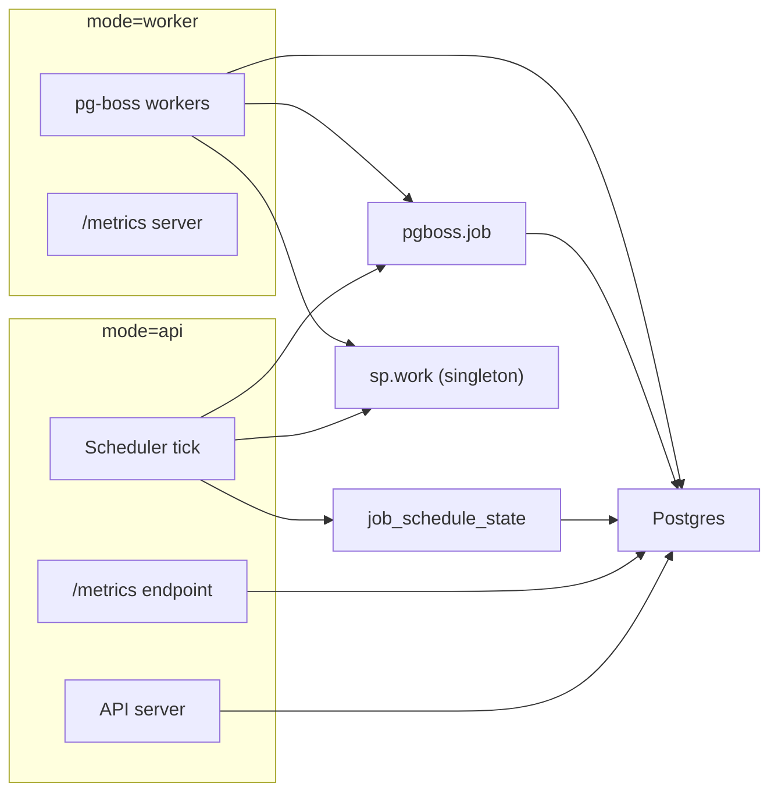

# Jobs (pg-boss)

This doc explains what a "job" is in dealbot when `DEALBOT_JOBS_MODE=pgboss`, how jobs are defined, how they're scheduled, and how they're executed. For operational steps (pausing/resuming/triggering jobs), see the runbook in `docs/runbooks/jobs.md`.

## Summary

- `job_schedule_state` is the primary schedule entity with one row per `<job_type, sp_address>` plus global rows with an empty `sp_address`.
- The dealbot scheduler loop polls for due `job_schedule_state` rows, enqueues corresponding pg-boss jobs, and advances `job_schedule_state.next_run_at`.
- Deal/retrieval jobs share the `sp.work` queue with `policy=singleton` and `singletonKey=spAddress` to enforce one active job per SP while allowing backlog.
- Dealbot workers poll pg-boss queues via `boss.work()` and run the corresponding handlers.

## Entities and Terminology

| Entity | Cardinality | Notes |
| --- | --- | --- |
| `job_schedule_state` | One per `<sp, job_type>` plus global rows | Schedule state owned by dealbot. |
| Storage provider (SP) | One per SP in registry | Filtered by `USE_ONLY_APPROVED_PROVIDERS` when enabled. |
| Job type | `deal`, `retrieval`, `metrics`, `metrics_cleanup` | `deal` corresponds to "data storage check" externally; we keep `deal` in code/DB for compatibility. |
| pg-boss queue | `sp.work`, `metrics.run`, `metrics.cleanup` | `sp.work` is a singleton queue. |
| Dealbot scheduler | One per process (when enabled) | Runs the scheduling loop. |
| Dealbot worker process | One Node.js process with `DEALBOT_RUN_MODE=worker` or `both` | Hosts pg-boss workers. |
| pg-boss worker | One per queue per dealbot worker process | Created by each `boss.work(...)` call. |
| Job (pg-boss) | One row per scheduled occurrence | Stored in `pgboss.job`. |

## Pg-boss vs Dealbot Scheduling

- pg-boss provides durable queues and worker execution.
- Dealbot owns schedule state and timing via `job_schedule_state` and does not use pg-boss cron scheduling (`boss.schedule(...)`).
- This custom scheduler exists because we need per-SP rate schedules, controlled backfill with caps/jitter, maintenance-window rules, and per-SP singleton execution across deal + retrieval.
- `cron` mode is still supported for external users, but pg-boss is the recommended and default operational mode for dealbot-managed deployments.

## Job Types, Queues, and Handlers

| Job type | Queue | Handler | Payload |
| --- | --- | --- | --- |
| `deal` | `sp.work` | `JobsService.handleDealJob` in `apps/backend/src/jobs/jobs.service.ts` | `{ jobType: 'deal', spAddress, intervalSeconds }` |
| `retrieval` | `sp.work` | `JobsService.handleRetrievalJob` in `apps/backend/src/jobs/jobs.service.ts` | `{ jobType: 'retrieval', spAddress, intervalSeconds }` |
| `metrics` | `metrics.run` | `JobsService.handleMetricsJob` in `apps/backend/src/jobs/jobs.service.ts` | `{ intervalSeconds }` |
| `metrics_cleanup` | `metrics.cleanup` | `JobsService.handleMetricsCleanupJob` in `apps/backend/src/jobs/jobs.service.ts` | `{ intervalSeconds }` |

`sp.work` is created with `policy=singleton`, and jobs set `singletonKey=spAddress` so only one active job per SP can run at a time.

pg-boss also has a separate pub/sub API (`publish`/`subscribe`) for fan-out. Dealbot uses `send`/`work` for direct queue processing.

## Pg-boss Storage, Retention, and Cleanup

- Queue rows are stored in `pgboss.job`. pg-boss manages job lifecycle within this table (no separate archive table in pg-boss v9+).
- pg-boss has built-in supervision that handles expired jobs and maintenance. These behaviors are controlled by constructor options such as `superviseIntervalSeconds`, `maintenanceIntervalSeconds`, and `monitorIntervalSeconds`.
- Dealbot currently uses pg-boss defaults for these options.

## How Schedules Are Created and Updated

1. **Startup provider sync**: When pg-boss is enabled, `JobsService` calls `WalletSdkService.ensureWalletAllowances()` and `WalletSdkService.loadProviders()` (unless `DEALBOT_DISABLE_CHAIN=true`). `loadProviders()` pulls providers from the on-chain SP registry and syncs them into `storage_providers`.
1. **Scheduler tick creates/updates schedules**: The scheduler loop runs immediately on startup and then every `JOB_SCHEDULER_POLL_SECONDS`. It upserts schedules for each active provider and ensures global metrics schedules exist. It deletes deal/retrieval schedules for providers that are no longer active/approved.
1. **New SP added to registry (example)**: Once `loadProviders()` syncs a new provider, the next scheduler tick inserts `deal` and `retrieval` schedules for that SP.
1. **SP status changes (example)**: When `loadProviders()` updates provider status, the next scheduler tick re-evaluates and deletes schedules for inactive/unapproved providers.

Note: In pg-boss mode, provider sync currently happens at startup (and whenever `loadProviders()` is called). There is no periodic refresh loop yet.

## How `next_run_at` Changes

`next_run_at` is controlled entirely by the scheduler loop:

- **Initial value**: set by `upsertSchedule()` when schedules are created, using `now + JOB_SCHEDULE_PHASE_SECONDS`.
- **On each tick**: The scheduler finds rows where `next_run_at <= now`, computes how many runs are due based on `interval_seconds`, enqueues up to `JOB_CATCHUP_MAX_ENQUEUE` runs per schedule row, and on successful enqueue advances `next_run_at` by `successCount * interval_seconds` while updating `last_run_at`.
- **Maintenance windows**: Deal/retrieval jobs are not enqueued during a maintenance window. We also skip enqueue if we are within `max(DEAL_JOB_TIMEOUT_SECONDS, RETRIEVAL_JOB_TIMEOUT_SECONDS)` of an upcoming window to avoid starting work that would overlap the window. (TODO: this depends on https://github.com/FilOzone/dealbot/pull/263)

Advancing `next_run_at` by `successCount * interval_seconds` records how many scheduled runs have been placed in the queue. The backlog lives in pg-boss rather than in `job_schedule_state`, which avoids re-enqueuing the same historical slots on every scheduler tick. This does **not** make jobs execute faster — execution rate is still bounded by worker capacity and the per-SP `singletonKey`.

## Backfill and Backpressure

- **Backfill**: If dealbot is down, the scheduler will enqueue missed runs on restart, up to `JOB_CATCHUP_MAX_ENQUEUE` per schedule row per tick. This preserves historical coverage while controlling enqueue rate.
- **Staggering**: `JOB_CATCHUP_SPREAD_HOURS` spreads backfill jobs over a window, and `JOB_ENQUEUE_JITTER_SECONDS` adds randomized delay to avoid synchronized bursts across deployments.

Backfill caps and spreading are about **enqueue rate**, not execution concurrency. Even with `singletonKey` limiting one active job per SP, a long outage could enqueue thousands of jobs at once, causing DB write bursts, large `pgboss.job` growth, and noisy metrics. Caps/jitter prevent that “enqueue storm” while still allowing backlog to drain at the worker rate. Increasing the cap only makes the backlog visible in the queue faster; to actually process it faster you need more worker capacity (or to relax per-SP exclusivity).

Example: If a job is scheduled every 15 minutes but takes 20 minutes, jobs will queue in pg-boss. The per-SP singleton prevents overlap, so runs execute sequentially and backlog grows. Backfill caps prevent a thundering herd when the system recovers.

## Polling Behavior

- **Scheduler polling**: `JobsService` runs a scheduler tick every `JOB_SCHEDULER_POLL_SECONDS` (default 300s).
- **Worker polling**: pg-boss workers check for new jobs every `JOB_WORKER_POLL_SECONDS` (default 60s) via the `pollingIntervalSeconds` worker option.

## Run Modes

`DEALBOT_RUN_MODE` controls which components run in a process:

- `api`: API server + scheduler + `/metrics` (no workers)
- `worker`: workers + `/metrics` only (no API)
- `both`: API server + scheduler + workers + `/metrics`

Notes:

- In pg-boss mode, `DEALBOT_RUN_MODE=api` disables workers.
- Set `DEALBOT_PGBOSS_SCHEDULER_ENABLED=false` to disable the enqueue loop (worker-only pods).
- `/metrics` is served on `DEALBOT_PORT` for `api`/`both` and on `DEALBOT_METRICS_PORT` for `worker` so worker-only processes can expose metrics without running the API server.

## Architecture (api + worker)



## Parallelism and Limits

- **Queue concurrency**: Deal/retrieval share the `sp.work` queue. Per-instance worker concurrency is `DEAL_MAX_CONCURRENCY + RETRIEVAL_MAX_CONCURRENCY` (pg-boss `localConcurrency`), with `batchSize=1`. Metrics/cleanup remain fixed at `batchSize=1`. Total concurrency scales with the number of dealbot worker processes.
- **Per-SP exclusion**: `sp.work` is created with `policy=singleton`, and jobs are enqueued with `singletonKey=spAddress`, ensuring only one active job per SP across all workers while allowing backlog.

## Capacity and Limits

Use these formulas to reason about whether the system can keep up and how much backlog it can absorb.

Per-SP capacity (one job per SP at a time):

- Per-SP execution-minutes per hour = `(deals_per_sp_per_hour * deal_max_minutes) + (retrievals_per_sp_per_hour * retrieval_max_minutes)`
- If per-SP execution-minutes per hour > 60, that SP can never catch up (backlog grows).
- If per-SP execution-minutes per hour <= 60, backlog will eventually drain (headroom = `60 - per-SP execution-minutes per hour`).

Note: 60 execution-minutes per hour = 100% utilization for a single SP.

Cluster capacity (worker pool bound):

- Deal capacity (deals/hour) = `dealbot_worker_processes * DEAL_MAX_CONCURRENCY * (60 / deal_max_minutes)`
- Retrieval capacity (retrievals/hour) = `dealbot_worker_processes * RETRIEVAL_MAX_CONCURRENCY * (60 / retrieval_max_minutes)`
- Max sustainable SP count = `min(deal_capacity / deals_per_sp_per_hour, retrieval_capacity / retrievals_per_sp_per_hour)`

Note: Deal and retrieval jobs share the same `sp.work` queue, so the effective concurrency is the combined budget (`DEAL_MAX_CONCURRENCY + RETRIEVAL_MAX_CONCURRENCY`) and will skew toward whichever job type dominates the backlog.

Example (18 SPs, 4 deals/hr @ 5m, 6 retrievals/hr @ 2m, 5 dealbot workers, 10/10 concurrency):

- Per-SP execution-minutes per hour = `4*5m + 6*2m = 32 execution-min/hr` (OK; 28 execution-min/hr headroom)
- Deal capacity = `5 dealbot worker processes * 10 concurrency slots * (60/5m) = 600 deals/hr` => `600/4 = 150 SPs`
- Retrieval capacity = `5 dealbot worker processes * 10 concurrency slots * (60/2m) = 1500 retrievals/hr` => `1500/6 = 250 SPs`
- Limited by deals. We can support ~150 SPs before hitting capacity with the parameters above.

## Staggering Multiple Deployments

If you run more than one dealbot in the same environment, use a phase offset and jitter to spread load and avoid synchronized bursts:

- `JOB_SCHEDULE_PHASE_SECONDS` shifts the initial `next_run_at` for all schedules.
- `JOB_ENQUEUE_JITTER_SECONDS` adds random delay when jobs are enqueued.

Example with two deployments running the same rates:

Deployment A:

```
JOB_SCHEDULE_PHASE_SECONDS=0
JOB_ENQUEUE_JITTER_SECONDS=300
```

Deployment B:

```
JOB_SCHEDULE_PHASE_SECONDS=1200
JOB_ENQUEUE_JITTER_SECONDS=300
```

This staggers schedules by 20 minutes and randomizes starts within 5 minutes.

## Metrics and Observability

- Dealbot does not store a first-class "job run" entity.
- `job_schedule_state.last_run_at` is updated when schedules are advanced (enqueue time), not when handlers finish.
- pg-boss stores each queued job in `pgboss.job` with states like `created`, `active`, and `retry` (we query this table for queue metrics).
- Execution metrics are exported via Prometheus (`jobs_started_total`, `jobs_completed_total`, `job_duration_seconds`).

## Critical Environment Variables

See the "Jobs (pg-boss)" section in `docs/environment-variables.md` for full definitions. The most important knobs are:

- [`DEALBOT_JOBS_MODE`](./environment-variables.md#dealbot_jobs_mode)
- [`DEALBOT_PGBOSS_SCHEDULER_ENABLED`](./environment-variables.md#dealbot_pgboss_scheduler_enabled)
- [`DEALBOT_RUN_MODE`](./environment-variables.md#dealbot_run_mode)
- [`DEALS_PER_SP_PER_HOUR`](./environment-variables.md#deals_per_sp_per_hour), [`RETRIEVALS_PER_SP_PER_HOUR`](./environment-variables.md#retrievals_per_sp_per_hour), [`METRICS_PER_HOUR`](./environment-variables.md#metrics_per_hour)
- [`JOB_SCHEDULER_POLL_SECONDS`](./environment-variables.md#job_scheduler_poll_seconds), [`JOB_WORKER_POLL_SECONDS`](./environment-variables.md#job_worker_poll_seconds)
- [`JOB_CATCHUP_MAX_ENQUEUE`](./environment-variables.md#job_catchup_max_enqueue), [`JOB_CATCHUP_SPREAD_HOURS`](./environment-variables.md#job_catchup_spread_hours)
- [`JOB_SCHEDULE_PHASE_SECONDS`](./environment-variables.md#job_schedule_phase_seconds), [`JOB_ENQUEUE_JITTER_SECONDS`](./environment-variables.md#job_enqueue_jitter_seconds)
- [`DEAL_MAX_CONCURRENCY`](./environment-variables.md#deal_max_concurrency), [`RETRIEVAL_MAX_CONCURRENCY`](./environment-variables.md#retrieval_max_concurrency)
- [`USE_ONLY_APPROVED_PROVIDERS`](./environment-variables.md#use_only_approved_providers)

## Source of Truth Links

- Job schedule entity: `apps/backend/src/database/entities/job-schedule-state.entity.ts`
- Job schedule repository: `apps/backend/src/jobs/repositories/job-schedule.repository.ts`
- Scheduler + workers: `apps/backend/src/jobs/jobs.service.ts`
- Provider sync (SP registry): `apps/backend/src/wallet-sdk/wallet-sdk.service.ts`
- Job metrics: `apps/backend/src/metrics-prometheus/metrics-prometheus.module.ts`
