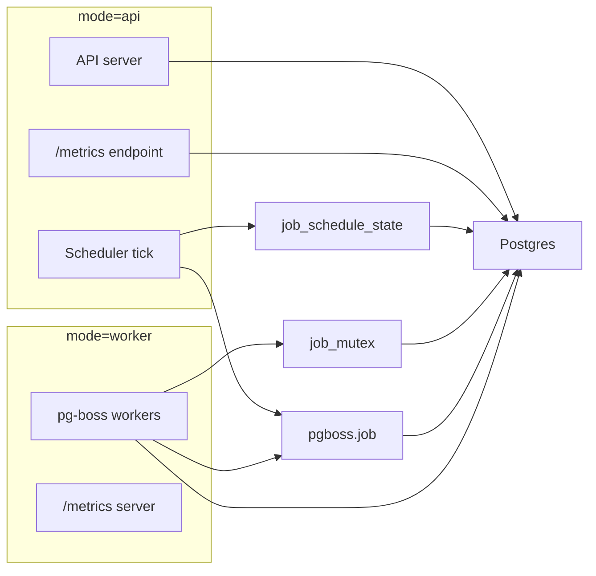

# Jobs (pg-boss)

This doc explains what a job is in dealbot when `DEALBOT_JOBS_MODE=pgboss`. For operational steps (pausing/resuming/triggering jobs), see the runbook in `docs/runbooks/jobs.md`.

## Summary

- Jobs are scheduled via `job_schedule_state` rows and executed via pg-boss queues.
- There is one schedule row per `<job_type, sp_address>` plus global jobs that use an empty `sp_address`.
- A scheduler loop polls for due schedules, enqueues pg-boss jobs, and advances `next_run_at`.
- Workers subscribe to pg-boss queues and execute the actual deal/retrieval/metrics handlers.

## Cardinality and Tables

- **Schedule rows**: `job_schedule_state` has a unique constraint on `(job_type, sp_address)`, which means one row per job type per SP address. Global jobs use `sp_address = ''`. Source: `apps/backend/src/database/entities/job-schedule-state.entity.ts`, `apps/backend/src/database/migrations/1760000000000-AddJobScheduleState.ts`.
- **Per-SP mutex**: `job_mutex` enforces one in-flight job per SP address across all workers (deal and retrieval share the same lock). Source: `apps/backend/src/database/migrations/1760000000003-AddJobMutex.ts`, `apps/backend/src/jobs/repositories/job-schedule.repository.ts`.
- **Queue rows**: pg-boss stores jobs in the `pgboss.job` table (created by pg-boss under the `pgboss` schema). We read from this table for metrics. Source: `apps/backend/src/jobs/repositories/job-schedule.repository.ts` (queries `pgboss.job`).

## Job Types and Queues

Job types map to pg-boss queue names in `JobsService.mapJobName`:

- `deal` -> `deal.run`
- `retrieval` -> `retrieval.run`
- `metrics` -> `metrics.run`
- `metrics_cleanup` -> `metrics.cleanup`

Publishing via `boss.publish(name, data, options)` inserts rows into `pgboss.job` under the configured `pgboss` schema, and workers consume them via `boss.subscribe(name, ...)` in our current pg-boss version (6.1.0). Newer pg-boss releases document workers via `work()` / `offWork()` and use `publish/subscribe` for pub/sub fan-out.

Source: `apps/backend/src/jobs/jobs.service.ts`.

## Pg-boss vs Dealbot Scheduling

- pg-boss provides durable queues and worker execution. Dealbot owns schedule state and timing via `job_schedule_state`.
- We do not call `boss.schedule(...)` or use pg-boss cron scheduling. The scheduler tick decides when a job is due and enqueues it.
- This custom scheduler exists because we need per-SP rate schedules, catch-up behavior with caps/jitter, maintenance-window skipping, and a cross-queue per-SP mutex (deal + retrieval).

## Pg-boss Storage, Retention, and Cleanup

- Queue rows are stored in `pgboss.job`. Archived jobs are stored in `pgboss.archive`.
- pg-boss has built-in maintenance that archives completed/failed/cancelled jobs and deletes archived rows after a retention window.
- These behaviors are controlled by constructor options such as `archiveCompletedAfterSeconds`, `archiveFailedAfterSeconds`, `deleteAfterDays`, and `maintenanceIntervalSeconds` / `maintenanceIntervalMinutes`.
- Dealbot currently uses pg-boss defaults for these options (we do not set them in code).

Reference: https://timgit.github.io/pg-boss/#/./api/constructor

## Worker API Versioning

- Our code uses the pg-boss v6 worker API (`boss.subscribe(queue, options, handler)`).
- Newer pg-boss versions document workers via `work()` / `offWork()` and treat `publish/subscribe` as pub/sub fan-out.
- If we upgrade pg-boss, we should refactor worker registration to `work()` and re-verify publish semantics.

Reference: https://timgit.github.io/pg-boss/#/./api/workers

## How Schedules Are Created and Updated

1. **Startup provider sync**: When pg-boss is enabled, `JobsService` calls `WalletSdkService.ensureWalletAllowances()` and `WalletSdkService.loadProviders()` (unless `DEALBOT_DISABLE_CHAIN=true`). `loadProviders()` pulls providers from the on-chain SP registry and syncs them into the `storage_providers` table (fields include `is_active` and `is_approved`). Source: `apps/backend/src/jobs/jobs.service.ts`, `apps/backend/src/wallet-sdk/wallet-sdk.service.ts`.

2. **Scheduler tick creates/updates schedules**: The scheduler loop runs immediately on startup and then every `JOB_SCHEDULER_POLL_SECONDS`. It queries `storage_providers` and upserts schedules for each active provider (and only approved providers if `USE_ONLY_APPROVED_PROVIDERS=true`). It also ensures global metrics schedules exist (`sp_address = ''`). It deletes deal/retrieval schedules for providers that are no longer active/approved. Source: `apps/backend/src/jobs/jobs.service.ts`, `apps/backend/src/jobs/repositories/job-schedule.repository.ts`.

3. **New SP added to registry (example)**: A new provider becomes visible once `WalletSdkService.loadProviders()` runs and syncs the `storage_providers` table. On the next scheduler tick, `ensureScheduleRows()` upserts `deal` and `retrieval` schedules for that SP. If `USE_ONLY_APPROVED_PROVIDERS=true`, the provider must be both `is_active=true` and `is_approved=true` to be scheduled.

4. **SP status changes (example)**: When `loadProviders()` syncs updated provider status into `storage_providers`, the next scheduler tick re-evaluates active/approved providers. If a provider is no longer active or approved, its deal/retrieval schedules are deleted.

Note: In pg-boss mode, provider sync currently happens at startup (and whenever `loadProviders()` is called). There is no periodic refresh loop, so new/changed providers require a refresh (restart or an explicit call to `loadProviders()`).

## How `next_run_at` Changes

`next_run_at` is controlled entirely by the scheduler loop:

- **Initial value**: set by `upsertSchedule()` when schedules are created, using `now + JOB_SCHEDULE_PHASE_SECONDS`.
- **On each tick**: The scheduler finds rows where `next_run_at <= now`, computes how many runs are due based on `interval_seconds`, enqueues up to `JOB_CATCHUP_MAX_ENQUEUE` runs per schedule row, and on successful enqueue advances `next_run_at` by `successCount * interval_seconds` while updating `last_run_at`.
- **Maintenance windows**: for deal/retrieval during maintenance windows, no jobs are enqueued, but `next_run_at` is still advanced to skip missed runs.

Source: `apps/backend/src/jobs/jobs.service.ts`, `apps/backend/src/jobs/repositories/job-schedule.repository.ts`.

## Polling Behavior

- **Scheduler polling**: `JobsService` runs a scheduler tick every `JOB_SCHEDULER_POLL_SECONDS` (default 300s).
- **Worker polling**: pg-boss workers check for new jobs every `JOB_WORKER_POLL_SECONDS` (default 60s) via `newJobCheckIntervalSeconds`.

Source: `apps/backend/src/jobs/jobs.service.ts`, `apps/backend/src/config/app.config.ts`.

## Run Modes

`DEALBOT_RUN_MODE` controls which components run in a process:

- `api`: API server + scheduler + `/metrics` (no workers)
- `worker`: workers + `/metrics` only (no API)
- `both`: API server + scheduler + workers + `/metrics`

Notes:

- In pg-boss mode, `DEALBOT_RUN_MODE=api` disables workers.
- Set `DEALBOT_PGBOSS_SCHEDULER_ENABLED=false` to disable the enqueue loop (worker-only pods).
- `/metrics` is served on `DEALBOT_PORT` for `api`/`both` and on `DEALBOT_METRICS_PORT` for `worker`.

## Architecture (api + worker)



## Parallelism and Limits

- **Queue concurrency**: Deal queue concurrency is `DEAL_MAX_CONCURRENCY` (pg-boss `teamSize`), retrieval queue concurrency is `RETRIEVAL_MAX_CONCURRENCY`, and metrics/cleanup are fixed at `teamSize=1`. These limits apply per instance; total concurrency scales with the number of worker pods.
- **Per-SP mutex**: `job_mutex` ensures only one job runs per SP at a time across both deal and retrieval queues. If a lock is held, the job is re-queued after `JOB_LOCK_RETRY_SECONDS`.

Source: `apps/backend/src/jobs/jobs.service.ts`, `apps/backend/src/jobs/repositories/job-schedule.repository.ts`.

## Backpressure and Catch-Up

- **Catch-up cap**: `JOB_CATCHUP_MAX_ENQUEUE` limits how many runs are enqueued per schedule row per tick.
- **Staggering**: `JOB_CATCHUP_SPREAD_HOURS` spreads catch-up jobs, and `JOB_ENQUEUE_JITTER_SECONDS` adds random delay.
- **Lock contention**: `JOB_LOCK_RETRY_SECONDS` delays re-queues when the per-SP lock is held; `JOB_LOCK_STALE_SECONDS` allows replacement of stale locks.

Example: If a job is scheduled every 15 minutes but takes 20 minutes, jobs will queue in pg-boss. The per-SP mutex prevents overlap, so runs execute sequentially and a backlog grows. Catch-up limits cap how fast backlog is enqueued per tick.

## Capacity and Limits

Use these formulas to reason about whether the system can keep up and how much backlog it can absorb.

Per-SP capacity (one job per SP at a time):

- Per-SP load (minutes/hour) = `(deals_per_sp_per_hour * deal_max_minutes) + (retrievals_per_sp_per_hour * retrieval_max_minutes)`
- If per-SP load > 60, that SP can never catch up (backlog grows).
- If per-SP load <= 60, backlog will eventually drain (catch-up rate = `60 - per_sp_load` minutes/hour).

Cluster capacity (worker pool bound):

- Deal capacity (deals/hour) = `workers * DEAL_MAX_CONCURRENCY * (60 / deal_max_minutes)`
- Retrieval capacity (retrievals/hour) = `workers * RETRIEVAL_MAX_CONCURRENCY * (60 / retrieval_max_minutes)`
- Max sustainable SP count = `min(deal_capacity / deals_per_sp_per_hour, retrieval_capacity / retrievals_per_sp_per_hour)`

Example (18 SPs, 4 deals/hr @ 5m, 6 retrievals/hr @ 2m, 5 workers, 10/10 concurrency):

- Per-SP load = `4*5m + 6*2m = 32 min/hr` (OK; 28 min/hr headroom)
- Deal capacity = `5 workers * 10 deals/hr/worker * (60/5m) = 600 deals/hr` => `600/4 = 150 SPs`
- Retrieval capacity = `5 workers * 10 retrievals/hr/worker * (60/2m) = 1500 retrievals/hr` => `1500/6 = 250 SPs`
- Binding limit = deals => ~150 SPs max before capacity <= arrival

## Staggering Multiple Deployments

If you run more than one dealbot in the same environment, use a phase offset and jitter to spread load:

- `JOB_SCHEDULE_PHASE_SECONDS` shifts the initial `next_run_at` for all schedules.
- `JOB_ENQUEUE_JITTER_SECONDS` adds random delay when jobs are enqueued.

Example with two deployments running the same rates:

Deployment A:

```
JOB_SCHEDULE_PHASE_SECONDS=0
JOB_ENQUEUE_JITTER_SECONDS=300
```

Deployment B:

```
JOB_SCHEDULE_PHASE_SECONDS=1200
JOB_ENQUEUE_JITTER_SECONDS=300
```

This staggers schedules by 20 minutes and randomizes starts within 5 minutes.

## Is There a “Job Run” Record?

- Dealbot does **not** store a first-class “job run” entity.
- `job_schedule_state.last_run_at` is updated when schedules are advanced (enqueue time), not when handlers finish.
- pg-boss itself stores each queued job in `pgboss.job` with states like `created`, `active`, and `retry` (we query this table for queue metrics).
- Execution metrics are exported via Prometheus (`jobs_started_total`, `jobs_completed_total`, `job_duration_seconds`).

Source: `apps/backend/src/jobs/jobs.service.ts`, `apps/backend/src/jobs/repositories/job-schedule.repository.ts`, `apps/backend/src/metrics-prometheus/metrics-prometheus.module.ts`.

## Critical Environment Variables

See the “Jobs (pg-boss)” section in `docs/environment-variables.md` for full definitions. The most important knobs are:

- `DEALBOT_JOBS_MODE`
- `DEALBOT_PGBOSS_SCHEDULER_ENABLED`
- `DEALBOT_RUN_MODE`
- `DEALS_PER_SP_PER_HOUR`, `RETRIEVALS_PER_SP_PER_HOUR`, `METRICS_PER_HOUR`
- `JOB_SCHEDULER_POLL_SECONDS`, `JOB_WORKER_POLL_SECONDS`
- `JOB_CATCHUP_MAX_ENQUEUE`, `JOB_CATCHUP_SPREAD_HOURS`
- `JOB_LOCK_RETRY_SECONDS`, `JOB_LOCK_STALE_SECONDS`
- `JOB_SCHEDULE_PHASE_SECONDS`, `JOB_ENQUEUE_JITTER_SECONDS`
- `DEAL_MAX_CONCURRENCY`, `RETRIEVAL_MAX_CONCURRENCY`
- `USE_ONLY_APPROVED_PROVIDERS`

## Source of Truth Links

- Job schedule entity: `apps/backend/src/database/entities/job-schedule-state.entity.ts`
- Job schedule repository: `apps/backend/src/jobs/repositories/job-schedule.repository.ts`
- Scheduler + workers: `apps/backend/src/jobs/jobs.service.ts`
- Provider sync (SP registry): `apps/backend/src/wallet-sdk/wallet-sdk.service.ts`
- Job metrics: `apps/backend/src/metrics-prometheus/metrics-prometheus.module.ts`
