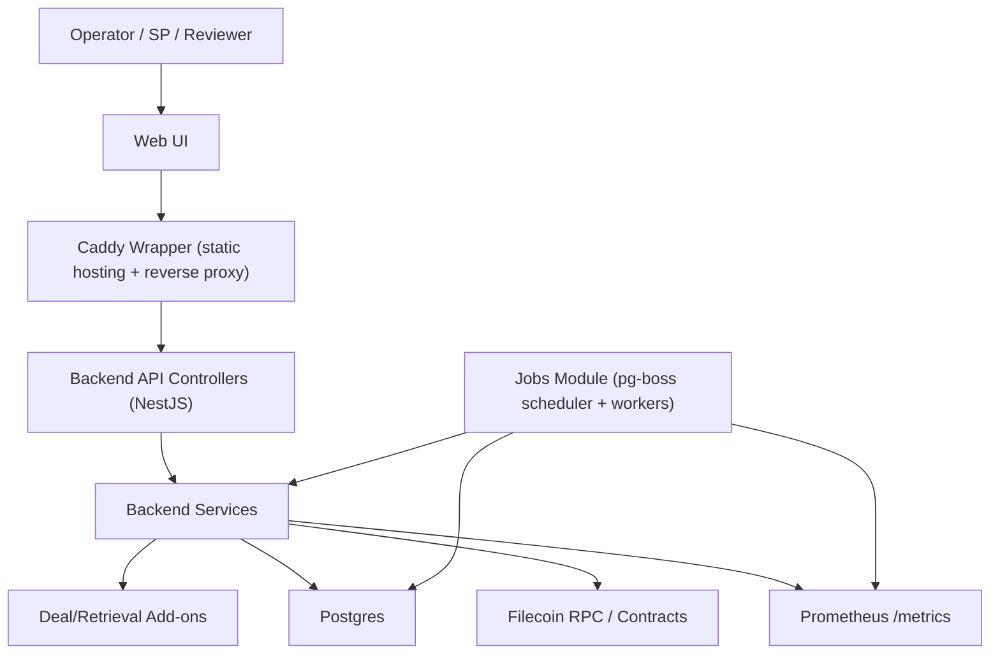

# Production Operations

This document covers application-level operational readiness for Dealbot.
For cluster deployment and post-deployment operations (logs, rollout, rollback, secrets, backup checks), use the [FiloOzone/infra Dealbot runbook](https://github.com/FilOzone/infra/blob/main/docs/runbooks/dealbot.md).

Team-internal tracker:

- Operational readiness Notion page (Filoz internal; requires team access): [FOC Operational Excellence: Dealbot](https://www.notion.so/filecoindev/FOC-Operational-Excellence-Dealbot-317dc41950c180fda76eddc205a63453).
- Internal deployment validation checklist (Filoz internal): [Dealbot Operational Excellence - Deployment Validation](https://www.notion.so/filecoindev/Dealbot-Operational-Excellence-317dc41950c180fda76eddc205a63453?source=copy_link#31adc41950c1807ab3f2c8a75e77cb5d)
- BetterStack and Grafana dashboard links are maintained in the Notion tracker above.

## 1) System Architecture

## 2) Component Responsibilities

- [Web UI](../apps/web): React/Vite dashboard served by a Caddy wrapper (static hosting plus `/api` and `/metrics` reverse proxy).
- [Backend API](../apps/backend/src): controllers and services for endpoints and business logic.
- [Deal add-ons](../apps/backend/src/deal-addons) and [Retrieval add-ons](../apps/backend/src/retrieval-addons): deal/retrieval check integrations.
- [Job execution](../apps/backend/src/jobs): pg-boss scheduler + workers for deal/retrieval jobs.
- [Wallet + chain integration](../apps/backend/src/wallet-sdk): provider discovery and on-chain operations.
- [Persistence](../apps/backend/src/database): deal/retrieval state plus pg-boss queue/schedule state in Postgres.
- [Metrics](../apps/backend/src/metrics-prometheus): Prometheus instrumentation and `/metrics` exposure.
- Metrics retention/alerting lives in external monitoring (Prometheus/Grafana/BetterStack); those systems are observability surfaces, not Dealbot source-of-truth state.

### Data Stores and Ownership

Postgres is the system-of-record for Dealbot state:

- SPs under test and provider metadata in `storage_providers`.
- Deal lifecycle records in `deals`, including managed dataset/piece identifiers (`data_set_id`, `piece_id`, `piece_cid`).
- Retrieval lifecycle records in `retrievals`.
- Scheduler state in `job_schedule_state` and queue execution state in `pgboss.job`.

Prometheus is for runtime observability, not durable state:

- Job health/performance metrics (for example `jobs_started_total`, `jobs_completed_total`, `jobs_queued`) are emitted at runtime on `/metrics`.
- Grafana/BetterStack visualize scraped metrics and logs; these are monitoring surfaces and not canonical Dealbot state.

## 3) Staging Coverage and Limits

Staging is for:

- Deploy and config validation.
- Crash-loop and regression detection.
- Web UI and API smoke checks.
- Scheduler/worker health verification.

Staging currently does not prove:

- Mainnet behavior (`staging` runs with `NETWORK=calibration` in infra config).
- Production wallet/account risk posture.
- Full production traffic patterns.

## 4) Promotion Criteria: Staging to Production

Promote only when all are true:

- No sustained Web UI errors in staging.
- No sustained backend crash loops in staging logs.
- Scheduler and workers are making progress (deal/retrieval jobs enqueued and completed).
- No unresolved critical alerts tied to Dealbot.
- Intended image tags and env changes are committed in infra and synced by ArgoCD.

Validation guidance:

- No sustained Web UI errors:
  - Check BetterStack errors/logs for sources `staging/mainnet` and `dealbot-web`.
  - Confirm no repeating error spikes in those sources during the staging validation window.
- No sustained backend crash loops:
  - Check ArgoCD app status for sync/health and recent operation errors on the staging Dealbot app.
  - In BetterStack source `staging/mainnet -> dealbot`, confirm a `bootstrap_listen_complete` event appears after expected deployment.
  - If `bootstrap_listen_complete` is missing after deployment, verify the Docker build workflow succeeded and ArgoCD is pointing at the expected image tags (Apps page -> Details -> Images).
  - `kubectl -n <dealbot-namespace> get pods`
  - `kubectl -n <dealbot-namespace> describe pod <backend-pod> | rg -n "Restart Count|Last State|Reason"`
  - `kubectl -n <dealbot-namespace> logs <backend-pod> --since=30m`
- Scheduler and workers are making progress (deal/retrieval):
  - Internal BetterStack jobs-in-flight dashboard: [Dealbot Jobs in Flight](https://telemetry.betterstack.com/team/t468215/dashboards/618457?rf=now-6h&rt=now&top=0)
  - Check `/metrics` for increasing `jobs_started_total` and `jobs_completed_total`.
  - Confirm `jobs_queued`/`oldest_queued_age_seconds` are not growing without bound.
  - For pg-boss operations and manual controls, see [docs/runbooks/jobs.md](runbooks/jobs.md).
- No unresolved critical alerts:
  - Verify no active critical alerts in BetterStack/Grafana for Dealbot services.
- Intended image tags/env changes are committed and synced by ArgoCD:
  - Validate in infra repo and ArgoCD status per [docs/release-process.md](release-process.md) and [docs/infra.md](infra.md).
  - Confirm ArgoCD app image references match the expected tags from the successful Docker build workflow.
  - Typical check: `argocd app get <dealbot-app>` and confirm `Synced` + `Healthy`.
