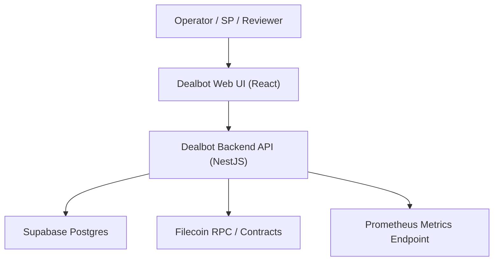
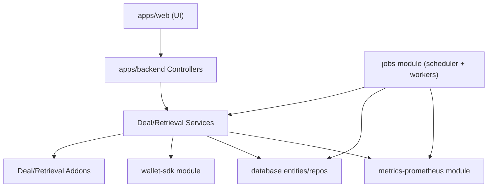

# Production Operations

This document covers application-level operational readiness for Dealbot.
For cluster deployment and post-deployment operations (logs, rollout, rollback, secrets, backup checks), use the infra runbook in `FilOzone/infra`:

- [Infra Dealbot runbook](https://github.com/FilOzone/infra/blob/main/docs/runbooks/dealbot.md)

Related issues:

- Infra runbook track: [FilOzone/infra#32](https://github.com/FilOzone/infra/issues/32)
- Ops-readiness umbrella: [FilOzone/dealbot#90](https://github.com/FilOzone/dealbot/issues/90)

Team-internal tracker:

- Operational readiness Notion page (Filoz internal; requires team access): [FOC Operational Excellence: Dealbot](https://www.notion.so/filecoindev/FOC-Operational-Excellence-Dealbot-317dc41950c180fda76eddc205a63453?source=copy_link).

## 1) System Architecture

## 2) Component Responsibilities

- Web UI (`apps/web`): dashboard and API client.
- Backend API (`apps/backend`): endpoints, scheduling orchestration, and business logic.
- Job execution (`apps/backend/src/jobs`): pg-boss scheduler + workers for deal/retrieval/metrics jobs.
- Wallet + chain integration (`apps/backend/src/wallet-sdk`): provider discovery and on-chain operations.
- Persistence (`apps/backend/src/database`): deal/retrieval/metrics state in Postgres.
- Metrics (`apps/backend/src/metrics-prometheus`): internal Prometheus instrumentation.

## 3) Component Interaction Diagram

Note: the frontend is React+Vite in this repo (not Next.js).

## 4) Staging Coverage and Limits

Staging is for:

- Deploy and config validation.
- Crash-loop and regression detection.
- UI and API smoke checks.
- Scheduler/worker health verification.

Staging currently does not prove:

- Mainnet behavior (`staging` runs with `NETWORK=calibration` in infra config).
- Production wallet/account risk posture.
- Full production traffic patterns.

## 5) Promotion Criteria: Staging to Production

Promote only when all are true:

- No sustained UI errors in staging.
- No sustained backend crash loops in staging logs.
- Scheduler and workers are making progress (jobs enqueued and completed).
- No unresolved critical alerts tied to Dealbot.
- Intended image tags and env changes are committed in infra and synced by ArgoCD.

## 6) Provider-Specific Log Visibility Status

Provider-specific public log visibility depends on:

- [FilOzone/dealbot#277](https://github.com/FilOzone/dealbot/issues/277)
- [FilOzone/dealbot#311](https://github.com/FilOzone/dealbot/issues/311)

Until both are complete, provider-specific troubleshooting is not fully self-serve through the public dashboard and may require Filoz team-assisted log triage.
